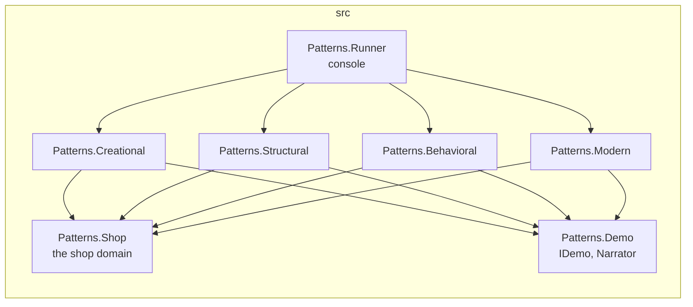
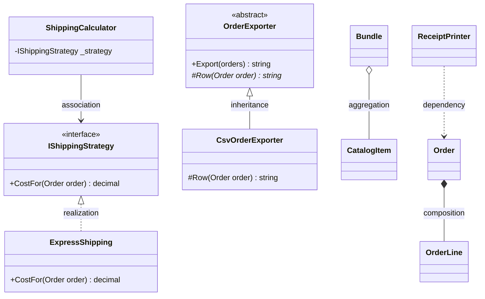
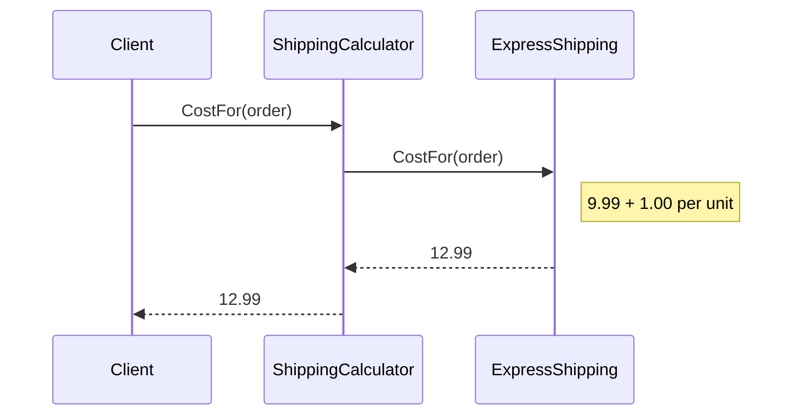
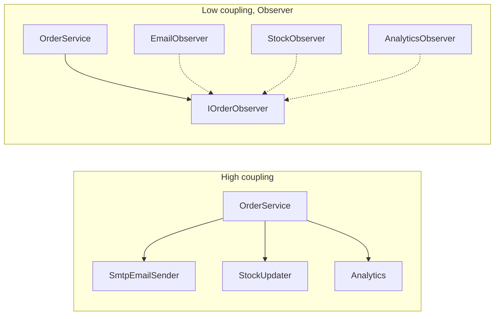
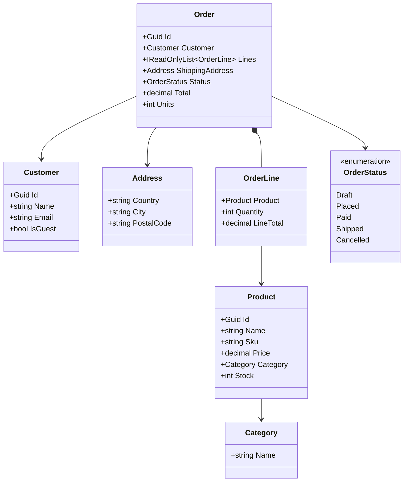
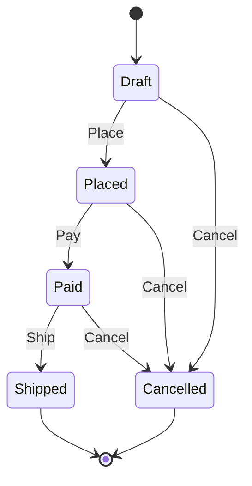

# Design Patterns Playground — Guide

This guide explains **31 design patterns** from zero: the 23 classic ones from the *Gang of Four* book and 8 that every modern .NET application uses. Each pattern is shown on the same small online shop and, in the code, at up to three levels:

| Level | Folder | What it shows |
|---|---|---|
| 0 · Problem | `0-Problem/` | The code **without** the pattern, and exactly what hurts in it. |
| 1 · Classic | `1-Classic/` | The pattern **by hand**, in plain C#, so you can see every moving part. |
| 2 · .NET | `2-DotNet/` | The same idea with **what .NET already gives you**: the version you would write at work. |

Every pattern also gets a **relevance mark**, because not all patterns deserve the same attention today:

| Mark | Name | Meaning |
|---|---|---|
| ⭐⭐⭐ | Essential | You will use it, or meet it in code you read, almost every day. |
| ⭐⭐ | Useful | It has its place; you should recognise it and know when it pays off. |
| ⭐ | Niche | It solves specific problems; knowing it exists is enough. |
| 🕰 | Historical | The language or the framework already solves it; you study it to understand older code and the vocabulary. |

Essential and useful patterns have all three levels. Niche and historical ones skip level 0: their "problem" is a short snippet in the guide.

**How to read it.** Chapters 1–3 come first: setup, how the repository is organised, and the foundations every pattern rests on (including the shop used in every example). After that, read the patterns in any order. Chapters 8 and 9 compare patterns that look alike and help you choose. Chapter 10 is the glossary: every term the guide uses is defined there.

## Contents

- [1. Setup](#1-setup)
  - [1.1 The .NET SDK](#11-the-net-sdk)
  - [1.2 VS Code and the recommended extensions](#12-vs-code-and-the-recommended-extensions)
  - [1.3 Everyday commands](#13-everyday-commands)
  - [1.4 How to study a pattern](#14-how-to-study-a-pattern)
- [2. Project anatomy](#2-project-anatomy)
  - [2.1 Solution and projects](#21-solution-and-projects)
  - [2.2 Root build files](#22-root-build-files)
  - [2.3 The folder of a pattern](#23-the-folder-of-a-pattern)
  - [2.4 The runner](#24-the-runner)
  - [2.5 Kinds of tests](#25-kinds-of-tests)
  - [2.6 Rules enforced by tests](#26-rules-enforced-by-tests)
- [3. Foundations](#3-foundations)
  - [3.1 What a design pattern is](#31-what-a-design-pattern-is)
  - [3.2 Pattern, idiom, architecture](#32-pattern-idiom-architecture)
  - [3.3 The GoF book and why some patterns aged](#33-the-gof-book-and-why-some-patterns-aged)
  - [3.4 How to read the diagrams](#34-how-to-read-the-diagrams)
  - [3.5 The principles under the patterns](#35-the-principles-under-the-patterns)
  - [3.6 Patternitis](#36-patternitis)
  - [3.7 How each pattern section is organised](#37-how-each-pattern-section-is-organised)
  - [3.8 The shop](#38-the-shop)
- [4. Creational patterns](#4-creational-patterns)
  - [4.1 Singleton](#41-singleton)
  - [4.2 Factory Method](#42-factory-method)
  - [4.3 Abstract Factory](#43-abstract-factory)
  - [4.4 Builder](#44-builder)
  - [4.5 Prototype](#45-prototype)
- [5. Structural patterns](#5-structural-patterns)
  - [5.1 Adapter](#51-adapter)
  - [5.2 Bridge](#52-bridge)
  - [5.3 Composite](#53-composite)
  - [5.4 Decorator](#54-decorator)
  - [5.5 Facade](#55-facade)
  - [5.6 Flyweight](#56-flyweight)
  - [5.7 Proxy](#57-proxy)
- [6. Behavioral patterns](#6-behavioral-patterns)
  - [6.1 Chain of Responsibility](#61-chain-of-responsibility)
  - [6.2 Command](#62-command)
  - [6.3 Interpreter](#63-interpreter)
  - [6.4 Iterator](#64-iterator)
  - [6.5 Mediator](#65-mediator)
  - [6.6 Memento](#66-memento)
  - [6.7 Observer](#67-observer)
  - [6.8 State](#68-state)
  - [6.9 Strategy](#69-strategy)
  - [6.10 Template Method](#610-template-method)
  - [6.11 Visitor](#611-visitor)
- [7. Modern .NET patterns](#7-modern-net-patterns)
  - [7.1 Dependency Injection](#71-dependency-injection)
  - [7.2 Options](#72-options)
  - [7.3 Repository](#73-repository)
  - [7.4 Unit of Work](#74-unit-of-work)
  - [7.5 Specification](#75-specification)
  - [7.6 Result](#76-result)
  - [7.7 Null Object](#77-null-object)
  - [7.8 Object Pool](#78-object-pool)
- [8. Patterns that get confused](#8-patterns-that-get-confused)
  - [8.1 Decorator, Proxy, Adapter, Facade](#81-decorator-proxy-adapter-facade)
  - [8.2 Strategy, State, Template Method](#82-strategy-state-template-method)
  - [8.3 Factory Method, Abstract Factory, Builder](#83-factory-method-abstract-factory-builder)
  - [8.4 Observer and Mediator](#84-observer-and-mediator)
  - [8.5 Command and Strategy](#85-command-and-strategy)
  - [8.6 Composite and Decorator](#86-composite-and-decorator)
- [9. Combining and choosing](#9-combining-and-choosing)
  - [9.1 Combinations you will meet in real code](#91-combinations-you-will-meet-in-real-code)
  - [9.2 From symptom to pattern](#92-from-symptom-to-pattern)
  - [9.3 When not to use each pattern](#93-when-not-to-use-each-pattern)
  - [9.4 Out of scope](#94-out-of-scope)
- [10. Glossary](#10-glossary)

---

## 1. Setup

What you need to build, run and test the playground, and the handful of commands you will use every day. No database and no Docker: every pattern runs in memory.

### 1.1 The .NET SDK

The **SDK** (Software Development Kit) is the package that contains everything to build .NET code: the C# compiler, the `dotnet` command-line tool, the runtime that executes the programs, and the base class library. The playground targets **.NET 10** with **C# 14**.

```bash
dotnet --list-sdks        # lists installed SDKs; you need a 10.0.4xx line
```

Install it with `winget install Microsoft.DotNet.SDK.10` (Windows) and open a **new** terminal afterwards: a terminal that was already open does not see the updated `PATH`.

The repository pins the SDK in [`global.json`](../global.json):

```json
{
  "sdk": { "version": "10.0.401", "rollForward": "latestFeature" },
  "test": { "runner": "Microsoft.Testing.Platform" }
}
```

- `version` is the SDK the playground was built with.
- `rollForward: latestFeature` means "10.0.401 or any newer **10.0** feature band" (10.0.5xx, 10.0.6xx…), but never 11. You get bug fixes without surprises from a new major version.
- `test.runner` switches `dotnet test` from the older VSTest runner to **Microsoft.Testing.Platform** (MTP), the newer test platform. In .NET 10 this is an opt-in, and this line is what turns it on; the `--solution`, `--project` and `--filter-class` options of section [1.3](#13-everyday-commands) only exist in MTP mode (section [2.5](#25-kinds-of-tests)).

### 1.2 VS Code and the recommended extensions

Any editor works (Visual Studio and Rider too). With **Visual Studio Code** (VS Code), open the repository folder and accept the recommended extensions it offers (listed in `.vscode/extensions.json`):

| Extension | Why |
|---|---|
| **C# Dev Kit** (`ms-dotnettools.csdevkit`) | IntelliSense, go-to-definition, the Solution Explorer and the Test Explorer for C#. |
| **Markdown Preview Mermaid Support** (`bierner.markdown-mermaid`) | Draws the diagrams of this guide in VS Code's Markdown preview (`Ctrl+Shift+V`). GitHub draws them on its own. |
| **EditorConfig** (`editorconfig.editorconfig`) | Applies the formatting rules of `.editorconfig` as you type (section [2.2](#22-root-build-files)). |

### 1.3 Everyday commands

Run them from the repository root.

```bash
dotnet run --project src/Patterns.Runner                   # list every pattern with its relevance
dotnet run --project src/Patterns.Runner -- strategy       # run one pattern's demo, narrated level by level
dotnet run --project src/Patterns.Runner -- all            # run every demo

dotnet build DesignPatterns.slnx -warnaserror              # build everything; any warning fails the build
dotnet test --solution DesignPatterns.slnx                 # run every test
dotnet test --project tests/Patterns.Behavioral.Tests --filter-class "*.StrategyTests"   # one pattern's tests
dotnet format DesignPatterns.slnx --verify-no-changes      # check the formatting without changing files
```

- `--project` tells `dotnet run` which project to start; everything after `--` is passed to the program, not to `dotnet`.
- `-warnaserror` turns every compiler and analyzer warning into an error (the build files already do this; the flag makes it explicit).
- `--filter-class` keeps only the test classes whose full name (namespace + class) matches; `*` is a wildcard. xUnit v3 also offers `--filter-method` and `--filter-namespace`.
- `dotnet format` applies the `.editorconfig` rules; with `--verify-no-changes` it only reports what it *would* change and fails if anything is off.

### 1.4 How to study a pattern

The same five steps work for every pattern:

1. **Run its demo** (`dotnet run --project src/Patterns.Runner -- <key>`). The output narrates each level with the shop example and ends with a one-line takeaway.
2. **Read the guide section** up to "Structure": the problem, the analogy and the diagram.
3. **Read the code in order**: `0-Problem/` (look for the `// PAIN:` comments), then `1-Classic/` (each class says which role it plays), then `2-DotNet/`.
4. **Read the tests**. The equivalence tests prove the three levels behave the same; the other tests show what makes the pattern the pattern (undo in Command, forbidden transitions in State…).
5. **Do the "Try it" experiments** at the end of the section. Breaking something on purpose and watching a test fail teaches more than reading.

---

## 2. Project anatomy

How the repository is organised: which project holds what, how a pattern's folder is laid out, how the runner finds the demos, and which tests guard what.

### 2.1 Solution and projects

A **solution** (`DesignPatterns.slnx`) is the list of projects that are built together; `.slnx` is the XML (Extensible Markup Language) solution format introduced in .NET 9, much shorter than the old `.sln`. A **project** (`.csproj`) produces one assembly (a `.dll` or an `.exe`) and lists the packages and other projects it references. A **project reference** is a compile-time permission: a project can only use the types of the projects it references.



An arrow means "references". `Patterns.Shop` and `Patterns.Demo` reference nothing, so every pattern can use them and they can never depend on a pattern.

| Project | What it holds | References |
|---|---|---|
| `Patterns.Shop` | The shop domain shared by every example: `Product`, `Category`, `Customer`, `Address`, `Order`, `OrderLine`, `OrderStatus`, and `SampleData` (section [3.8](#38-the-shop)). | nothing |
| `Patterns.Demo` | The contract every demo implements (`IDemo`), the relevance marks, and `Narrator`, which prints the levels in a uniform format. | nothing |
| `Patterns.Creational` | Singleton, Factory Method, Abstract Factory, Builder, Prototype. | Shop, Demo, Microsoft DI (dependency injection) container |
| `Patterns.Structural` | Adapter, Bridge, Composite, Decorator, Facade, Flyweight, Proxy. | Shop, Demo, Microsoft Logging, Configuration |
| `Patterns.Behavioral` | Chain of Responsibility, Command, Interpreter, Iterator, Mediator, Memento, Observer, State, Strategy, Template Method, Visitor. | Shop, Demo, Microsoft DI, ASP.NET Core (to run real middleware in memory) |
| `Patterns.Modern` | Dependency Injection, Options, Repository, Unit of Work, Specification, Result, Null Object, Object Pool. | Shop, Demo, Microsoft DI, Options, Configuration, Logging, ObjectPool |
| `Patterns.Runner` | The console program that lists and runs the demos. | the four category projects |

The tests live in `tests/`: one project per category (`Patterns.Creational.Tests`…), `Patterns.Runner.Tests` and `Patterns.ArchitectureTests` (section [2.5](#25-kinds-of-tests)).

Why one project per **category** and not one per pattern? Thirty-one projects of two or three files each would be mostly ceremony. The price of sharing a project is that the compiler would let one pattern use another; an architecture test forbids it instead (section [2.6](#26-rules-enforced-by-tests)).

### 2.2 Root build files

Four files at the root apply to every project, so each is written once. MSBuild, the engine behind `dotnet build`, finds `Directory.Build.props` and `Directory.Packages.props` by walking up from each project's folder; the compiler and the editor find `.editorconfig` the same way; the `dotnet` command finds `global.json` walking up from the folder you run it in.

**`Directory.Build.props`** — compiler settings for every project:

| Setting | Effect |
|---|---|
| `TargetFramework` `net10.0` | Every project targets .NET 10. |
| `Nullable` `enable` | Reference types are non-nullable unless marked `?`; the compiler warns when `null` can sneak in. |
| `ImplicitUsings` `enable` | Common namespaces (`System`, `System.Linq`, `System.Collections.Generic`…) are imported automatically. |
| `TreatWarningsAsErrors` `true` | A warning stops the build. Warnings that nobody fixes accumulate until nobody reads them. |
| `AnalysisLevel` `latest-recommended` | Turns on the recommended set of .NET code analyzers. An **analyzer** is a compiler plug-in that inspects your code and reports problems; these rules are named `CAxxxx` (code analysis), for example CA1305 "specify a culture when formatting". |
| `EnforceCodeStyleInBuild` `true` | Style rules from `.editorconfig` (rules named `IDExxxx`, after IDE: integrated development environment) are checked during the build, not only in the editor. |
| `InvariantGlobalization` `true` | The programs behave the same on every machine's language settings: `12.50` never prints as `12,50`. |
| `ManagePackageVersionsCentrally` `true` | Package versions live in one file (next row). |

**`Directory.Packages.props`** — **central package management**: the only place where package versions are written. A `.csproj` lists `<PackageReference Include="xunit.v3" />` without a version. Every project therefore uses exactly the same version of each library.

**`.editorconfig`** — formatting and style rules (indentation, file-scoped namespaces, `_camelCase` private fields, braces always…), read by the editor, the build and `dotnet format`. One rule is relaxed on purpose: **IDE0130** normally asks the namespace to match the folder, but pattern folders are numbered (`1-Classic`) for reading order, and a namespace cannot contain `1-`. The namespace drops the number (`Patterns.Behavioral.Strategy.Classic`).

**`global.json`** — the SDK version (section [1.1](#11-the-net-sdk)).

### 2.3 The folder of a pattern

Every pattern has the same shape. Strategy, for example:

```
src/Patterns.Behavioral/Strategy/
  README.md          relevance, intent, what to read first, levels, run command, link to this guide
  0-Problem/         namespace Patterns.Behavioral.Strategy.Problem   (essential and useful patterns only)
  1-Classic/         namespace Patterns.Behavioral.Strategy.Classic
  2-DotNet/          namespace Patterns.Behavioral.Strategy.DotNet
  StrategyDemo.cs    namespace Patterns.Behavioral.Strategy           (what the runner executes)
```

**The levels never share the pattern's own types.** If Problem and Classic both need a "shipping calculator", each level declares its own. That duplication is deliberate: each level must be readable on its own, and comparing two files side by side is the point. The one exception is "someone else's code" that the pattern wraps or coordinates (the carrier SDK in Adapter, the subsystems in Facade, the image store in Proxy): it lives in its own sub-folder of the pattern and every level uses the same one, because in real life you could not change it either. Types that a pattern needs and the shop does not have (a carrier client, a notifier, a bundle…) live in the pattern's folder, not in `Patterns.Shop`.

**Comments are part of the lesson.** Three kinds appear in pattern code:

```csharp
// Role: ConcreteStrategy — prices express shipping: a fixed fee plus one euro per unit.
// Guide: §6.9
public sealed class ExpressShipping : IShippingStrategy
{
    public decimal CostFor(Order order) => 9.99m + 1.00m * order.Units;
}
```

```csharp
public decimal CostFor(Order order, string method) => method switch
{
    "standard" => order.Total >= 50.00m ? 0.00m : 4.99m,
    "express" => 9.99m + 1.00m * order.Units,
    "pickup" => 0.00m,
    // PAIN: every new carrier means another case here, and this method's tests change with it.
    _ => throw new ArgumentException($"Unknown shipping method '{method}'."),
};
```

- `// Role:` names the role the class plays in the pattern (the names are the ones used in the pattern's class diagram) and says, in a few words, what it does in the shop.
- `// Guide: §N.M` points to the section of this guide that explains it.
- `// PAIN:` marks, in Problem code only, the exact spot that hurts and why.

Other comments explain **why** something is done, never *what* the next line does.

### 2.4 The runner

`Patterns.Runner` is a console program. Every pattern exposes one **demo**, a class implementing `IDemo`:

```csharp
public interface IDemo
{
    string Key { get; }               // "strategy": what you type after `--`
    string Name { get; }              // "Strategy"
    PatternCategory Category { get; } // Creational, Structural, Behavioral, Modern
    Relevance Relevance { get; }      // Essential, Useful, Niche, Historical
    string GuideSection { get; }      // "§6.9"
    void Run(TextWriter output);
}
```

`Run` writes to the `TextWriter` it receives, not to `Console`, so a test can capture and check the output. Each category project lists its demos in a static `Demos.All`, and the runner simply concatenates the four lists: there is no reflection or scanning, so following how a demo gets run takes one "go to definition".

| Command | What happens |
|---|---|
| `dotnet run --project src/Patterns.Runner` (or `-- list`) | Lists the patterns by category with their relevance mark and key. |
| `-- <key>` | Runs that demo. The key is trimmed and case-insensitive: `Strategy`, `strategy` and `STRATEGY` are the same. |
| `-- all` | Runs every demo, in the order of this guide. |
| anything else | Prints `Unknown pattern '<what you typed>'.` and the list, and exits with code 1 (so scripts can detect the mistake). |

A demo narrates through `Narrator`, so every demo looks the same. Strategy's output looks like this:

```
═══ Strategy (Behavioral · ⭐⭐⭐ Essential) · guide §6.9 ═══
── Level 0 · Problem ──
  → Shipping for 3 books (37.50) through one method with a switch on the method name
    = standard 4.99 · express 12.99 · pickup 0.00
── Level 1 · Classic ──
  → The same order, priced by three strategy objects behind IShippingStrategy
    = standard 4.99 · express 12.99 · pickup 0.00
── Level 2 · .NET ──
  → The strategies registered as keyed services and picked by name from the container
    = standard 4.99 · express 12.99 · pickup 0.00
  ✔ Same prices at every level: the pattern changes where the rules live, not what they compute.
```

`→` is a step the demo takes, `=` its result, `✔` the takeaway.

### 2.5 Kinds of tests

Tests use **xUnit v3** with its plain `Assert` class, run by **Microsoft.Testing.Platform** (`dotnet test`). Four kinds, each with a different job:

| Kind | Where | What it proves | Example |
|---|---|---|---|
| **Equivalence** | `Patterns.<Category>.Tests` | With the same input, Problem, Classic and .NET give the same result. A pattern changes the *structure* of the code, not its *behaviour*; these tests make that visible. | Shipping for 3 books is `4.99` / `12.99` / `0.00` in all three levels. |
| **Pattern behaviour** | `Patterns.<Category>.Tests` | What makes the pattern the pattern, including the edge cases. | Undo three times empties the cart (Command); shipping an order that is not paid throws (State); applying the coupon before or after VAT (value-added tax) gives different prices (Decorator). |
| **Runner** | `Patterns.Runner.Tests` | Every demo runs and writes output; the catalog holds exactly the expected patterns with their relevance; keys are unique; an unknown key exits with 1. | `UnknownKey_PrintsErrorAndList_Returns1` |
| **Architecture** | `Patterns.ArchitectureTests` | The structural rules of the repository (next section). | `Pattern_DoesNotUseAnotherPattern` |

Test names describe the behaviour, with underscores separating the parts: `Standard_AtExactly50_IsFree` reads as "standard shipping, at exactly 50, is free". The tests of a pattern are written **before** its code (TDD, Test-Driven Development: write a failing test, make it pass, clean up).

### 2.6 Rules enforced by tests

Some rules cannot be expressed with project references alone, so `Patterns.ArchitectureTests` checks them with **ArchUnitNET**, a library that loads the compiled assemblies and asserts who uses whom. One test per rule, named after the rule:

| Rule (test name) | Why it exists |
|---|---|
| `Shop_DependsOnNothing` | The shop is shared by every pattern. If it used a pattern, changing that pattern could break all the others. |
| `Demo_DependsOnNothing` | The demo contract must stay a neutral, tiny contract. |
| `Pattern_DoesNotUseAnotherPattern` | Each pattern must be understandable alone. Patterns share a project per category, so the compiler would allow it; this test does not. |
| `Classic_DoesNotUseProblem`, `DotNet_DoesNotUseProblem` | The Problem level is the "before" picture; the solutions must not lean on it. |
| `Classic_DoesNotUseMicrosoftExtensions` | "By hand" means by hand: the Classic level uses only the base class library, so every moving part of the pattern is visible. |
| `PatternCode_DoesNotUseThirdPartyLibraries` | The code shows the patterns and what .NET provides, nothing else. Third-party libraries (MediatR, AutoMapper, Scrutor…) are named in the guide, never referenced. |

If a change makes one of these tests fail, the design is what changes, never the test.

---

## 3. Foundations

Before the first pattern: what a pattern is (and is not), why some of the classic ones have aged, how to read the diagrams of this guide, the principles every pattern leans on, the risk of using patterns for their own sake, and the shop that every example uses.

### 3.1 What a design pattern is

A **design pattern** is a named, proven solution to a problem that keeps coming back when you design code, described in a way you can adapt to your own situation. It is a **description**, not a piece of code or a library: you cannot install Strategy, you recognise the situation and shape your classes after it.

The idea comes from building architecture. In the 1970s the architect Christopher Alexander catalogued recurring solutions for towns and houses ("a window place", "light on two sides of every room"), each with a name, the problem it solves and the forces that shape it. Programmers borrowed the format in the late 1980s.

Every pattern has four parts:

| Part | What it says | Strategy, for example |
|---|---|---|
| **Name** | A word to talk about the design. | "Strategy" |
| **Problem** | When to apply it: the situation and the forces in tension. | One task (pricing shipping) has several interchangeable ways of being done, and new ways keep arriving. |
| **Solution** | The classes, their roles and how they collaborate; a template, not finished code. | Each way becomes a class behind a common interface; the code that needs the price receives one of them. |
| **Consequences** | What you gain and what you pay. | Adding a way no longer edits existing code; you pay with more types and an extra indirection. |

The name is the most underrated part. "Wrap the repository in a caching decorator" is one sentence that carries a whole design: everyone who knows the vocabulary knows which interface, which classes and which call order you mean. That shared vocabulary, more than any line of code, is what you take from this playground.

A pattern is **not**:
- a **goal**: nobody is paid to "use patterns"; they are paid to make code that is easy to change;
- a **recipe to copy**: the structure adapts to the language and the problem (most patterns look different in C# 14 than in 1994's C++);
- **always an improvement**: every pattern adds types and indirection. Section [3.6](#36-patternitis) is about that cost.

### 3.2 Pattern, idiom, architecture

Patterns exist at different scales. This playground is about the middle one.

| Scale | What it organises | Examples | Where you learn it |
|---|---|---|---|
| **Idiom** | A few lines, in one language. | `using` to dispose resources, `TryParse` instead of exceptions, `is not null`, `?.` and `??`. | The language's documentation and code reviews. |
| **Design pattern** | A few classes and how they collaborate, in any object-oriented language. | Strategy, Decorator, Observer. | This guide. |
| **Architecture pattern** | The whole application: its big parts and the rules between them. | Layered, Clean/Hexagonal, Vertical slices, Microservices. | Architecture books (the sibling repository `architecture-playground`, if you have it). |

The boundaries are blurry: Dependency Injection is a design pattern that ends up shaping the architecture; middleware is a design pattern (Chain of Responsibility) that the ASP.NET Core architecture is built around. The useful question is not "which scale is this?" but "how many classes does this decision touch?".

### 3.3 The GoF book and why some patterns aged

In 1994 Erich Gamma, Richard Helm, Ralph Johnson and John Vlissides published *Design Patterns: Elements of Reusable Object-Oriented Software*. The four authors became known as the **Gang of Four** (**GoF**), and their 23 patterns, with examples in C++ and Smalltalk, are still the common vocabulary. They grouped them in three families, which are chapters 4–6 of this guide:

| Family | The question it answers | Chapter |
|---|---|---|
| **Creational** | Who creates an object, and how, so that the code using it does not depend on the concrete class? | [4](#4-creational-patterns) |
| **Structural** | How do we wrap and combine objects into larger structures? | [5](#5-structural-patterns) |
| **Behavioral** | Who does what, and how do objects talk to each other? | [6](#6-behavioral-patterns) |

The C++ of 1994 had no garbage collector, no lambdas, no generics in the modern sense, no interfaces as a separate concept, no reflection worth the name and no standard collection library. Many GoF patterns are partly **workarounds for missing language features**. In 1996 Peter Norvig showed that 16 of the 23 have simpler or invisible implementations in dynamic languages such as Lisp and Dylan, thanks to first-class functions and types, macros and multimethods (at least for some uses). C# and .NET have since absorbed many of them:

| Language or framework feature | Pattern it absorbed | What is left to learn |
|---|---|---|
| Delegates and lambdas (`Func<>`, `Action`) | Strategy, Command, Template Method (partly) | When a whole class still beats a lambda. |
| `IEnumerable<T>`, `foreach`, `yield return` | Iterator | How lazy enumeration works and when it bites. |
| `event`, `IObservable<T>` | Observer | Unsubscribing, and what happens when a subscriber throws. |
| Records and `with` | Prototype, Memento | Shallow vs deep copies. |
| Pattern matching (`switch` expressions) | Visitor (often), State (simple cases) | When a class hierarchy still wins. |
| The dependency injection container | Singleton, Factory Method, Abstract Factory (partly) | Lifetimes, and why a static singleton is now a smell. |
| The garbage collector and string interning | Flyweight (mostly) | Why it rarely matters in .NET. |

That table is why relevance marks exist (see the introduction). A 🕰 historical pattern is not useless: you still meet it in older code and in interviews, and knowing what the language does for you is part of knowing the language.

The GoF book did not cover patterns that became everyday .NET practice later: Dependency Injection, Options, Repository, Unit of Work, Specification, Result, Null Object, Object Pool. They are chapter [7](#7-modern-net-patterns).

### 3.4 How to read the diagrams

Each pattern has a **class diagram** (which types exist and how they relate) and a **sequence diagram** (what happens, in order, during one call). Both are drawn with **Mermaid**, a text format that GitHub and VS Code (with the extension of section [1.2](#12-vs-code-and-the-recommended-extensions)) turn into pictures.

**Class diagrams.** Every relation used in this guide, with the C# that produces it:



| Relation | Arrow | Meaning | In C# |
|---|---|---|---|
| **Realization** | dashed line, hollow triangle | A class implements an interface. | `class ExpressShipping : IShippingStrategy` |
| **Inheritance** | solid line, hollow triangle | A class extends another class. | `class CsvOrderExporter : OrderExporter` |
| **Association** | solid line, open arrow | A class keeps a reference to another and uses it over time. | a field: `private readonly IShippingStrategy _strategy;` |
| **Aggregation** | solid line, hollow diamond on the owner's side | A "has" relation where the parts can live without the whole. | `Bundle` holds items that also exist outside it. |
| **Composition** | solid line, filled diamond on the owner's side | The parts belong to the whole and live and die with it. | An `Order`'s lines mean nothing without the order. |
| **Dependency** | dashed line, open arrow | A class uses another only briefly: a parameter, a local variable, a return type. | `string Print(Order order)` |

Inside a class box: `+` public, `-` private, `#` protected; `Name(parameters) ReturnType`; a trailing `*` marks an abstract member. `<<interface>>` and `<<abstract>>` above the name say what kind of type it is.

In pattern sections, the label above the name is the **role** the class plays in the pattern, using the GoF names (`<<Strategy>>`, `<<ConcreteStrategy>>`, `<<Context>>`). The same role appears in the class's `// Role:` comment, so you can go from the diagram to the code and back. Interfaces are recognisable by their `I` prefix.

**Sequence diagrams.** Time runs downwards. Each column is an object (a *participant*); a solid arrow is a call, a dashed arrow is the value returned; a note explains a step.



Some sections also use a **flowchart** (boxes and arrows for a process) or a **state diagram** (the states something can be in and the events that move it between them; see the order life cycle in [3.8](#38-the-shop)).

### 3.5 The principles under the patterns

Patterns are concrete applications of a few general principles. When you understand the principle, the pattern stops being something to memorise.

#### SOLID

Five principles of object-oriented design gathered by Robert C. Martin; the initials spell SOLID.

| Principle | In plain words | In the shop | Patterns that lean on it |
|---|---|---|---|
| **S**ingle Responsibility | A class should have one reason to change. | Pricing shipping and sending the confirmation email change for different reasons (a new carrier, a new email template), so they belong in different classes. | Facade, Command, Observer |
| **O**pen/Closed | Open for extension, closed for modification: add behaviour by adding code, not by editing working code. | A new shipping method is a new class, not a new `case` in an existing `switch`. | Strategy, Decorator, Chain of Responsibility, Visitor |
| **L**iskov Substitution | Any implementation of an abstraction must work wherever the abstraction is expected, without surprises. | Every `IShippingStrategy` returns a non-negative price; one that threw for some countries would break code that trusts the interface. | Every pattern built on an interface |
| **I**nterface Segregation | Many small interfaces are better than one large one; no class should implement methods it does not need. | A notifier that only sends does not have to implement "read inbox". | Adapter, Bridge, Repository (specific vs generic) |
| **D**ependency Inversion | High-level code should depend on abstractions, not on concrete low-level classes; the details depend on the abstraction. | The checkout depends on `IEmailSender`, not on an SMTP (Simple Mail Transfer Protocol) client. | Dependency Injection, Factory Method, Abstract Factory, Adapter |

#### Composition over inheritance

**Inheritance** (`class B : A`) reuses code by becoming a kind of the parent: it is fixed at compile time, exposes the parent's protected internals to the child, and a class can only have one parent. **Composition** reuses code by *holding* another object and delegating to it: the held object can be swapped at run time and only its public contract is visible.

The GoF advice is "favour object composition over class inheritance". In the shop: an `ExpressCsvExporter : CsvExporter : OrderExporter` hierarchy explodes as soon as two independent things vary (format and filter); an exporter that *holds* a format object and a filter object does not. Decorator, Strategy, Bridge and Composite are all forms of composition. Template Method is the GoF pattern built on inheritance, and its section explains when that is still fine.

#### Program to an interface, not an implementation

Code that needs a service should know **what** it does (the interface), not **which class** does it. Then the class can change, be replaced in a test, or be wrapped, without touching the code that uses it. In C# this usually means depending on an interface (`IShippingStrategy`) or an abstract class, and receiving the concrete object from outside (section [7.1](#71-dependency-injection)).

"Interface" here means the contract, not necessarily the `interface` keyword: a `Func<Order, decimal>` is also a contract.

#### Encapsulate what varies

Find the part of the code that changes often or in different ways, and put it behind its own boundary so that the rest does not change with it. Almost every behavioral pattern is this principle applied to one kind of variation: *how* something is computed (Strategy), *what happens next* depending on the state (State), *who reacts* to an event (Observer), *which steps* run in a request (Chain of Responsibility).

#### Coupling and cohesion

- **Coupling** is how much one piece of code depends on another. High coupling means a change in one place forces changes in others. Patterns lower it by putting an abstraction between the two sides.
- **Cohesion** is how much the things inside one piece of code belong together. High cohesion means a class does one job and everything in it serves that job.

The goal is **low coupling and high cohesion**: small, focused pieces that know little about each other.



On the left, `OrderService` knows three concrete classes and changes whenever a new reaction to an order is added. On the right it knows one interface; reactions are added without touching it.

### 3.6 Patternitis

**Patternitis** is the habit of applying patterns because they exist, not because the code needs them. It is the most common way patterns make code worse. Symptoms:

- an interface with exactly one implementation, and no test or plan that needs a second one;
- a factory whose only job is to call `new`;
- a strategy for something that has had one behaviour for years;
- three classes and two interfaces where a `switch` of four lines was clear;
- a reader has to open five files to follow one call.

Every pattern trades **directness** for **flexibility**. Indirection is a cost paid every time someone reads, debugs or navigates the code; flexibility only pays when the change it prepares for actually happens.

Two rules of thumb keep the balance:

- **YAGNI** (*You Aren't Gonna Need It*): do not build for a change you only imagine. Write the simple version.
- **The rule of three**: the first time, just write it; the second time, notice the duplication; the third time, refactor. A pattern usually earns its place when the third variation arrives, not before.

The healthy direction is **refactoring towards a pattern** when the code starts to hurt, not designing with patterns up front. That is exactly the order of the levels in this playground: Problem first, then the pattern that removes the pain. Every pattern section has a "When NOT to use it" part with the simpler alternative.

### 3.7 How each pattern section is organised

Every pattern in chapters 4–7 follows the same template, so you always know where to look:

| # | Part | What it contains |
|---|---|---|
| 1 | **Card** | Relevance, family, intent in one sentence, other names, the levels in the code, the command to run its demo. |
| 2 | **The problem** | The situation in the shop, in plain language, and an analogy from everyday life. |
| 3 | **Without the pattern** | The code that hurts and what exactly hurts (from `0-Problem/`, or a snippet for niche and historical patterns). |
| 4 | **Structure** | The class diagram with the role names, and a table: role → our class → responsibility. |
| 5 | **How it runs** | A sequence diagram of one call. |
| 6 | **By hand** | The key code of `1-Classic/`, commented. |
| 7 | **In .NET** | What the framework gives you (`2-DotNet/`), and how it differs from the hand-written version. |
| 8 | **In the ecosystem** | Well-known libraries for the pattern and their licence (only when there are some). |
| 9 | **When to use it** | Concrete signals in your code. |
| 10 | **When NOT to use it** | Concrete signals that it is overkill, and the simpler alternative. |
| 11 | **Costs** | What you pay: more types, indirection, harder debugging… |
| 12 | **Relevance today** | The mark and why. |
| 13 | **Relatives** | What it is confused with and what it combines with (chapter 8 goes deeper). |
| 14 | **Try it** | The demo command and two or three experiments. |
| 15 | **Interview questions** | Two or three questions; click to reveal the answers. |

### 3.8 The shop

Every example happens in the same small **online shop**, so that you only have to learn the domain once. It is deliberately tiny: just enough for the patterns to have something real to work on. The types live in `src/Patterns.Shop` and depend on nothing.

| Type | What it is |
|---|---|
| `Category` | A product family: Books, Electronics, Home. |
| `Product` | Something the shop sells: an id, a name, a **SKU** (Stock Keeping Unit: the shop's own product code, like `BOOK-001`), a price, its category and the units in stock. |
| `Customer` | Who buys: a name, an email and whether they are a **guest** (bought without an account). |
| `Address` | Where an order is shipped. `Country` uses two-letter ISO (International Organization for Standardization) codes: `ES` Spain, `PT` Portugal, `FR` France. |
| `OrderLine` | One product in an order and how many units; `LineTotal` = price × quantity. |
| `Order` | A customer's purchase: its lines, the shipping address and its status. `Total` is the sum of the line totals; `Units` the number of items. |
| `OrderStatus` | Where the order is in its life: `Draft`, `Placed`, `Paid`, `Shipped`, `Cancelled`. |

All of them except the `OrderStatus` enum are C# **records**: types whose equality compares values instead of references, and which can be copied with changes using `with` (`order with { Status = OrderStatus.Paid }`). Money is `decimal` (exact for amounts, unlike `double`), in a single currency (euros), with at most two decimals. Ids are `Guid`s.



**Sample data.** `SampleData` gives every demo and test the same products, customers and addresses, with fixed product and customer ids so the output is stable (orders built with `OrderOf` get a new id each time):

| Name | Value |
|---|---|
| `SampleData.Book` | "Clean Code", SKU `BOOK-001`, **12.50**, Books, 20 in stock |
| `SampleData.Headphones` | "Wireless Headphones", SKU `ELEC-001`, **59.90**, Electronics, 5 in stock |
| `SampleData.Mug` | "Coffee Mug", SKU `HOME-001`, **8.00**, Home, **0 in stock** (the out-of-stock case, on purpose) |
| `SampleData.Ana` | A registered customer, `ana@example.com` |
| `SampleData.Guest` | A guest customer (no account, no email) |
| `SampleData.Madrid` | `ES`, Madrid, 28001 |
| `SampleData.Lisbon` | `PT`, Lisbon, 1100-148 |
| `SampleData.OrderOf((Book, 2), (Headphones, 1))` | A draft order for Ana, shipped to Madrid: total **84.90**, 3 units |

With those prices the numbers in the examples are easy to check by hand: 4 books are exactly 50.00, 8 books exactly 100.00.

**The order life cycle.** An order starts as a draft, is placed, paid and shipped; it can be cancelled until it has been shipped. Section [6.8](#68-state) (State) implements exactly this diagram three times.



Any other move (paying a draft, shipping an order that is not paid, cancelling a shipped order) is an error.

---

## 4. Creational patterns

*Coming in a later phase.*

### 4.1 Singleton

*Coming in a later phase.*

### 4.2 Factory Method

*Coming in a later phase.*

### 4.3 Abstract Factory

*Coming in a later phase.*

### 4.4 Builder

*Coming in a later phase.*

### 4.5 Prototype

*Coming in a later phase.*

---

## 5. Structural patterns

*Coming in a later phase.*

### 5.1 Adapter

*Coming in a later phase.*

### 5.2 Bridge

*Coming in a later phase.*

### 5.3 Composite

*Coming in a later phase.*

### 5.4 Decorator

*Coming in a later phase.*

### 5.5 Facade

*Coming in a later phase.*

### 5.6 Flyweight

*Coming in a later phase.*

### 5.7 Proxy

*Coming in a later phase.*

---

## 6. Behavioral patterns

*Coming in a later phase.*

### 6.1 Chain of Responsibility

*Coming in a later phase.*

### 6.2 Command

*Coming in a later phase.*

### 6.3 Interpreter

*Coming in a later phase.*

### 6.4 Iterator

*Coming in a later phase.*

### 6.5 Mediator

*Coming in a later phase.*

### 6.6 Memento

*Coming in a later phase.*

### 6.7 Observer

*Coming in a later phase.*

### 6.8 State

*Coming in a later phase.*

### 6.9 Strategy

*Coming in a later phase.*

### 6.10 Template Method

*Coming in a later phase.*

### 6.11 Visitor

*Coming in a later phase.*

---

## 7. Modern .NET patterns

*Coming in a later phase.*

### 7.1 Dependency Injection

*Coming in a later phase.*

### 7.2 Options

*Coming in a later phase.*

### 7.3 Repository

*Coming in a later phase.*

### 7.4 Unit of Work

*Coming in a later phase.*

### 7.5 Specification

*Coming in a later phase.*

### 7.6 Result

*Coming in a later phase.*

### 7.7 Null Object

*Coming in a later phase.*

### 7.8 Object Pool

*Coming in a later phase.*

---

## 8. Patterns that get confused

*Coming in a later phase.*

### 8.1 Decorator, Proxy, Adapter, Facade

*Coming in a later phase.*

### 8.2 Strategy, State, Template Method

*Coming in a later phase.*

### 8.3 Factory Method, Abstract Factory, Builder

*Coming in a later phase.*

### 8.4 Observer and Mediator

*Coming in a later phase.*

### 8.5 Command and Strategy

*Coming in a later phase.*

### 8.6 Composite and Decorator

*Coming in a later phase.*

---

## 9. Combining and choosing

*Coming in a later phase.*

### 9.1 Combinations you will meet in real code

*Coming in a later phase.*

### 9.2 From symptom to pattern

*Coming in a later phase.*

### 9.3 When not to use each pattern

*Coming in a later phase.*

### 9.4 Out of scope

*Coming in a later phase.*

---

## 10. Glossary

*Coming in a later phase.*
