# Design Patterns Playground — Guide

This guide explains **31 design patterns** from zero: the 23 classic ones from the *Gang of Four* book and 8 that every modern .NET application uses. Each pattern is shown on the same small online shop and, in the code, at up to three levels:

| Level | Folder | What it shows |
|---|---|---|
| 0 · Problem | `0-Problem/` | The code **without** the pattern, and exactly what hurts in it. |
| 1 · Classic | `1-Classic/` | The pattern **by hand**, in plain C#, so you can see every moving part. |
| 2 · .NET | `2-DotNet/` | The same idea with **what .NET already gives you**: the version you would write at work. |

Every pattern also gets a **relevance mark**, because not all patterns deserve the same attention today:

| Mark | Name | Meaning |
|---|---|---|
| ⭐⭐⭐ | Essential | You will use it, or meet it in code you read, almost every day. |
| ⭐⭐ | Useful | It has its place; you should recognise it and know when it pays off. |
| ⭐ | Niche | It solves specific problems; knowing it exists is enough. |
| 🕰 | Historical | The language or the framework already solves it; you study it to understand older code and the vocabulary. |

Essential and useful patterns have all three levels. Niche and historical ones skip level 0: their "problem" is a short snippet in the guide.

**How to read it.** Chapters 1–3 come first: setup, how the repository is organised, and the foundations every pattern rests on (including the shop used in every example). After that, read the patterns in any order. Chapters 8 and 9 compare patterns that look alike and help you choose. Chapter 10 is the glossary: every term the guide uses is defined there.

## Contents

- [1. Setup](#1-setup)
  - [1.1 The .NET SDK](#11-the-net-sdk)
  - [1.2 VS Code and the recommended extensions](#12-vs-code-and-the-recommended-extensions)
  - [1.3 Everyday commands](#13-everyday-commands)
  - [1.4 How to study a pattern](#14-how-to-study-a-pattern)
- [2. Project anatomy](#2-project-anatomy)
  - [2.1 Solution and projects](#21-solution-and-projects)
  - [2.2 Root build files](#22-root-build-files)
  - [2.3 The folder of a pattern](#23-the-folder-of-a-pattern)
  - [2.4 The runner](#24-the-runner)
  - [2.5 Kinds of tests](#25-kinds-of-tests)
  - [2.6 Rules enforced by tests](#26-rules-enforced-by-tests)
- [3. Foundations](#3-foundations)
  - [3.1 What a design pattern is](#31-what-a-design-pattern-is)
  - [3.2 Pattern, idiom, architecture](#32-pattern-idiom-architecture)
  - [3.3 The GoF book and why some patterns aged](#33-the-gof-book-and-why-some-patterns-aged)
  - [3.4 How to read the diagrams](#34-how-to-read-the-diagrams)
  - [3.5 The principles under the patterns](#35-the-principles-under-the-patterns)
  - [3.6 Patternitis](#36-patternitis)
  - [3.7 How each pattern section is organised](#37-how-each-pattern-section-is-organised)
  - [3.8 The shop](#38-the-shop)
- [4. Creational patterns](#4-creational-patterns)
  - [4.1 Singleton](#41-singleton)
  - [4.2 Factory Method](#42-factory-method)
  - [4.3 Abstract Factory](#43-abstract-factory)
  - [4.4 Builder](#44-builder)
  - [4.5 Prototype](#45-prototype)
- [5. Structural patterns](#5-structural-patterns)
  - [5.1 Adapter](#51-adapter)
  - [5.2 Bridge](#52-bridge)
  - [5.3 Composite](#53-composite)
  - [5.4 Decorator](#54-decorator)
  - [5.5 Facade](#55-facade)
  - [5.6 Flyweight](#56-flyweight)
  - [5.7 Proxy](#57-proxy)
- [6. Behavioral patterns](#6-behavioral-patterns)
  - [6.1 Chain of Responsibility](#61-chain-of-responsibility)
  - [6.2 Command](#62-command)
  - [6.3 Interpreter](#63-interpreter)
  - [6.4 Iterator](#64-iterator)
  - [6.5 Mediator](#65-mediator)
  - [6.6 Memento](#66-memento)
  - [6.7 Observer](#67-observer)
  - [6.8 State](#68-state)
  - [6.9 Strategy](#69-strategy)
  - [6.10 Template Method](#610-template-method)
  - [6.11 Visitor](#611-visitor)
- [7. Modern .NET patterns](#7-modern-net-patterns)
  - [7.1 Dependency Injection](#71-dependency-injection)
  - [7.2 Options](#72-options)
  - [7.3 Repository](#73-repository)
  - [7.4 Unit of Work](#74-unit-of-work)
  - [7.5 Specification](#75-specification)
  - [7.6 Result](#76-result)
  - [7.7 Null Object](#77-null-object)
  - [7.8 Object Pool](#78-object-pool)
- [8. Patterns that get confused](#8-patterns-that-get-confused)
  - [8.1 Decorator, Proxy, Adapter, Facade](#81-decorator-proxy-adapter-facade)
  - [8.2 Strategy, State, Template Method](#82-strategy-state-template-method)
  - [8.3 Factory Method, Abstract Factory, Builder](#83-factory-method-abstract-factory-builder)
  - [8.4 Observer and Mediator](#84-observer-and-mediator)
  - [8.5 Command and Strategy](#85-command-and-strategy)
  - [8.6 Composite and Decorator](#86-composite-and-decorator)
- [9. Combining and choosing](#9-combining-and-choosing)
  - [9.1 Combinations you will meet in real code](#91-combinations-you-will-meet-in-real-code)
  - [9.2 From symptom to pattern](#92-from-symptom-to-pattern)
  - [9.3 When not to use each pattern](#93-when-not-to-use-each-pattern)
  - [9.4 Out of scope](#94-out-of-scope)
- [10. Glossary](#10-glossary)

---

## 1. Setup

What you need to build, run and test the playground, and the handful of commands you will use every day. No database and no Docker: every pattern runs in memory.

### 1.1 The .NET SDK

The **SDK** (Software Development Kit) is the package that contains everything to build .NET code: the C# compiler, the `dotnet` command-line tool, the runtime that executes the programs, and the base class library. The playground targets **.NET 10** with **C# 14**.

```bash
dotnet --list-sdks        # lists installed SDKs; you need a 10.0.4xx line
```

Install it with `winget install Microsoft.DotNet.SDK.10` (Windows) and open a **new** terminal afterwards: a terminal that was already open does not see the updated `PATH`.

The repository pins the SDK in [`global.json`](../global.json):

```json
{
  "sdk": { "version": "10.0.401", "rollForward": "latestFeature" },
  "test": { "runner": "Microsoft.Testing.Platform" }
}
```

- `version` is the SDK the playground was built with.
- `rollForward: latestFeature` means "10.0.401 or any newer **10.0** feature band" (10.0.5xx, 10.0.6xx…), but never 11. You get bug fixes without surprises from a new major version.
- `test.runner` switches `dotnet test` from the older VSTest runner to **Microsoft.Testing.Platform** (MTP), the newer test platform. In .NET 10 this is an opt-in, and this line is what turns it on; the `--solution`, `--project` and `--filter-class` options of section [1.3](#13-everyday-commands) only exist in MTP mode (section [2.5](#25-kinds-of-tests)).

### 1.2 VS Code and the recommended extensions

Any editor works (Visual Studio and Rider too). With **Visual Studio Code** (VS Code), open the repository folder and accept the recommended extensions it offers (listed in `.vscode/extensions.json`):

| Extension | Why |
|---|---|
| **C# Dev Kit** (`ms-dotnettools.csdevkit`) | IntelliSense, go-to-definition, the Solution Explorer and the Test Explorer for C#. |
| **Markdown Preview Mermaid Support** (`bierner.markdown-mermaid`) | Draws the diagrams of this guide in VS Code's Markdown preview (`Ctrl+Shift+V`). GitHub draws them on its own. |
| **EditorConfig** (`editorconfig.editorconfig`) | Applies the formatting rules of `.editorconfig` as you type (section [2.2](#22-root-build-files)). |

### 1.3 Everyday commands

Run them from the repository root.

```bash
dotnet run --project src/Patterns.Runner                   # list every pattern with its relevance
dotnet run --project src/Patterns.Runner -- strategy       # run one pattern's demo, narrated level by level
dotnet run --project src/Patterns.Runner -- all            # run every demo

dotnet build DesignPatterns.slnx -warnaserror              # build everything; any warning fails the build
dotnet test --solution DesignPatterns.slnx                 # run every test
dotnet test --project tests/Patterns.Behavioral.Tests --filter-class "*.StrategyTests"   # one pattern's tests
dotnet format DesignPatterns.slnx --verify-no-changes      # check the formatting without changing files
```

- `--project` tells `dotnet run` which project to start; everything after `--` is passed to the program, not to `dotnet`.
- `-warnaserror` turns every compiler and analyzer warning into an error (the build files already do this; the flag makes it explicit).
- `--filter-class` keeps only the test classes whose full name (namespace + class) matches; `*` is a wildcard. xUnit v3 also offers `--filter-method` and `--filter-namespace`.
- `dotnet format` applies the `.editorconfig` rules; with `--verify-no-changes` it only reports what it *would* change and fails if anything is off.

### 1.4 How to study a pattern

The same five steps work for every pattern:

1. **Run its demo** (`dotnet run --project src/Patterns.Runner -- <key>`). The output narrates each level with the shop example and ends with a one-line takeaway.
2. **Read the guide section** up to "Structure": the problem, the analogy and the diagram.
3. **Read the code in order**: `0-Problem/` (look for the `// PAIN:` comments), then `1-Classic/` (each class says which role it plays), then `2-DotNet/`.
4. **Read the tests**. The equivalence tests prove the three levels behave the same; the other tests show what makes the pattern the pattern (undo in Command, forbidden transitions in State…).
5. **Do the "Try it" experiments** at the end of the section. Breaking something on purpose and watching a test fail teaches more than reading.

---

## 2. Project anatomy

How the repository is organised: which project holds what, how a pattern's folder is laid out, how the runner finds the demos, and which tests guard what.

### 2.1 Solution and projects

A **solution** (`DesignPatterns.slnx`) is the list of projects that are built together; `.slnx` is the XML (Extensible Markup Language) solution format introduced in .NET 9, much shorter than the old `.sln`. A **project** (`.csproj`) produces one assembly (a `.dll` or an `.exe`) and lists the packages and other projects it references. A **project reference** is a compile-time permission: a project can only use the types of the projects it references.

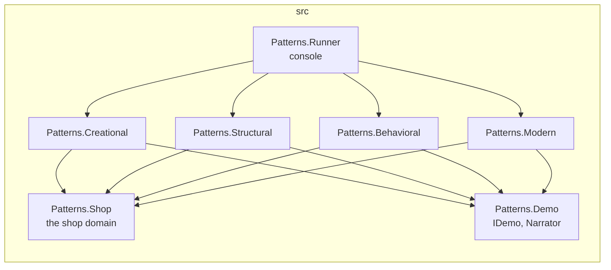
```mermaid
flowchart LR
    subgraph src
        Shop[Patterns.Shop<br/>the shop domain]
        Demo[Patterns.Demo<br/>IDemo, Narrator]
        Cre[Patterns.Creational]
        Str[Patterns.Structural]
        Beh[Patterns.Behavioral]
        Mod[Patterns.Modern]
        Run[Patterns.Runner<br/>console]
    end
    Cre --> Shop
    Cre --> Demo
    Str --> Shop
    Str --> Demo
    Beh --> Shop
    Beh --> Demo
    Mod --> Shop
    Mod --> Demo
    Run --> Cre
    Run --> Str
    Run --> Beh
    Run --> Mod
```

An arrow means "references". `Patterns.Shop` and `Patterns.Demo` reference nothing, so every pattern can use them and they can never depend on a pattern.

| Project | What it holds | References |
|---|---|---|
| `Patterns.Shop` | The shop domain shared by every example: `Product`, `Category`, `Customer`, `Address`, `Order`, `OrderLine`, `OrderStatus`, and `SampleData` (section [3.8](#38-the-shop)). | nothing |
| `Patterns.Demo` | The contract every demo implements (`IDemo`), the relevance marks, and `Narrator`, which prints the levels in a uniform format. | nothing |
| `Patterns.Creational` | Singleton, Factory Method, Abstract Factory, Builder, Prototype. | Shop, Demo, Microsoft DI (dependency injection) container |
| `Patterns.Structural` | Adapter, Bridge, Composite, Decorator, Facade, Flyweight, Proxy. | Shop, Demo, Microsoft Logging, Configuration |
| `Patterns.Behavioral` | Chain of Responsibility, Command, Interpreter, Iterator, Mediator, Memento, Observer, State, Strategy, Template Method, Visitor. | Shop, Demo, Microsoft DI, ASP.NET Core (to run real middleware in memory) |
| `Patterns.Modern` | Dependency Injection, Options, Repository, Unit of Work, Specification, Result, Null Object, Object Pool. | Shop, Demo, Microsoft DI, Options, Configuration, Logging, ObjectPool |
| `Patterns.Runner` | The console program that lists and runs the demos. | the four category projects |

The tests live in `tests/`: one project per category (`Patterns.Creational.Tests`…), `Patterns.Runner.Tests` and `Patterns.ArchitectureTests` (section [2.5](#25-kinds-of-tests)).

Why one project per **category** and not one per pattern? Thirty-one projects of two or three files each would be mostly ceremony. The price of sharing a project is that the compiler would let one pattern use another; an architecture test forbids it instead (section [2.6](#26-rules-enforced-by-tests)).

### 2.2 Root build files

Four files at the root apply to every project, so each is written once. MSBuild, the engine behind `dotnet build`, finds `Directory.Build.props` and `Directory.Packages.props` by walking up from each project's folder; the compiler and the editor find `.editorconfig` the same way; the `dotnet` command finds `global.json` walking up from the folder you run it in.

**`Directory.Build.props`** — compiler settings for every project:

| Setting | Effect |
|---|---|
| `TargetFramework` `net10.0` | Every project targets .NET 10. |
| `Nullable` `enable` | Reference types are non-nullable unless marked `?`; the compiler warns when `null` can sneak in. |
| `ImplicitUsings` `enable` | Common namespaces (`System`, `System.Linq`, `System.Collections.Generic`…) are imported automatically. |
| `TreatWarningsAsErrors` `true` | A warning stops the build. Warnings that nobody fixes accumulate until nobody reads them. |
| `AnalysisLevel` `latest-recommended` | Turns on the recommended set of .NET code analyzers. An **analyzer** is a compiler plug-in that inspects your code and reports problems; these rules are named `CAxxxx` (code analysis), for example CA1305 "specify a culture when formatting". |
| `EnforceCodeStyleInBuild` `true` | Style rules from `.editorconfig` (rules named `IDExxxx`, after IDE: integrated development environment) are checked during the build, not only in the editor. |
| `InvariantGlobalization` `true` | The programs behave the same on every machine's language settings: `12.50` never prints as `12,50`. |
| `ManagePackageVersionsCentrally` `true` | Package versions live in one file (next row). |

**`Directory.Packages.props`** — **central package management**: the only place where package versions are written. A `.csproj` lists `<PackageReference Include="xunit.v3" />` without a version. Every project therefore uses exactly the same version of each library.

**`.editorconfig`** — formatting and style rules (indentation, file-scoped namespaces, `_camelCase` private fields, braces always…), read by the editor, the build and `dotnet format`. One rule is relaxed on purpose: **IDE0130** normally asks the namespace to match the folder, but pattern folders are numbered (`1-Classic`) for reading order, and a namespace cannot contain `1-`. The namespace drops the number (`Patterns.Behavioral.Strategy.Classic`).

**`global.json`** — the SDK version (section [1.1](#11-the-net-sdk)).

### 2.3 The folder of a pattern

Every pattern has the same shape. Strategy, for example:

```
src/Patterns.Behavioral/Strategy/
  README.md          relevance, intent, what to read first, levels, run command, link to this guide
  0-Problem/         namespace Patterns.Behavioral.Strategy.Problem   (essential and useful patterns only)
  1-Classic/         namespace Patterns.Behavioral.Strategy.Classic
  2-DotNet/          namespace Patterns.Behavioral.Strategy.DotNet
  StrategyDemo.cs    namespace Patterns.Behavioral.Strategy           (what the runner executes)
```

**The levels never share the pattern's own types.** If Problem and Classic both need a "shipping calculator", each level declares its own. That duplication is deliberate: each level must be readable on its own, and comparing two files side by side is the point. The one exception is "someone else's code" that the pattern wraps or coordinates (the carrier SDK in Adapter, the subsystems in Facade, the image store in Proxy): it lives in its own sub-folder of the pattern and every level uses the same one, because in real life you could not change it either. Types that a pattern needs and the shop does not have (a carrier client, a notifier, a bundle…) live in the pattern's folder, not in `Patterns.Shop`.

**Comments are part of the lesson.** Three kinds appear in pattern code:

```csharp
// Role: ConcreteStrategy — prices express shipping: a fixed fee plus one euro per unit.
// Guide: §6.9
public sealed class ExpressShipping : IShippingStrategy
{
    public decimal CostFor(Order order) => 9.99m + 1.00m * order.Units;
}
```

```csharp
public decimal CostFor(Order order, string method) => method switch
{
    "standard" => order.Total >= 50.00m ? 0.00m : 4.99m,
    "express" => 9.99m + 1.00m * order.Units,
    "pickup" => 0.00m,
    // PAIN: every new carrier means another case here, and this method's tests change with it.
    _ => throw new ArgumentException($"Unknown shipping method '{method}'."),
};
```

- `// Role:` names the role the class plays in the pattern (the names are the ones used in the pattern's class diagram) and says, in a few words, what it does in the shop.
- `// Guide: §N.M` points to the section of this guide that explains it.
- `// PAIN:` marks, in Problem code only, the exact spot that hurts and why.

Other comments explain **why** something is done, never *what* the next line does.

### 2.4 The runner

`Patterns.Runner` is a console program. Every pattern exposes one **demo**, a class implementing `IDemo`:

```csharp
public interface IDemo
{
    string Key { get; }               // "strategy": what you type after `--`
    string Name { get; }              // "Strategy"
    PatternCategory Category { get; } // Creational, Structural, Behavioral, Modern
    Relevance Relevance { get; }      // Essential, Useful, Niche, Historical
    string GuideSection { get; }      // "§6.9"
    void Run(TextWriter output);
}
```

`Run` writes to the `TextWriter` it receives, not to `Console`, so a test can capture and check the output. Each category project lists its demos in a static `Demos.All`, and the runner simply concatenates the four lists: there is no reflection or scanning, so following how a demo gets run takes one "go to definition".

| Command | What happens |
|---|---|
| `dotnet run --project src/Patterns.Runner` (or `-- list`) | Lists the patterns by category with their relevance mark and key. |
| `-- <key>` | Runs that demo. The key is trimmed and case-insensitive: `Strategy`, `strategy` and `STRATEGY` are the same. |
| `-- all` | Runs every demo, in the order of this guide. |
| anything else | Prints `Unknown pattern '<what you typed>'.` and the list, and exits with code 1 (so scripts can detect the mistake). |

A demo narrates through `Narrator`, so every demo looks the same. Strategy's output looks like this:

```
═══ Strategy (Behavioral · ⭐⭐⭐ Essential) · guide §6.9 ═══
── Level 0 · Problem ──
  → Shipping for 3 books (37.50) through one method with a switch on the method name
    = standard 4.99 · express 12.99 · pickup 0.00
── Level 1 · Classic ──
  → The same order, priced by three strategy objects behind IShippingStrategy
    = standard 4.99 · express 12.99 · pickup 0.00
── Level 2 · .NET ──
  → The strategies registered as keyed services and picked by name from the container
    = standard 4.99 · express 12.99 · pickup 0.00
  ✔ Same prices at every level: the pattern changes where the rules live, not what they compute.
```

`→` is a step the demo takes, `=` its result, `✔` the takeaway.

### 2.5 Kinds of tests

Tests use **xUnit v3** with its plain `Assert` class, run by **Microsoft.Testing.Platform** (`dotnet test`). Four kinds, each with a different job:

| Kind | Where | What it proves | Example |
|---|---|---|---|
| **Equivalence** | `Patterns.<Category>.Tests` | With the same input, Problem, Classic and .NET give the same result. A pattern changes the *structure* of the code, not its *behaviour*; these tests make that visible. | Shipping for 3 books is `4.99` / `12.99` / `0.00` in all three levels. |
| **Pattern behaviour** | `Patterns.<Category>.Tests` | What makes the pattern the pattern, including the edge cases. | Undo three times empties the cart (Command); shipping an order that is not paid throws (State); applying the coupon before or after VAT (value-added tax) gives different prices (Decorator). |
| **Runner** | `Patterns.Runner.Tests` | Every demo runs and writes output; the catalog holds exactly the expected patterns with their relevance; keys are unique; an unknown key exits with 1. | `UnknownKey_PrintsErrorAndList_Returns1` |
| **Architecture** | `Patterns.ArchitectureTests` | The structural rules of the repository (next section). | `Pattern_DoesNotUseAnotherPattern` |

Test names describe the behaviour, with underscores separating the parts: `Standard_AtExactly50_IsFree` reads as "standard shipping, at exactly 50, is free". The tests of a pattern are written **before** its code (TDD, Test-Driven Development: write a failing test, make it pass, clean up).

### 2.6 Rules enforced by tests

Some rules cannot be expressed with project references alone, so `Patterns.ArchitectureTests` checks them with **ArchUnitNET**, a library that loads the compiled assemblies and asserts who uses whom. One test per rule, named after the rule:

| Rule (test name) | Why it exists |
|---|---|
| `Shop_DependsOnNothing` | The shop is shared by every pattern. If it used a pattern, changing that pattern could break all the others. |
| `Demo_DependsOnNothing` | The demo contract must stay a neutral, tiny contract. |
| `Pattern_DoesNotUseAnotherPattern` | Each pattern must be understandable alone. Patterns share a project per category, so the compiler would allow it; this test does not. |
| `Classic_DoesNotUseProblem`, `DotNet_DoesNotUseProblem` | The Problem level is the "before" picture; the solutions must not lean on it. |
| `Classic_DoesNotUseMicrosoftExtensions` | "By hand" means by hand: the Classic level uses only the base class library, so every moving part of the pattern is visible. |
| `PatternCode_DoesNotUseThirdPartyLibraries` | The code shows the patterns and what .NET provides, nothing else. Third-party libraries (MediatR, AutoMapper, Scrutor…) are named in the guide, never referenced. |

If a change makes one of these tests fail, the design is what changes, never the test.

---

## 3. Foundations

Before the first pattern: what a pattern is (and is not), why some of the classic ones have aged, how to read the diagrams of this guide, the principles every pattern leans on, the risk of using patterns for their own sake, and the shop that every example uses.

### 3.1 What a design pattern is

A **design pattern** is a named, proven solution to a problem that keeps coming back when you design code, described in a way you can adapt to your own situation. It is a **description**, not a piece of code or a library: you cannot install Strategy, you recognise the situation and shape your classes after it.

The idea comes from building architecture. In the 1970s the architect Christopher Alexander catalogued recurring solutions for towns and houses ("a window place", "light on two sides of every room"), each with a name, the problem it solves and the forces that shape it. Programmers borrowed the format in the late 1980s.

Every pattern has four parts:

| Part | What it says | Strategy, for example |
|---|---|---|
| **Name** | A word to talk about the design. | "Strategy" |
| **Problem** | When to apply it: the situation and the forces in tension. | One task (pricing shipping) has several interchangeable ways of being done, and new ways keep arriving. |
| **Solution** | The classes, their roles and how they collaborate; a template, not finished code. | Each way becomes a class behind a common interface; the code that needs the price receives one of them. |
| **Consequences** | What you gain and what you pay. | Adding a way no longer edits existing code; you pay with more types and an extra indirection. |

The name is the most underrated part. "Wrap the repository in a caching decorator" is one sentence that carries a whole design: everyone who knows the vocabulary knows which interface, which classes and which call order you mean. That shared vocabulary, more than any line of code, is what you take from this playground.

A pattern is **not**:
- a **goal**: nobody is paid to "use patterns"; they are paid to make code that is easy to change;
- a **recipe to copy**: the structure adapts to the language and the problem (most patterns look different in C# 14 than in 1994's C++);
- **always an improvement**: every pattern adds types and indirection. Section [3.6](#36-patternitis) is about that cost.

### 3.2 Pattern, idiom, architecture

Patterns exist at different scales. This playground is about the middle one.

| Scale | What it organises | Examples | Where you learn it |
|---|---|---|---|
| **Idiom** | A few lines, in one language. | `using` to dispose resources, `TryParse` instead of exceptions, `is not null`, `?.` and `??`. | The language's documentation and code reviews. |
| **Design pattern** | A few classes and how they collaborate, in any object-oriented language. | Strategy, Decorator, Observer. | This guide. |
| **Architecture pattern** | The whole application: its big parts and the rules between them. | Layered, Clean/Hexagonal, Vertical slices, Microservices. | Architecture books (the sibling repository `architecture-playground`, if you have it). |

The boundaries are blurry: Dependency Injection is a design pattern that ends up shaping the architecture; middleware is a design pattern (Chain of Responsibility) that the ASP.NET Core architecture is built around. The useful question is not "which scale is this?" but "how many classes does this decision touch?".

### 3.3 The GoF book and why some patterns aged

In 1994 Erich Gamma, Richard Helm, Ralph Johnson and John Vlissides published *Design Patterns: Elements of Reusable Object-Oriented Software*. The four authors became known as the **Gang of Four** (**GoF**), and their 23 patterns, with examples in C++ and Smalltalk, are still the common vocabulary. They grouped them in three families, which are chapters 4–6 of this guide:

| Family | The question it answers | Chapter |
|---|---|---|
| **Creational** | Who creates an object, and how, so that the code using it does not depend on the concrete class? | [4](#4-creational-patterns) |
| **Structural** | How do we wrap and combine objects into larger structures? | [5](#5-structural-patterns) |
| **Behavioral** | Who does what, and how do objects talk to each other? | [6](#6-behavioral-patterns) |

The C++ of 1994 had no garbage collector, no lambdas, no generics in the modern sense, no interfaces as a separate concept, no reflection worth the name and no standard collection library. Many GoF patterns are partly **workarounds for missing language features**. In 1996 Peter Norvig showed that 16 of the 23 have simpler or invisible implementations in dynamic languages such as Lisp and Dylan, thanks to first-class functions and types, macros and multimethods (at least for some uses). C# and .NET have since absorbed many of them:

| Language or framework feature | Pattern it absorbed | What is left to learn |
|---|---|---|
| Delegates and lambdas (`Func<>`, `Action`) | Strategy, Command, Template Method (partly) | When a whole class still beats a lambda. |
| `IEnumerable<T>`, `foreach`, `yield return` | Iterator | How lazy enumeration works and when it bites. |
| `event`, `IObservable<T>` | Observer | Unsubscribing, and what happens when a subscriber throws. |
| Records and `with` | Prototype, Memento | Shallow vs deep copies. |
| Pattern matching (`switch` expressions) | Visitor (often), State (simple cases) | When a class hierarchy still wins. |
| The dependency injection container | Singleton, Factory Method, Abstract Factory (partly) | Lifetimes, and why a static singleton is now a smell. |
| The garbage collector and string interning | Flyweight (mostly) | Why it rarely matters in .NET. |

That table is why relevance marks exist (see the introduction). A 🕰 historical pattern is not useless: you still meet it in older code and in interviews, and knowing what the language does for you is part of knowing the language.

The GoF book did not cover patterns that became everyday .NET practice later: Dependency Injection, Options, Repository, Unit of Work, Specification, Result, Null Object, Object Pool. They are chapter [7](#7-modern-net-patterns).

### 3.4 How to read the diagrams

Each pattern has a **class diagram** (which types exist and how they relate) and a **sequence diagram** (what happens, in order, during one call). Both are drawn with **Mermaid**, a text format that GitHub and VS Code (with the extension of section [1.2](#12-vs-code-and-the-recommended-extensions)) turn into pictures.

**Class diagrams.** Every relation used in this guide, with the C# that produces it:

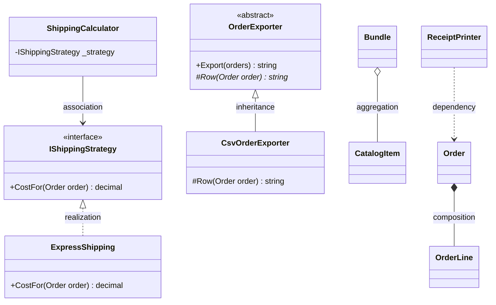
```mermaid
classDiagram
    class IShippingStrategy {
        <<interface>>
        +CostFor(Order order) decimal
    }
    class ExpressShipping {
        +CostFor(Order order) decimal
    }
    class OrderExporter {
        <<abstract>>
        +Export(orders) string
        #Row(Order order)* string
    }
    class CsvOrderExporter {
        #Row(Order order) string
    }
    class ShippingCalculator {
        -IShippingStrategy _strategy
    }
    IShippingStrategy <|.. ExpressShipping : realization
    OrderExporter <|-- CsvOrderExporter : inheritance
    ShippingCalculator --> IShippingStrategy : association
    Bundle o-- CatalogItem : aggregation
    Order *-- OrderLine : composition
    ReceiptPrinter ..> Order : dependency
```

| Relation | Arrow | Meaning | In C# |
|---|---|---|---|
| **Realization** | dashed line, hollow triangle | A class implements an interface. | `class ExpressShipping : IShippingStrategy` |
| **Inheritance** | solid line, hollow triangle | A class extends another class. | `class CsvOrderExporter : OrderExporter` |
| **Association** | solid line, open arrow | A class keeps a reference to another and uses it over time. | a field: `private readonly IShippingStrategy _strategy;` |
| **Aggregation** | solid line, hollow diamond on the owner's side | A "has" relation where the parts can live without the whole. | `Bundle` holds items that also exist outside it. |
| **Composition** | solid line, filled diamond on the owner's side | The parts belong to the whole and live and die with it. | An `Order`'s lines mean nothing without the order. |
| **Dependency** | dashed line, open arrow | A class uses another only briefly: a parameter, a local variable, a return type. | `string Print(Order order)` |

Inside a class box: `+` public, `-` private, `#` protected; `Name(parameters) ReturnType`; a trailing `*` marks an abstract member. `<<interface>>` and `<<abstract>>` above the name say what kind of type it is.

In pattern sections, the label above the name is the **role** the class plays in the pattern, using the GoF names (`<<Strategy>>`, `<<ConcreteStrategy>>`, `<<Context>>`). The same role appears in the class's `// Role:` comment, so you can go from the diagram to the code and back. Interfaces are recognisable by their `I` prefix.

**Sequence diagrams.** Time runs downwards. Each column is an object (a *participant*); a solid arrow is a call, a dashed arrow is the value returned; a note explains a step.

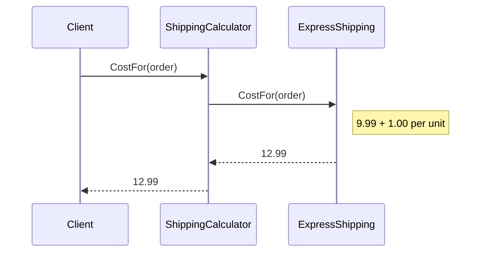
```mermaid
sequenceDiagram
    participant Client
    participant Calculator as ShippingCalculator
    participant Strategy as ExpressShipping
    Client->>Calculator: CostFor(order)
    Calculator->>Strategy: CostFor(order)
    Note right of Strategy: 9.99 + 1.00 per unit
    Strategy-->>Calculator: 12.99
    Calculator-->>Client: 12.99
```

Some sections also use a **flowchart** (boxes and arrows for a process) or a **state diagram** (the states something can be in and the events that move it between them; see the order life cycle in [3.8](#38-the-shop)).

### 3.5 The principles under the patterns

Patterns are concrete applications of a few general principles. When you understand the principle, the pattern stops being something to memorise.

#### SOLID

Five principles of object-oriented design gathered by Robert C. Martin; the initials spell SOLID.

| Principle | In plain words | In the shop | Patterns that lean on it |
|---|---|---|---|
| **S**ingle Responsibility | A class should have one reason to change. | Pricing shipping and sending the confirmation email change for different reasons (a new carrier, a new email template), so they belong in different classes. | Facade, Command, Observer |
| **O**pen/Closed | Open for extension, closed for modification: add behaviour by adding code, not by editing working code. | A new shipping method is a new class, not a new `case` in an existing `switch`. | Strategy, Decorator, Chain of Responsibility, Visitor |
| **L**iskov Substitution | Any implementation of an abstraction must work wherever the abstraction is expected, without surprises. | Every `IShippingStrategy` returns a non-negative price; one that threw for some countries would break code that trusts the interface. | Every pattern built on an interface |
| **I**nterface Segregation | Many small interfaces are better than one large one; no class should implement methods it does not need. | A notifier that only sends does not have to implement "read inbox". | Adapter, Bridge, Repository (specific vs generic) |
| **D**ependency Inversion | High-level code should depend on abstractions, not on concrete low-level classes; the details depend on the abstraction. | The checkout depends on `IEmailSender`, not on an SMTP (Simple Mail Transfer Protocol) client. | Dependency Injection, Factory Method, Abstract Factory, Adapter |

#### Composition over inheritance

**Inheritance** (`class B : A`) reuses code by becoming a kind of the parent: it is fixed at compile time, exposes the parent's protected internals to the child, and a class can only have one parent. **Composition** reuses code by *holding* another object and delegating to it: the held object can be swapped at run time and only its public contract is visible.

The GoF advice is "favour object composition over class inheritance". In the shop: an `ExpressCsvExporter : CsvExporter : OrderExporter` hierarchy explodes as soon as two independent things vary (format and filter); an exporter that *holds* a format object and a filter object does not. Decorator, Strategy, Bridge and Composite are all forms of composition. Template Method is the GoF pattern built on inheritance, and its section explains when that is still fine.

#### Program to an interface, not an implementation

Code that needs a service should know **what** it does (the interface), not **which class** does it. Then the class can change, be replaced in a test, or be wrapped, without touching the code that uses it. In C# this usually means depending on an interface (`IShippingStrategy`) or an abstract class, and receiving the concrete object from outside (section [7.1](#71-dependency-injection)).

"Interface" here means the contract, not necessarily the `interface` keyword: a `Func<Order, decimal>` is also a contract.

#### Encapsulate what varies

Find the part of the code that changes often or in different ways, and put it behind its own boundary so that the rest does not change with it. Almost every behavioral pattern is this principle applied to one kind of variation: *how* something is computed (Strategy), *what happens next* depending on the state (State), *who reacts* to an event (Observer), *which steps* run in a request (Chain of Responsibility).

#### Coupling and cohesion

- **Coupling** is how much one piece of code depends on another. High coupling means a change in one place forces changes in others. Patterns lower it by putting an abstraction between the two sides.
- **Cohesion** is how much the things inside one piece of code belong together. High cohesion means a class does one job and everything in it serves that job.

The goal is **low coupling and high cohesion**: small, focused pieces that know little about each other.

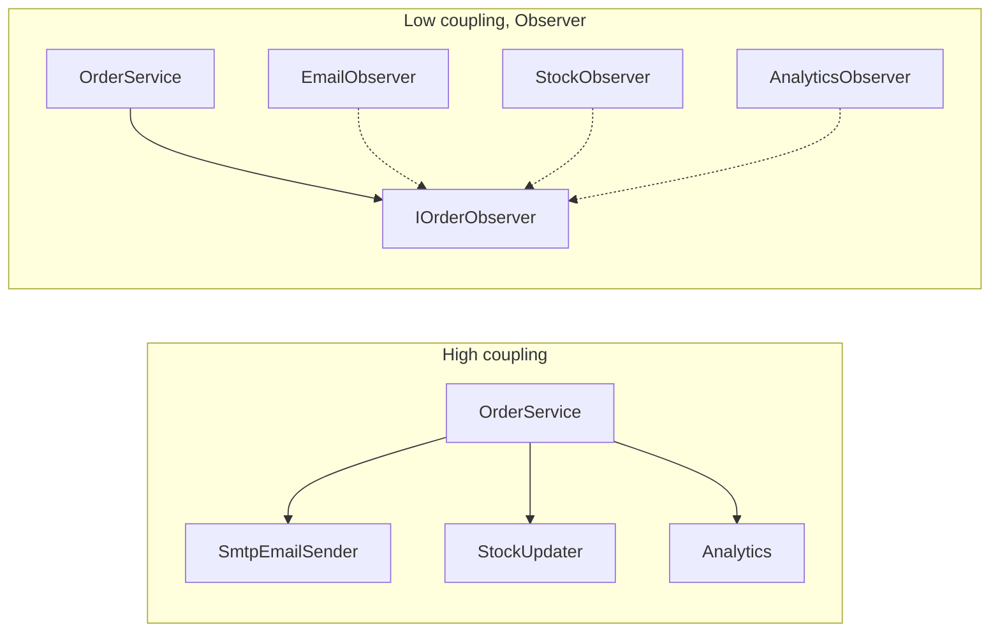
```mermaid
flowchart LR
    subgraph before [High coupling]
        OS1[OrderService] --> E1[SmtpEmailSender]
        OS1 --> S1[StockUpdater]
        OS1 --> A1[Analytics]
    end
    subgraph after [Low coupling, Observer]
        OS2[OrderService] --> P[IOrderObserver]
        E2[EmailObserver] -.-> P
        S2[StockObserver] -.-> P
        A2[AnalyticsObserver] -.-> P
    end
```

On the left, `OrderService` knows three concrete classes and changes whenever a new reaction to an order is added. On the right it knows one interface; reactions are added without touching it.

### 3.6 Patternitis

**Patternitis** is the habit of applying patterns because they exist, not because the code needs them. It is the most common way patterns make code worse. Symptoms:

- an interface with exactly one implementation, and no test or plan that needs a second one;
- a factory whose only job is to call `new`;
- a strategy for something that has had one behaviour for years;
- three classes and two interfaces where a `switch` of four lines was clear;
- a reader has to open five files to follow one call.

Every pattern trades **directness** for **flexibility**. Indirection is a cost paid every time someone reads, debugs or navigates the code; flexibility only pays when the change it prepares for actually happens.

Two rules of thumb keep the balance:

- **YAGNI** (*You Aren't Gonna Need It*): do not build for a change you only imagine. Write the simple version.
- **The rule of three**: the first time, just write it; the second time, notice the duplication; the third time, refactor. A pattern usually earns its place when the third variation arrives, not before.

The healthy direction is **refactoring towards a pattern** when the code starts to hurt, not designing with patterns up front. That is exactly the order of the levels in this playground: Problem first, then the pattern that removes the pain. Every pattern section has a "When NOT to use it" part with the simpler alternative.

### 3.7 How each pattern section is organised

Every pattern in chapters 4–7 follows the same template, so you always know where to look:

| # | Part | What it contains |
|---|---|---|
| 1 | **Card** | Relevance, family, intent in one sentence, other names, the levels in the code, the command to run its demo. |
| 2 | **The problem** | The situation in the shop, in plain language, and an analogy from everyday life. |
| 3 | **Without the pattern** | The code that hurts and what exactly hurts (from `0-Problem/`, or a snippet for niche and historical patterns). |
| 4 | **Structure** | The class diagram with the role names, and a table: role → our class → responsibility. |
| 5 | **How it runs** | A sequence diagram of one call. |
| 6 | **By hand** | The key code of `1-Classic/`, commented. |
| 7 | **In .NET** | What the framework gives you (`2-DotNet/`), and how it differs from the hand-written version. |
| 8 | **In the ecosystem** | Well-known libraries for the pattern and their licence (only when there are some). |
| 9 | **When to use it** | Concrete signals in your code. |
| 10 | **When NOT to use it** | Concrete signals that it is overkill, and the simpler alternative. |
| 11 | **Costs** | What you pay: more types, indirection, harder debugging… |
| 12 | **Relevance today** | The mark and why. |
| 13 | **Relatives** | What it is confused with and what it combines with (chapter 8 goes deeper). |
| 14 | **Try it** | The demo command and two or three experiments. |
| 15 | **Interview questions** | Two or three questions; click to reveal the answers. |

### 3.8 The shop

Every example happens in the same small **online shop**, so that you only have to learn the domain once. It is deliberately tiny: just enough for the patterns to have something real to work on. The types live in `src/Patterns.Shop` and depend on nothing.

| Type | What it is |
|---|---|
| `Category` | A product family: Books, Electronics, Home. |
| `Product` | Something the shop sells: an id, a name, a **SKU** (Stock Keeping Unit: the shop's own product code, like `BOOK-001`), a price, its category and the units in stock. |
| `Customer` | Who buys: a name, an email and whether they are a **guest** (bought without an account). |
| `Address` | Where an order is shipped. `Country` uses two-letter ISO (International Organization for Standardization) codes: `ES` Spain, `PT` Portugal, `FR` France. |
| `OrderLine` | One product in an order and how many units; `LineTotal` = price × quantity. |
| `Order` | A customer's purchase: its lines, the shipping address and its status. `Total` is the sum of the line totals; `Units` the number of items. |
| `OrderStatus` | Where the order is in its life: `Draft`, `Placed`, `Paid`, `Shipped`, `Cancelled`. |

All of them except the `OrderStatus` enum are C# **records**: types whose equality compares values instead of references, and which can be copied with changes using `with` (`order with { Status = OrderStatus.Paid }`). Money is `decimal` (exact for amounts, unlike `double`), in a single currency (euros), with at most two decimals. Ids are `Guid`s.

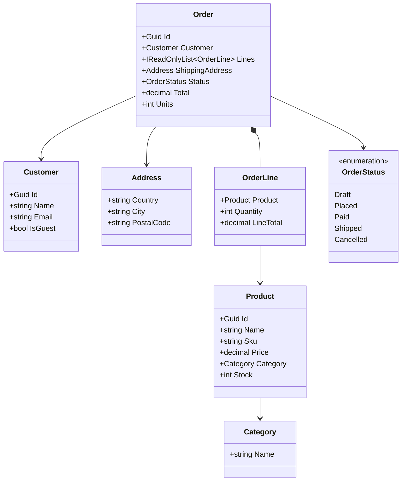
```mermaid
classDiagram
    class Category {
        +string Name
    }
    class Product {
        +Guid Id
        +string Name
        +string Sku
        +decimal Price
        +Category Category
        +int Stock
    }
    class Customer {
        +Guid Id
        +string Name
        +string Email
        +bool IsGuest
    }
    class Address {
        +string Country
        +string City
        +string PostalCode
    }
    class OrderLine {
        +Product Product
        +int Quantity
        +decimal LineTotal
    }
    class Order {
        +Guid Id
        +Customer Customer
        +IReadOnlyList~OrderLine~ Lines
        +Address ShippingAddress
        +OrderStatus Status
        +decimal Total
        +int Units
    }
    class OrderStatus {
        <<enumeration>>
        Draft
        Placed
        Paid
        Shipped
        Cancelled
    }
    Product --> Category
    OrderLine --> Product
    Order *-- OrderLine
    Order --> Customer
    Order --> Address
    Order --> OrderStatus
```

**Sample data.** `SampleData` gives every demo and test the same products, customers and addresses, with fixed product and customer ids so the output is stable (orders built with `OrderOf` get a new id each time):

| Name | Value |
|---|---|
| `SampleData.Book` | "Clean Code", SKU `BOOK-001`, **12.50**, Books, 20 in stock |
| `SampleData.Headphones` | "Wireless Headphones", SKU `ELEC-001`, **59.90**, Electronics, 5 in stock |
| `SampleData.Mug` | "Coffee Mug", SKU `HOME-001`, **8.00**, Home, **0 in stock** (the out-of-stock case, on purpose) |
| `SampleData.Ana` | A registered customer, `ana@example.com` |
| `SampleData.Guest` | A guest customer (no account, no email) |
| `SampleData.Madrid` | `ES`, Madrid, 28001 |
| `SampleData.Lisbon` | `PT`, Lisbon, 1100-148 |
| `SampleData.OrderOf((Book, 2), (Headphones, 1))` | A draft order for Ana, shipped to Madrid: total **84.90**, 3 units |

With those prices the numbers in the examples are easy to check by hand: 4 books are exactly 50.00, 8 books exactly 100.00.

**The order life cycle.** An order starts as a draft, is placed, paid and shipped; it can be cancelled until it has been shipped. Section [6.8](#68-state) (State) implements exactly this diagram three times.

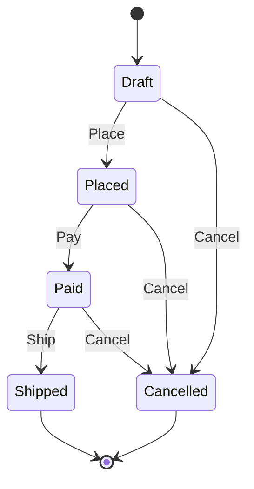
```mermaid
stateDiagram-v2
    [*] --> Draft
    Draft --> Placed : Place
    Placed --> Paid : Pay
    Paid --> Shipped : Ship
    Draft --> Cancelled : Cancel
    Placed --> Cancelled : Cancel
    Paid --> Cancelled : Cancel
    Shipped --> [*]
    Cancelled --> [*]
```

Any other move (paying a draft, shipping an order that is not paid, cancelling a shipped order) is an error.

---

## 4. Creational patterns

**Creational** patterns answer one question: **who decides which object gets created, and how**. Writing `new EmailNotifier()` in the middle of business code ties that code to one concrete class, one way of building it and one moment in time. Creational patterns move that decision somewhere else: to a subclass, to a factory object, to a step-by-step builder, or to a copy of an existing object.

In modern .NET most of these decisions belong to the **dependency injection (DI) container** (section [7.1](#71-dependency-injection)): you register *what* to create and *for how long it lives*, and the container builds the objects. That is why several patterns in this chapter look smaller in their .NET level than in their hand-written one.

| Pattern | Relevance | In one line |
|---|---|---|
| [4.1 Singleton](#41-singleton) | ⭐⭐ Useful | Exactly one instance of a class, reachable by everyone. Today: one instance **per container**, not a static field. |
| [4.2 Factory Method](#42-factory-method) | ⭐⭐ Useful | A method that subclasses (or a registration) override to decide which class to create. |
| [4.3 Abstract Factory](#43-abstract-factory) | ⭐ Niche | One object that creates a whole family of related objects that must match. |
| [4.4 Builder](#44-builder) | ⭐⭐⭐ Essential | Build a complex object step by step, and only hand it out when it is valid. |
| [4.5 Prototype](#45-prototype) | 🕰 Historical | Create an object by copying an existing one. Records and `with` absorbed it. |

### 4.1 Singleton

#### Card

| | |
|---|---|
| Relevance | ⭐⭐ Useful — the *idea* (one shared instance) is everywhere; the hand-written *static* version is an anti-pattern today |
| Family | Creational |
| Intent | Ensure a class has only one instance and give a global point of access to it. |
| Also known as | — |
| Levels | Problem · Classic · .NET |
| Run | `dotnet run --project src/Patterns.Runner -- singleton` |
| Code | [`src/Patterns.Creational/Singleton/`](../src/Patterns.Creational/Singleton/) |

#### The problem

The shop charges VAT (value-added tax), and the rate depends on the country: 21 % in Spain (`ES`), 23 % in Portugal (`PT`), 20 % in France (`FR`). The checkout, the receipt and the invoice all need the same table. Loading it once and sharing it is sensible: there is one truth, and building it again on every call is waste.

*Analogy:* an office has **one** official calendar of public holidays. Everybody reads the same one; nobody keeps a private copy that drifts out of date.

#### Without the pattern

The quickest way to share data is a public static field ([`0-Problem/`](../src/Patterns.Creational/Singleton/0-Problem/)):

```csharp
public static class VatRates
{
    // PAIN: public and mutable. Any code (and any test) can change a rate for everybody, and
    // tests that run in parallel see each other's changes.
    public static Dictionary<string, decimal> Rates { get; } = new()
    {
        ["ES"] = 0.21m, ["PT"] = 0.23m, ["FR"] = 0.20m,
    };
}
```

What hurts:

- **Shared mutable state.** `VatRates.Rates["ES"] = 0.99m` anywhere changes every price in the application. Nothing in the type stops it.
- **Hidden dependency.** A class that reads `VatRates.Rates` does not say so in its constructor; you find out by reading its body.
- **Untestable in isolation.** A test cannot give one class a different table; it has to change the global one and remember to put it back. The test `Problem_AnyoneCanChangeTheRates` does exactly that, with a `finally` to restore the value, and that `finally` *is* the pain.

#### Structure

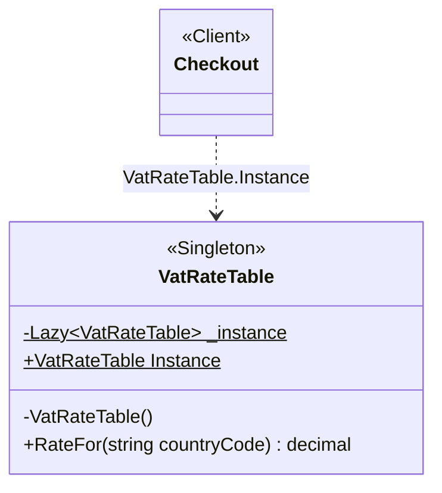
```mermaid
classDiagram
    class VatRateTable {
        <<Singleton>>
        -Lazy~VatRateTable~ _instance$
        +VatRateTable Instance$
        -VatRateTable()
        +RateFor(string countryCode) decimal
    }
    class Checkout {
        <<Client>>
    }
    Checkout ..> VatRateTable : VatRateTable.Instance
```

| Role | Our class | Responsibility |
|---|---|---|
| Singleton | `VatRateTable` | Holds the rates, prevents other instances (private constructor) and exposes the only one through `Instance`. |
| Client | whoever needs a rate | Reads `VatRateTable.Instance.RateFor("ES")`. |

`$` marks a static member.

#### How it runs

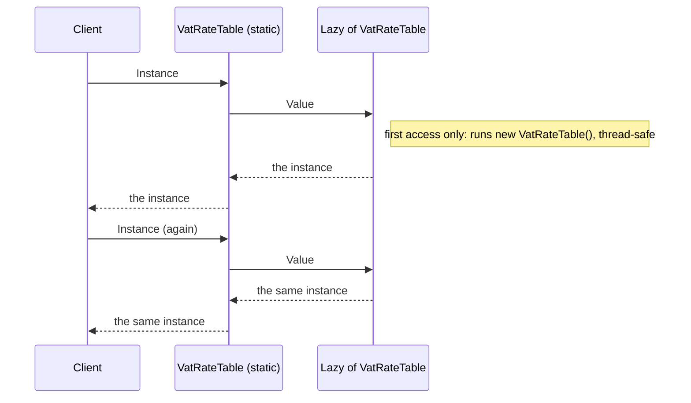
```mermaid
sequenceDiagram
    participant Client
    participant Type as VatRateTable (static)
    participant Lazy as Lazy of VatRateTable
    Client->>Type: Instance
    Type->>Lazy: Value
    Note right of Lazy: first access only: runs new VatRateTable(), thread-safe
    Lazy-->>Type: the instance
    Type-->>Client: the instance
    Client->>Type: Instance (again)
    Type->>Lazy: Value
    Lazy-->>Type: the same instance
    Type-->>Client: the same instance
```

#### By hand

```csharp
// Role: Singleton — the one VAT rate table of the application.
// Guide: §4.1
public sealed class VatRateTable
{
    // Lazy<T> creates the instance on first use and is thread-safe by default
    // (LazyThreadSafetyMode.ExecutionAndPublication): two threads never build two tables.
    private static readonly Lazy<VatRateTable> _instance = new(() => new VatRateTable());

    public static VatRateTable Instance => _instance.Value;

    private readonly Dictionary<string, decimal> _rates = new()
    {
        ["ES"] = 0.21m, ["PT"] = 0.23m, ["FR"] = 0.20m,
    };

    private VatRateTable() { } // private: nobody else can call new VatRateTable()

    public decimal RateFor(string countryCode)
    {
        var code = countryCode.Trim().ToUpperInvariant();
        return _rates.TryGetValue(code, out var rate)
            ? rate
            : throw new ArgumentException($"No VAT rate for country '{code}'."); // no paramName: it would append " (Parameter '…')" to the message
    }
}
```

Three things make it a Singleton: the **private constructor**, the **static field** that holds the one instance, and the **static accessor**. The rates are now private and read-only from outside, which fixes the first pain. The other two remain: `VatRateTable.Instance` is still a hidden, global dependency, and a test still cannot replace it.

Before `Lazy<T>` existed, people wrote "double-checked locking" by hand (`if (_instance == null) lock (...) if (_instance == null) ...`), which is easy to get subtly wrong. If laziness does not matter, `public static VatRateTable Instance { get; } = new();` is also thread-safe: the runtime runs static initializers once.

#### In .NET

In .NET you rarely write the pattern; you **register** a class as a singleton and the DI container enforces "only one" ([`2-DotNet/`](../src/Patterns.Creational/Singleton/2-DotNet/)):

```csharp
// The class is ordinary: public constructor, no static members.
public sealed class VatRateTable
{
    public decimal RateFor(string countryCode) { /* same as above */ }
}

public static class VatRatesServiceCollectionExtensions
{
    public static IServiceCollection AddVatRates(this IServiceCollection services) =>
        services.AddSingleton<VatRateTable>(); // one instance for the lifetime of this container
}

// Consumers ask for it in their constructor: the dependency is visible.
public sealed class Checkout(VatRateTable vatRates) { /* ... */ }
```

The important change of meaning: a DI singleton is **one instance per container**, not one per process. The same container always returns the same object; two containers return two different objects. That is exactly what tests need: each test builds its own container (or just calls `new VatRateTable()`) and nobody shares state. The tests `DotNet_OneContainer_ResolvesTheSameObject` and `DotNet_TwoContainers_HaveDifferentObjects` show both halves.

| | Static Singleton (Classic) | DI singleton (.NET) |
|---|---|---|
| "Only one" enforced by | the class itself (private constructor) | the container's registration |
| Scope | the whole process | one container |
| The dependency is | hidden (`VatRateTable.Instance` inside a method) | visible (a constructor parameter) |
| Replaceable in a test | no | yes: register another instance or pass one by hand |
| Lifetime can change later | rewrite the class | change `AddSingleton` to `AddScoped` |

`Lazy<T>` itself is worth knowing on its own: it is the standard way to create something expensive once, on first use, safely across threads.

#### When to use it

- The object is **stateless or read-only** (a rate table, a configuration snapshot, a `JsonSerializerOptions` instance, an `HttpClient` handler) and building it more than once is waste.
- It wraps something that must be **unique**: a cache shared by the whole application, a connection multiplexer.
- Use it through DI: `AddSingleton`, and receive it in constructors.

#### When NOT to use it

- **As a global variable.** If the reason is "so I can reach it from anywhere", that is the anti-pattern. Pass it in the constructor.
- **When it has mutable state per user or per request** (a cart, a current user): that is `AddScoped`, not a singleton. A singleton that holds per-request data mixes users' data.
- **Never hand-write the static version in new code** that has a DI container. Simpler alternative: an ordinary class registered with `AddSingleton`, or a `static readonly` field for a true constant.
- **When it depends on a scoped service:** a singleton that receives a scoped `DbContext` keeps it forever (a *captive dependency*, section [7.1](#71-dependency-injection)).

#### Costs

- The static version: global state, hidden coupling, tests that interfere with each other, and a class that controls its own lifetime (two responsibilities).
- The DI version: almost none, but its state is shared by every thread, so it must be thread-safe or immutable.

#### Relevance today

⭐⭐ **Useful.** "One shared instance" is one of the three lifetimes of every .NET application, so you meet the idea daily. The GoF implementation (private constructor + static accessor) is an **anti-pattern** in code with a DI container: you study it to recognise it in older code and to understand what `AddSingleton` replaced.

#### Relatives

- **Flyweight** ([5.6](#56-flyweight)) also shares instances, but *many* of them, one per distinct value; Singleton has exactly one.
- **Object Pool** ([7.8](#78-object-pool)) keeps several reusable instances and lends them out; a singleton is never "returned".
- **Abstract Factory** and **Facade** objects are often singletons.
- **Dependency Injection** ([7.1](#71-dependency-injection)) is what made the static Singleton unnecessary.

#### Try it

```bash
dotnet run --project src/Patterns.Runner -- singleton
```

1. In `SingletonTests`, remove the `finally` from `Problem_AnyoneCanChangeTheRates` and run the whole test class a few times: other tests start failing at random, depending on the order. That is shared mutable state.
2. In the DotNet level, change `AddSingleton` to `AddTransient` and run `DotNet_OneContainer_ResolvesTheSameObject`: it fails, because every resolution now builds a new table.
3. Add `["DE"] = 0.19m` to the Classic table and ask for `" de "`.

#### Interview questions

<details>
<summary>Why is the classic Singleton considered an anti-pattern today?</summary>

It is global state behind a static accessor: dependencies are hidden, the class controls its own lifetime, and tests cannot replace it or isolate from each other. A DI container gives the same "one instance" with a visible constructor dependency and one instance per container.
</details>

<details>
<summary>What is the difference between <code>AddSingleton</code> and the GoF Singleton?</summary>

`AddSingleton` means one instance *per container*, enforced by the registration; the class is ordinary and can be created by hand. The GoF Singleton means one instance *per process*, enforced by the class itself through a private constructor.
</details>

<details>
<summary>How do you make a lazy singleton thread-safe in C#?</summary>

Use `Lazy<T>` (thread-safe by default) or a static read-only field, which the runtime initializes exactly once. Avoid hand-written double-checked locking.
</details>

### 4.2 Factory Method

#### Card

| | |
|---|---|
| Relevance | ⭐⭐ Useful |
| Family | Creational |
| Intent | Define a method for creating an object, and let subclasses decide which class to create. |
| Also known as | Virtual Constructor |
| Levels | Problem · Classic · .NET |
| Run | `dotnet run --project src/Patterns.Runner -- factory-method` |
| Code | [`src/Patterns.Creational/FactoryMethod/`](../src/Patterns.Creational/FactoryMethod/) |

#### The problem

When an order ships, the shop tells the customer. Some customers want an email, some an SMS (Short Message Service, a text message). The code that sends the notification is the same in both cases: build the message, send it, record the result. Only **which notifier** is created changes.

Every level uses the same small shape, declared again inside each level:

```csharp
public enum NotificationChannel { Email, Sms }

public interface INotifier
{
    string Send(Customer customer, string message);
}
// EmailNotifier → "EMAIL to ana@example.com: Your order has shipped"
// SmsNotifier   → "SMS to Ana: Your order has shipped"
```

*Analogy:* a restaurant franchise has one procedure for serving a dish (plate it, check it, take it to the table). Each restaurant decides **which** dish its kitchen produces. The procedure is fixed; the "create the dish" step is left to each restaurant.

#### Without the pattern

From [`0-Problem/`](../src/Patterns.Creational/FactoryMethod/0-Problem/):

```csharp
public sealed class NotificationService
{
    public string Notify(NotificationChannel channel, Customer customer, string message)
    {
        // PAIN: the service knows every concrete notifier, and every new channel edits this method.
        INotifier notifier = channel switch
        {
            NotificationChannel.Email => new EmailNotifier(),
            NotificationChannel.Sms => new SmsNotifier(),
            _ => throw new ArgumentOutOfRangeException(nameof(channel)),
        };
        return notifier.Send(customer, message);
    }
}
```

What hurts: the "send" logic is mixed with the "which class" decision. Adding WhatsApp means editing a class whose real job is sending, and every class that needs a notifier repeats this `switch`.

A `switch` like this is **not always wrong**: with two channels that rarely change, it is the simplest thing that works (see "When NOT to use it").

#### Structure

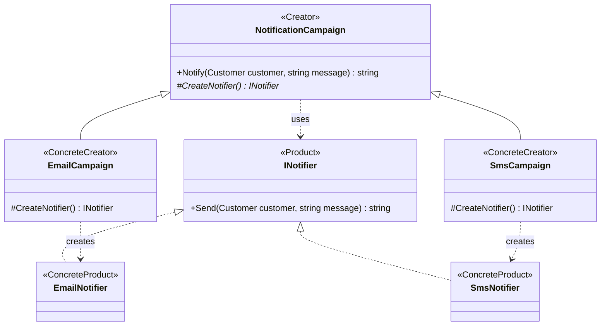
```mermaid
classDiagram
    class NotificationCampaign {
        <<Creator>>
        +Notify(Customer customer, string message) string
        #CreateNotifier()* INotifier
    }
    class EmailCampaign {
        <<ConcreteCreator>>
        #CreateNotifier() INotifier
    }
    class SmsCampaign {
        <<ConcreteCreator>>
        #CreateNotifier() INotifier
    }
    class INotifier {
        <<Product>>
        +Send(Customer customer, string message) string
    }
    class EmailNotifier {
        <<ConcreteProduct>>
    }
    class SmsNotifier {
        <<ConcreteProduct>>
    }
    NotificationCampaign <|-- EmailCampaign
    NotificationCampaign <|-- SmsCampaign
    INotifier <|.. EmailNotifier
    INotifier <|.. SmsNotifier
    NotificationCampaign ..> INotifier : uses
    EmailCampaign ..> EmailNotifier : creates
    SmsCampaign ..> SmsNotifier : creates
```

| Role | Our class | Responsibility |
|---|---|---|
| Creator | `NotificationCampaign` | Contains the logic that *uses* a notifier, and declares the factory method `CreateNotifier()`. |
| ConcreteCreator | `EmailCampaign`, `SmsCampaign` | Override the factory method to return their notifier. |
| Product | `INotifier` | What the factory method returns. |
| ConcreteProduct | `EmailNotifier`, `SmsNotifier` | The real notifiers. |

#### How it runs

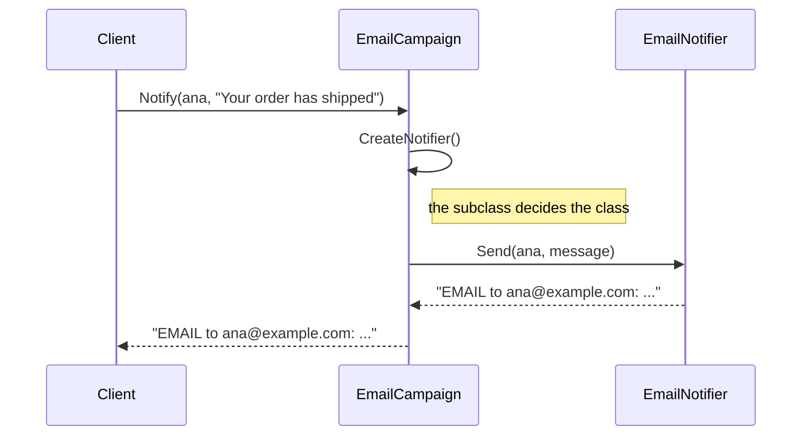
```mermaid
sequenceDiagram
    participant Client
    participant Campaign as EmailCampaign
    participant Notifier as EmailNotifier
    Client->>Campaign: Notify(ana, "Your order has shipped")
    Campaign->>Campaign: CreateNotifier()
    Note right of Campaign: the subclass decides the class
    Campaign->>Notifier: Send(ana, message)
    Notifier-->>Campaign: "EMAIL to ana@example.com: ..."
    Campaign-->>Client: "EMAIL to ana@example.com: ..."
```

#### By hand

```csharp
// Role: Creator — the notification logic, with the "which notifier" step left open.
// Guide: §4.2
public abstract class NotificationCampaign
{
    public string Notify(Customer customer, string message)
    {
        var notifier = CreateNotifier(); // the factory method: subclasses decide the class
        return notifier.Send(customer, message);
    }

    protected abstract INotifier CreateNotifier();
}

// Role: ConcreteCreator — campaigns that reach the customer by email.
public sealed class EmailCampaign : NotificationCampaign
{
    protected override INotifier CreateNotifier() => new EmailNotifier();
}

// Role: ConcreteCreator — campaigns that reach the customer by SMS.
public sealed class SmsCampaign : NotificationCampaign
{
    protected override INotifier CreateNotifier() => new SmsNotifier();
}
```

`Notify` no longer knows any concrete notifier; a new channel is a new subclass, and `NotificationCampaign` does not change. The pattern is Template Method ([6.10](#610-template-method)) applied to creation: the base class fixes the algorithm and one step of it is "create the object".

**Three things are called "factory"**, and only the first is the GoF pattern:

| Name | What it is | Example |
|---|---|---|
| **Factory Method** (GoF) | An overridable method; a *subclass* decides the class. | `CreateNotifier()` above. |
| **"A factory"** (everyday) | Any method, class or delegate whose job is to create objects. No inheritance needed. | `static INotifier Create(NotificationChannel c)`, a `Func<INotifier>`. |
| **Static factory method** | A static method used instead of a constructor, usually for a clearer name or caching. | `TimeSpan.FromMinutes(5)`, `Guid.NewGuid()`. |

#### In .NET

In modern .NET the decision "which class for this channel" usually moves into the **DI container**, using **keyed services** (.NET 8 and later): several implementations of the same interface, each registered under a key ([`2-DotNet/`](../src/Patterns.Creational/FactoryMethod/2-DotNet/)):

```csharp
services.AddKeyedSingleton<INotifier, EmailNotifier>(NotificationChannel.Email);
services.AddKeyedSingleton<INotifier, SmsNotifier>(NotificationChannel.Sms);

public sealed class NotificationService(IServiceProvider services)
{
    public string Notify(NotificationChannel channel, Customer customer, string message)
    {
        // The container is the factory: the registrations decide the class for each key.
        var notifier = services.GetRequiredKeyedService<INotifier>(channel);
        return notifier.Send(customer, message);
    }
}
```

A new channel is a new class plus one registration line; `NotificationService` does not change. An unregistered key throws `InvalidOperationException`. When the key is known at compile time, a constructor parameter is cleaner than asking the provider: `NotificationService([FromKeyedServices(NotificationChannel.Email)] INotifier notifier)`.

Other factories in the framework you already use:

- `ILoggerFactory.CreateLogger("Checkout")` creates a logger without you knowing which providers stand behind it.
- `IHttpClientFactory.CreateClient("carrier")` creates a configured `HttpClient` and manages the lifetime of its handlers.
- Every `services.AddSingleton<IX>(sp => new X(...))` registration is a factory delegate.

#### When to use it

- A class contains logic that is the same for every variant, and only **which object it creates** changes.
- You see the same `switch` that `new`s different classes in more than one place.
- You write a framework or library and want users to plug in their own class (the base class calls `CreateX()`, the user overrides it).
- In application code with a container, prefer keyed services or a factory delegate (a `Func<T>` you register yourself; the Microsoft container does not inject `Func<T>` automatically) over subclassing.

#### When NOT to use it

- **Two or three variants that rarely change**, created in one place: a `switch` expression is clearer.
- **Only to wrap `new`**: a factory whose method is `return new X();` with no decision in it is ceremony (section [3.6](#36-patternitis)). Let the container create it.
- **When subclassing the creator just to change the product** creates parallel hierarchies (one campaign per notifier). If that grows, inject the notifier (or a `Func<INotifier>`) instead.

#### Costs

- One subclass per product, and the two hierarchies grow together.
- Keyed services: a missing registration fails at run time, not at compile time; the tests have to cover each key.

#### Relevance today

⭐⭐ **Useful.** The subclass-based version shows up in frameworks and in older code; in applications, the container (keyed services, factory delegates, `ILoggerFactory`, `IHttpClientFactory`) does the job. Knowing the idea helps you read all of them.

#### Relatives

- **Abstract Factory** ([4.3](#43-abstract-factory)) is often a set of factory methods, one per product of a family. Comparison in [8.3](#83-factory-method-abstract-factory-builder).
- **Template Method** ([6.10](#610-template-method)): Factory Method is a template method whose step is "create".
- **Strategy** ([6.9](#69-strategy)) with keyed services looks the same in DI: there the key picks *a behaviour*, here *an object to create*.

#### Try it

```bash
dotnet run --project src/Patterns.Runner -- factory-method
```

1. Add a `Push` channel at each level. Count the files you touch: Problem edits the `switch`; Classic adds a subclass and a notifier; .NET adds a notifier and one registration.
2. Call the .NET `NotificationService` with `(NotificationChannel)99` and read the exception message.
3. Replace the Classic subclasses with a `NotificationCampaign(Func<INotifier> createNotifier)` constructor. What did you gain, and what did you lose?

#### Interview questions

<details>
<summary>What is the difference between Factory Method and a "simple factory"?</summary>

Factory Method is an overridable method in a class hierarchy: subclasses decide which product to create, and the base class uses it inside its own logic. A simple factory is just a method or class with a `switch` that creates objects; it involves no inheritance.
</details>

<details>
<summary>How do keyed services replace Factory Method in .NET?</summary>

Each implementation is registered under a key (`AddKeyedSingleton<INotifier, EmailNotifier>(NotificationChannel.Email)`) and the consumer resolves by key (`GetRequiredKeyedService` or `[FromKeyedServices]`). The registration decides the class, so the consumer and the base class no longer need subclasses.
</details>

### 4.3 Abstract Factory

#### Card

| | |
|---|---|
| Relevance | ⭐ Niche |
| Family | Creational |
| Intent | Provide an interface for creating families of related objects without naming their concrete classes. |
| Also known as | Kit |
| Levels | Classic · .NET |
| Run | `dotnet run --project src/Patterns.Runner -- abstract-factory` |
| Code | [`src/Patterns.Creational/AbstractFactory/`](../src/Patterns.Creational/AbstractFactory/) |

#### The problem

The shop takes payments through two providers: **card** and **wallet** (a digital wallet). Each provider needs three cooperating objects: a **charger** that takes the money and returns a transaction id, a **refunder** that gives it back, and a **receipt formatter**. The three must come from the **same** provider: refunding a card transaction through the wallet refunder is a bug.

*Analogy:* furniture sold in collections. If you pick the "oak" collection, the table, the chairs and the shelf all come in oak. You choose the collection once; you do not choose the wood piece by piece.

#### Without the pattern

```csharp
// The checkout picks every piece itself, by provider name.
IPaymentCharger charger = provider == "card" ? new CardCharger() : new WalletCharger();
IReceiptFormatter formatter = provider == "card" ? new CardReceiptFormatter() : new WalletReceiptFormatter();
// Nothing stops a mixed family: a card charger with a wallet formatter, after a typo in one line.
```

What hurts: the "which provider" decision is repeated once per object, the client knows six concrete classes, and nothing guarantees the pieces match.

#### Structure

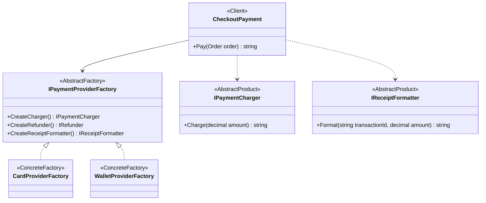
```mermaid
classDiagram
    class IPaymentProviderFactory {
        <<AbstractFactory>>
        +CreateCharger() IPaymentCharger
        +CreateRefunder() IRefunder
        +CreateReceiptFormatter() IReceiptFormatter
    }
    class CardProviderFactory {
        <<ConcreteFactory>>
    }
    class WalletProviderFactory {
        <<ConcreteFactory>>
    }
    class IPaymentCharger {
        <<AbstractProduct>>
        +Charge(decimal amount) string
    }
    class IReceiptFormatter {
        <<AbstractProduct>>
        +Format(string transactionId, decimal amount) string
    }
    class CheckoutPayment {
        <<Client>>
        +Pay(Order order) string
    }
    IPaymentProviderFactory <|.. CardProviderFactory
    IPaymentProviderFactory <|.. WalletProviderFactory
    CheckoutPayment --> IPaymentProviderFactory
    CheckoutPayment ..> IPaymentCharger
    CheckoutPayment ..> IReceiptFormatter
```

`IRefunder` (`Refund(string transactionId) : string`) is the third abstract product; it is left out of the diagram to keep it readable.

| Role | Our class | Responsibility |
|---|---|---|
| AbstractFactory | `IPaymentProviderFactory` | One creation method per product of the family. |
| ConcreteFactory | `CardProviderFactory`, `WalletProviderFactory` | Create the products of one provider; transaction ids start with `CARD` or `WALLET`. |
| AbstractProduct | `IPaymentCharger`, `IRefunder`, `IReceiptFormatter` | What each product can do. |
| ConcreteProduct | `CardCharger`, `WalletRefunder`, … | One per product per family. |
| Client | `CheckoutPayment` | Receives one factory and uses only the interfaces. |

#### How it runs

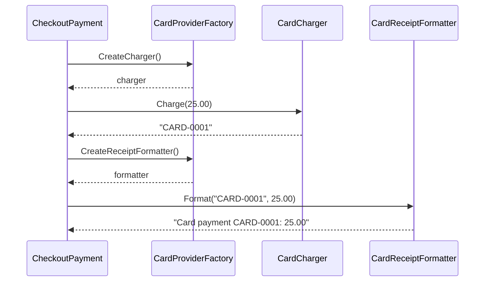
```mermaid
sequenceDiagram
    participant Client as CheckoutPayment
    participant Factory as CardProviderFactory
    participant Charger as CardCharger
    participant Formatter as CardReceiptFormatter
    Client->>Factory: CreateCharger()
    Factory-->>Client: charger
    Client->>Charger: Charge(25.00)
    Charger-->>Client: "CARD-0001"
    Client->>Factory: CreateReceiptFormatter()
    Factory-->>Client: formatter
    Client->>Formatter: Format("CARD-0001", 25.00)
    Formatter-->>Client: "Card payment CARD-0001: 25.00"
```

#### By hand

```csharp
// Role: AbstractFactory — creates the three objects of one payment provider.
// Guide: §4.3
public interface IPaymentProviderFactory
{
    IPaymentCharger CreateCharger();
    IRefunder CreateRefunder();
    IReceiptFormatter CreateReceiptFormatter();
}

// Role: ConcreteFactory — the card family. Everything it creates speaks "CARD".
public sealed class CardProviderFactory : IPaymentProviderFactory
{
    public IPaymentCharger CreateCharger() => new CardCharger();       // ids CARD-0001, CARD-0002…
    public IRefunder CreateRefunder() => new CardRefunder();           // rejects ids that are not CARD-…
    public IReceiptFormatter CreateReceiptFormatter() => new CardReceiptFormatter();
}

// Role: Client — knows the interfaces only; the family is decided by whoever passes the factory.
public sealed class CheckoutPayment(IPaymentProviderFactory provider)
{
    // Created once: the charger numbers its transactions (CARD-0001, CARD-0002…).
    private readonly IPaymentCharger _charger = provider.CreateCharger();
    private readonly IReceiptFormatter _formatter = provider.CreateReceiptFormatter();

    public string Pay(Order order)
    {
        var transactionId = _charger.Charge(order.Total);
        return _formatter.Format(transactionId, order.Total);
    }
}
```

Paying for two books: card gives `"Card payment CARD-0001: 25.00"`, wallet gives `"Wallet payment WALLET-0001: 25.00"`. `CardRefunder.Refund("WALLET-0001")` throws `ArgumentException`: the families protect themselves against mixing. Amounts are written with `CultureInfo.InvariantCulture`, so `25.00` never becomes `25,00` in an application running with a Spanish culture. (This repository runs with invariant globalization, section [2.2](#22-root-build-files), but code you copy elsewhere will not.)

The choice of family happens **once**, where the factory is created. Adding a "bank transfer" provider is a new factory and three products; `CheckoutPayment` does not change. Adding a fourth *product* to every family (say, a fraud checker) is the expensive direction: the interface and every factory change.

#### In .NET

The family is picked in DI, again with keyed services ([`2-DotNet/`](../src/Patterns.Creational/AbstractFactory/2-DotNet/)):

```csharp
services.AddKeyedSingleton<IPaymentProviderFactory, CardProviderFactory>("card");
services.AddKeyedSingleton<IPaymentProviderFactory, WalletProviderFactory>("wallet");

var factory = provider.GetRequiredKeyedService<IPaymentProviderFactory>("card");
var receipt = new CheckoutPayment(factory).Pay(order);
```

The framework's own Abstract Factory is **`DbProviderFactory`** from ADO.NET (the low-level database API under Entity Framework and Dapper). One factory per database engine creates the matching connection, command and parameter objects:

```csharp
DbProviderFactory factory = SqlClientFactory.Instance;   // or NpgsqlFactory.Instance, SqliteFactory.Instance…
using DbConnection connection = factory.CreateConnection()!;
using DbCommand command = factory.CreateCommand()!;
DbParameter parameter = factory.CreateParameter()!;
// Code written against DbConnection/DbCommand works with any engine; the factory keeps the family consistent.
```

That snippet is not coded in the repository (it needs a database driver), but it is the textbook example of the pattern in .NET.

#### When to use it

- Several objects must be **used together** and **change together** (one provider, one database engine, one UI, user interface, theme).
- The client must not know the concrete classes, and mixing families would be a bug.
- The set of products is stable, while new families appear.

#### When NOT to use it

- **Only one family exists** and no second one is planned: inject the objects directly.
- **The products are independent** of each other: inject each one separately (each with its own key if needed); grouping them in a factory adds nothing.
- **The set of products keeps changing:** every new product edits every factory. Simpler alternative: one keyed registration per product, with a shared key per family.

#### Costs

- Many types: one factory per family plus one class per product per family.
- Adding a product touches the interface and every concrete factory.

#### Relevance today

⭐ **Niche.** DI containers and keyed services cover most "pick an implementation" needs. The pattern still earns its place when a family *must* stay consistent, as `DbProviderFactory` shows; recognising it is enough for most developers.

#### Relatives

- **Factory Method** ([4.2](#42-factory-method)): an abstract factory is usually a set of factory methods. Comparison in [8.3](#83-factory-method-abstract-factory-builder).
- **Singleton** ([4.1](#41-singleton)): concrete factories hold no state, so they are registered as singletons.
- **Bridge** ([5.2](#52-bridge)): a factory can create the right implementor for an abstraction.

#### Try it

```bash
dotnet run --project src/Patterns.Runner -- abstract-factory
```

1. Add a `TransferProviderFactory` (prefix `TRANSFER`). How many files did you add, and how many existing ones changed?
2. Now add a fourth product, `IFraudChecker`, to every family. Compare the count with experiment 1.
3. Refund a wallet transaction with the card refunder and read the message.

#### Interview questions

<details>
<summary>What is the difference between Abstract Factory and Factory Method?</summary>

Factory Method creates one product and relies on a subclass to choose the class. Abstract Factory is an object that creates a whole family of related products and is passed to the client; switching the factory object switches the whole family at once.
</details>

<details>
<summary>Give an example of Abstract Factory in .NET.</summary>

`DbProviderFactory`: each database provider (`SqlClientFactory`, `NpgsqlFactory`, …) creates matching `DbConnection`, `DbCommand` and `DbParameter` objects.
</details>

### 4.4 Builder

#### Card

| | |
|---|---|
| Relevance | ⭐⭐⭐ Essential |
| Family | Creational |
| Intent | Separate the construction of a complex object from its representation, so it can be built step by step and only handed out when complete. |
| Also known as | — |
| Levels | Problem · Classic · .NET |
| Run | `dotnet run --project src/Patterns.Runner -- builder` |
| Code | [`src/Patterns.Creational/Builder/`](../src/Patterns.Creational/Builder/) |

#### The problem

An order has a customer, a shipping address, one or more lines, and optionally a gift note. Some combinations are invalid: an order without lines, or without an address. The shop builds orders in many places (the web checkout, the mobile app, imports, tests), and each place should not have to remember all the rules.

*Analogy:* ordering a custom sandwich. You say "wholemeal bread, add ham, add cheese, no tomato" one step at a time, and the sandwich is only handed over at the end, once it is complete. Nobody hands you half a sandwich.

#### Without the pattern

From [`0-Problem/`](../src/Patterns.Creational/Builder/0-Problem/):

```csharp
public sealed class MutableOrder
{
    public Customer? Customer { get; set; }
    public Address? ShippingAddress { get; set; }
    public List<OrderLine> Lines { get; } = [];

    // PAIN: an invalid order exists until someone remembers to call IsValid(), and every caller
    // must remember to.
    public bool IsValid() => Customer is not null && ShippingAddress is not null && Lines.Count > 0;
}
```

What hurts: the object is **invalid while it is being filled in**, and it can travel through the code in that state. Validation is a method someone has to remember to call, and the rules (what happens when the same product is added twice?) are scattered over every caller. The other classic way to avoid this, a constructor with every parameter, becomes unreadable once there are several optional values (the "telescoping constructor").

#### Structure

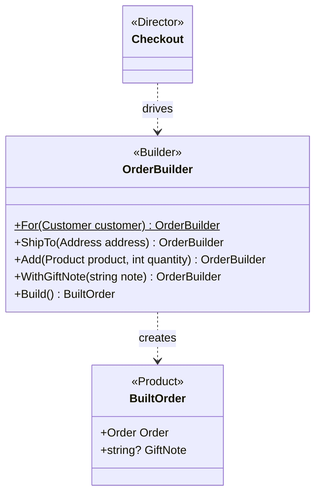
```mermaid
classDiagram
    class OrderBuilder {
        <<Builder>>
        +For(Customer customer)$ OrderBuilder
        +ShipTo(Address address) OrderBuilder
        +Add(Product product, int quantity) OrderBuilder
        +WithGiftNote(string note) OrderBuilder
        +Build() BuiltOrder
    }
    class BuiltOrder {
        <<Product>>
        +Order Order
        +string? GiftNote
    }
    class Checkout {
        <<Director>>
    }
    Checkout ..> OrderBuilder : drives
    OrderBuilder ..> BuiltOrder : creates
```

| Role | Our class | Responsibility |
|---|---|---|
| Builder | `OrderBuilder` | Collects the parts step by step, applies the rules, and creates the result only when it is valid. |
| Product | `BuiltOrder` (an `Order` plus the optional gift note) | The finished, valid, immutable object. |
| Director | whoever calls the steps (the checkout, a test) | Knows *which* steps to call, not how they work. |

The GoF version has an abstract `Builder` with several concrete builders producing different representations from the same steps. In C# the common form is a single **fluent builder**: each step returns the builder itself, so calls chain.

#### How it runs

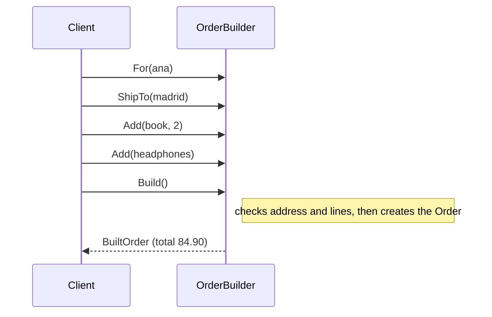
```mermaid
sequenceDiagram
    participant Client
    participant Builder as OrderBuilder
    Client->>Builder: For(ana)
    Client->>Builder: ShipTo(madrid)
    Client->>Builder: Add(book, 2)
    Client->>Builder: Add(headphones)
    Client->>Builder: Build()
    Note right of Builder: checks address and lines, then creates the Order
    Builder-->>Client: BuiltOrder (total 84.90)
```

#### By hand

```csharp
// Role: Builder — assembles an order step by step; an invalid order never leaves this class.
// Guide: §4.4
public sealed class OrderBuilder
{
    private readonly Customer _customer;
    private readonly List<OrderLine> _lines = [];
    private Address? _address;
    private string? _giftNote;

    private OrderBuilder(Customer customer) => _customer = customer;

    public static OrderBuilder For(Customer customer) => new(customer);

    public OrderBuilder ShipTo(Address address) { _address = address; return this; }

    public OrderBuilder Add(Product product, int quantity = 1)
    {
        ArgumentOutOfRangeException.ThrowIfLessThan(quantity, 1);
        var index = _lines.FindIndex(line => line.Product == product);
        if (index >= 0)
            _lines[index] = _lines[index] with { Quantity = _lines[index].Quantity + quantity }; // same product: add up
        else
            _lines.Add(new OrderLine(product, quantity));
        return this;
    }

    public OrderBuilder WithGiftNote(string note) { _giftNote = note; return this; }

    public BuiltOrder Build()
    {
        if (_address is null) throw new InvalidOperationException("An order needs a shipping address.");
        if (_lines.Count == 0) throw new InvalidOperationException("An order needs at least one line.");

        // A copy of the list: later calls on this builder cannot change the order already built.
        return new BuiltOrder(new Order(Guid.NewGuid(), _customer, [.. _lines], _address), _giftNote);
    }
}

// Usage: reads like the sentence it builds.
var built = OrderBuilder.For(SampleData.Ana)
    .ShipTo(SampleData.Madrid)
    .Add(SampleData.Book, 2)
    .Add(SampleData.Headphones)
    .Build(); // built.Order.Total == 84.90
```

The rules live in **one** place: adding a book twice merges the quantities, a quantity below 1 throws `ArgumentOutOfRangeException`, and `Build()` refuses an order without an address or lines with an exact message. The resulting `Order` is an immutable record, so it stays valid after `Build`.

**Builder's second face: the test data builder.** Tests need many orders that differ in one detail. Writing every field in every test hides the detail that matters. A *test data builder* (in the test project, not in production code) supplies sensible defaults and lets each test say only what is special:

```csharp
// Defaults: customer Ana, shipped to Madrid. The test states only what it is about.
var order = AnOrder.WithLines((SampleData.Book, 4)).ShippedTo(SampleData.Lisbon).Build();
```

When a new required field is added to `Order`, only `AnOrder` changes, not a hundred tests.

#### In .NET

The framework is full of builders. The DotNet level codes two of them ([`2-DotNet/`](../src/Patterns.Creational/Builder/2-DotNet/)):

**`StringBuilder`** builds a string from many pieces without creating a new string at every `+` (strings are immutable, so `a + b + c` in a loop copies everything again and again):

```csharp
public static string Print(Order order)
{
    var receipt = new StringBuilder();
    receipt.AppendLine(CultureInfo.InvariantCulture, $"Order for {order.Customer.Name}");
    foreach (var line in order.Lines)
    {
        receipt.AppendLine(CultureInfo.InvariantCulture,
            $"{line.Quantity} x {line.Product.Name} @ {line.Product.Price:0.00} = {line.LineTotal:0.00}");
    }
    receipt.Append(CultureInfo.InvariantCulture, $"Total: {order.Total:0.00}");
    return receipt.ToString(); // the one moment the final string is created
}
```

For two books and the headphones it produces exactly:

```
Order for Ana
2 x Clean Code @ 12.50 = 25.00
1 x Wireless Headphones @ 59.90 = 59.90
Total: 84.90
```

**`UriBuilder`** builds a valid URI (Uniform Resource Identifier, the general form of a web address) from parts, handling the separators for you:

```csharp
public static Uri For(Guid orderId) =>
    new UriBuilder(Uri.UriSchemeHttps, "track.example.com")
    {
        Path = $"orders/{orderId}",
        Query = "lang=en",
    }.Uri; // https://track.example.com/orders/<id>?lang=en
```

**`WebApplication.CreateBuilder(args)`** in ASP.NET Core is a builder on a large scale: you configure services, configuration and logging step by step, and `builder.Build()` produces the `WebApplication`. After `Build()`, the service registrations become read-only (you still add middleware and endpoints to the app), which is exactly the "only hand it out when complete" idea. `Host.CreateApplicationBuilder`, `ConfigurationBuilder` and `ImmutableArray.CreateBuilder<T>()` follow the same shape.

#### When to use it

- The object has **many optional parts**, or the constructor would need many parameters.
- The object must be **valid and immutable** once created, but is assembled over several steps.
- Construction has **rules** (merge duplicates, check required parts) that should live in one place.
- Tests build many variations of the same object: a test data builder.

#### When NOT to use it

- **Two or three required values:** a constructor or a record with required properties is enough.
- **Optional values without rules:** named arguments (`new Order(Id: …, Customer: ana, …)`) or object initializers with `required` and `init` properties already give named, readable construction without a builder class.
- **A builder that only copies values into a constructor**, with no rules and no steps, is ceremony.

#### Costs

- One more class per built type, which must be kept in sync with the product.
- A builder is mutable and usually not thread-safe; it is meant to be used once and thrown away.

#### Relevance today

⭐⭐⭐ **Essential.** You use `StringBuilder` and `WebApplication.CreateBuilder` in almost every project, and test data builders are one of the most useful tools for readable tests.

#### Relatives

- **Factory Method** and **Abstract Factory** create an object in one call; Builder assembles one over several. Comparison in [8.3](#83-factory-method-abstract-factory-builder).
- **Composite** ([5.3](#53-composite)): builders are a handy way to assemble trees.
- **Fluent interface**: Builder is the most common use of method chaining, but chaining alone (LINQ, for example) is not a builder.

#### Try it

```bash
dotnet run --project src/Patterns.Runner -- builder
```

1. Call `Build()` without `ShipTo` and read the message. Then try the same mistake with `MutableOrder`: nothing stops you.
2. Add the same book twice with quantities 1 and 3, and check that the order has one line with 4.
3. Remove `CultureInfo.InvariantCulture` from one `AppendLine` and build: analyzer CA1305 fails the build. This repository runs with invariant globalization (section [2.2](#22-root-build-files)), so you cannot switch to `es-ES` here; in an ordinary project that line would print `12,50` on a Spanish machine.

#### Interview questions

<details>
<summary>What problem does Builder solve that a constructor does not?</summary>

It assembles an object over several steps with rules between them (merge duplicates, required parts) and returns it only when it is valid, keeping the product immutable. It also avoids constructors with many optional parameters.
</details>

<details>
<summary>What is a test data builder?</summary>

A builder in the test project that gives every field a sensible default, so each test sets only the values it is about. Tests become shorter, state their intent, and survive changes to the built type.
</details>

<details>
<summary>Why use <code>StringBuilder</code> instead of string concatenation?</summary>

Strings are immutable: concatenating in a loop creates and copies a new string every time. `StringBuilder` appends into a growing buffer and creates the final string once, in `ToString()`.
</details>

### 4.5 Prototype

#### Card

| | |
|---|---|
| Relevance | 🕰 Historical — records and `with` do it for you |
| Family | Creational |
| Intent | Create new objects by copying an existing one (the prototype). |
| Also known as | Clone |
| Levels | Classic · .NET |
| Run | `dotnet run --project src/Patterns.Runner -- prototype` |
| Code | [`src/Patterns.Creational/Prototype/`](../src/Patterns.Creational/Prototype/) |

#### The problem

Some customers order the same things every month: coffee and a book, say. The shop keeps that as a **template** and creates each month's order from it. Building the order again from scratch every month repeats work; copying the template and changing what differs (the id, the delivery date) is simpler.

*Analogy:* a document template. You do not rewrite the company letterhead each time; you copy the template and edit the copy. Editing the copy must never change the template.

#### Without the pattern

```csharp
// Copying by hand, field by field, in the caller:
var next = new OrderTemplate { Name = template.Name, Lines = template.Lines };
next.Lines.Add(new OrderLine(SampleData.Mug, 1));
// Oops: Lines is the same List object, so the template now has the mug too.
```

What hurts: the caller must know every field of the class (and update every copy site when a field is added), and it is easy to copy a **reference** when you meant to copy the **thing**.

#### Structure

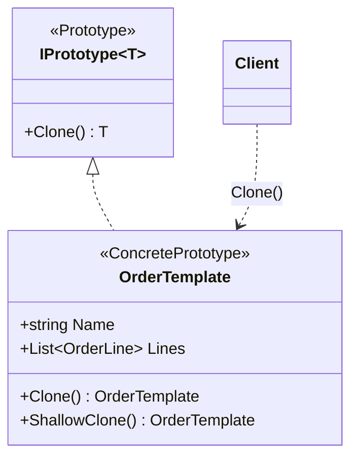
```mermaid
classDiagram
    class IPrototype~T~ {
        <<Prototype>>
        +Clone() T
    }
    class OrderTemplate {
        <<ConcretePrototype>>
        +string Name
        +List~OrderLine~ Lines
        +Clone() OrderTemplate
        +ShallowClone() OrderTemplate
    }
    class Client
    IPrototype~T~ <|.. OrderTemplate
    Client ..> OrderTemplate : Clone()
```

| Role | Our class | Responsibility |
|---|---|---|
| Prototype | `IPrototype<T>` | Declares `Clone()`. |
| ConcretePrototype | `OrderTemplate` | Knows how to copy itself correctly, including which parts must be copied and which can be shared. |
| Client | whoever needs a new order | Asks the prototype for a copy instead of calling a constructor. |

#### How it runs

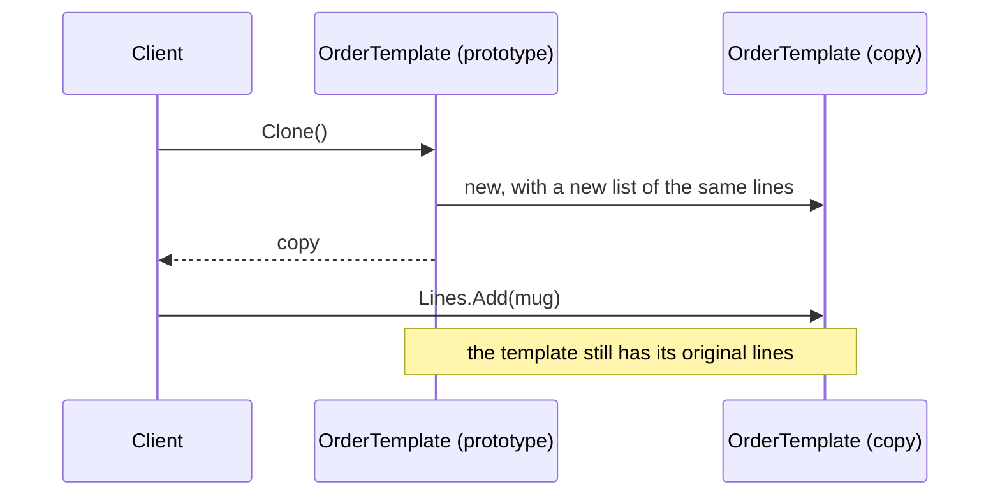
```mermaid
sequenceDiagram
    participant Client
    participant Template as OrderTemplate (prototype)
    participant Copy as OrderTemplate (copy)
    Client->>Template: Clone()
    Template->>Copy: new, with a new list of the same lines
    Template-->>Client: copy
    Client->>Copy: Lines.Add(mug)
    Note over Template,Copy: the template still has its original lines
```

#### By hand

```csharp
// Role: ConcretePrototype — a monthly order that knows how to copy itself.
// Guide: §4.5
public sealed class OrderTemplate : IPrototype<OrderTemplate>
{
    public required string Name { get; set; }
    public required List<OrderLine> Lines { get; init; }

    // Deep enough: a new list. The OrderLine records inside are immutable, so sharing them is safe.
    public OrderTemplate Clone() => new() { Name = Name, Lines = [.. Lines] };

    // MemberwiseClone copies the fields one by one: the copy gets the SAME list object.
    public OrderTemplate ShallowClone() => (OrderTemplate)MemberwiseClone();
}
```

**Shallow vs deep copy.** A **shallow copy** copies the object's fields as they are: value types (numbers, dates) are copied, but reference-type fields (a `List<T>`, another object) are copied as **references**, so the copy and the original point to the same list. A **deep copy** also copies what those references point to. The test `ShallowClone_SharesTheLines` adds a line to a shallow copy and finds it in the original too.

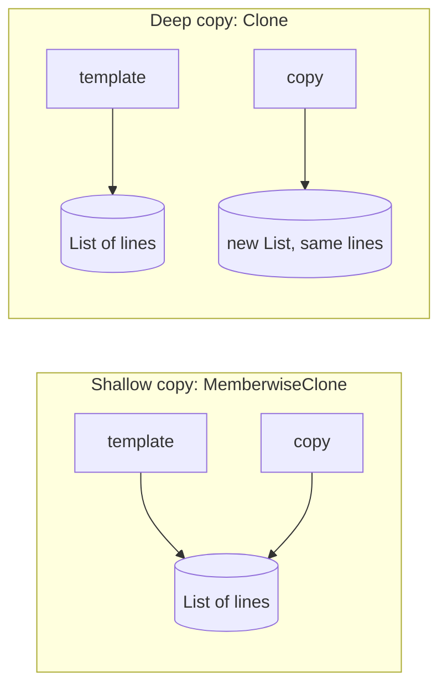
```mermaid
flowchart LR
    subgraph shallow [Shallow copy: MemberwiseClone]
        T1[template] --> L1[(List of lines)]
        C1[copy] --> L1
    end
    subgraph deep [Deep copy: Clone]
        T2[template] --> L2[(List of lines)]
        C2[copy] --> L3[(new List, same lines)]
    end
```

"Deep enough" is a judgment call: our `Clone` copies the list but shares the `OrderLine` records, because they are immutable and can never change under anyone's feet. Immutable parts never need copying.

#### In .NET

C# records have a built-in copy operation, `with`, that creates a new record with some properties changed ([`2-DotNet/`](../src/Patterns.Creational/Prototype/2-DotNet/)):

```csharp
// Guide: §4.5
public sealed record RecurringOrder(Guid Id, string Name, ImmutableArray<OrderLine> Lines, DateOnly NextDelivery);

var march = new RecurringOrder(Guid.NewGuid(), "Monthly coffee",
    [new OrderLine(SampleData.Mug, 1)], new DateOnly(2026, 3, 1));

// The prototype pattern in one expression: copy, then change what differs.
var april = march with { Id = Guid.NewGuid(), NextDelivery = march.NextDelivery.AddMonths(1) };
```

Careful: **`with` is a shallow copy** too. It works safely here because `ImmutableArray<OrderLine>` cannot be modified: sharing it between `march` and `april` is harmless. With a `List<OrderLine>` property, `with` would share the list and bring back the bug from "Without the pattern". Records plus immutable collections are what make Prototype disappear.

**Why `ICloneable` is discouraged.** .NET has had `ICloneable` since version 1.0, and Microsoft's design guidelines say not to implement it in public APIs:

- its contract does not say whether `Clone()` is **deep or shallow**, so callers cannot rely on either;
- it returns `object`, so every caller casts.

If you need a copy method, write one with a clear name and type (`Clone()` returning `OrderTemplate`, or `DeepCopy()`), or use a record.

#### When to use it

- Creating an object is expensive or complex, and you already have one that is almost what you need.
- You need many objects that differ in a few values from a template.
- In C#: use a **record with `with`** and immutable members; write a `Clone()` by hand only for mutable classes you cannot turn into records.

#### When NOT to use it

- **The object is cheap to create** from its constructor: just create it.
- **The type is a record with immutable members:** `with` already is the pattern. Do not write an `IPrototype<T>`.
- **The object graph is deep, mutable and has cycles:** hand-written deep copy is fragile. Rethink the design towards immutability, or serialize and deserialize as a last resort.

#### Costs

- Every class must implement copying correctly, and keep it correct when fields are added.
- The shallow-vs-deep decision is easy to get wrong and the bug is silent (two objects quietly share state).

#### Relevance today

🕰 **Historical.** In 1994 copying objects needed a pattern; in C# 9 and later, records and `with` give you the copy for free, and immutable collections make it safe. You study Prototype to understand shallow vs deep copies, which matters every day, and to read older code with `Clone()` methods.

#### Relatives

- **Memento** ([6.6](#66-memento)) also copies state, but to restore it later, not to create a new object.
- **Abstract Factory** ([4.3](#43-abstract-factory)) can keep a set of prototypes and clone them instead of calling constructors.
- **Flyweight** ([5.6](#56-flyweight)) shares one object on purpose; Prototype makes independent copies.

#### Try it

```bash
dotnet run --project src/Patterns.Runner -- prototype
```

1. Replace `ImmutableArray<OrderLine>` with `List<OrderLine>` in `RecurringOrder`, add a line to `april`, and look at `march`.
2. Records compare by value: `march == (march with { })` is `true`, and `march == april` is `false` because the id and date differ. (It works for `Lines` only because `with` shares the same `ImmutableArray`, which compares by array reference, not by content.)
3. Add a `DiscountPercent` property to `OrderTemplate` and forget to copy it in `Clone()`. Which test would have caught it?

#### Interview questions

<details>
<summary>What is the difference between a shallow and a deep copy?</summary>

A shallow copy duplicates the object but keeps the same references for its reference-type fields, so the copy and the original share those inner objects. A deep copy also duplicates the inner objects, so the two are independent.
</details>

<details>
<summary>Is the <code>with</code> expression a deep copy?</summary>

No, it is shallow: properties are copied as they are, so a mutable list would be shared. It is safe when the record's members are immutable.
</details>

<details>
<summary>Why should you not implement <code>ICloneable</code>?</summary>

Its contract does not say whether the copy is deep or shallow, and it returns `object`. Callers cannot rely on its behaviour, so Microsoft's guidelines recommend a clearly named, strongly typed copy method instead.
</details>

---

## 5. Structural patterns

**Structural** patterns are about **how objects are wrapped and combined** into larger structures: putting one object inside another to change its interface, add behaviour, control access, or treat a group like a single thing. Almost all of them are forms of composition (section [3.5](#35-the-principles-under-the-patterns)): an object holds another and forwards calls to it.

| Pattern | Relevance | In one line |
|---|---|---|
| [5.1 Adapter](#51-adapter) | ⭐⭐⭐ Essential | Make a class you cannot change fit the interface your code expects. |
| [5.2 Bridge](#52-bridge) | ⭐ Niche | Split two dimensions that vary independently into two hierarchies joined by a reference. |
| [5.3 Composite](#53-composite) | ⭐⭐ Useful | Treat a single item and a group of items through the same interface (trees). |
| [5.4 Decorator](#54-decorator) | ⭐⭐⭐ Essential | Wrap an object to add behaviour, keeping its interface; wrappers stack. |
| [5.5 Facade](#55-facade) | ⭐⭐⭐ Essential | One simple entry point in front of a set of subsystems. |
| [5.6 Flyweight](#56-flyweight) | 🕰 Historical | Share one object among many users instead of keeping thousands of identical copies. |
| [5.7 Proxy](#57-proxy) | ⭐⭐ Useful | A stand-in with the same interface that controls access to the real object. |

**The wrapper family.** Four of these patterns look almost identical in a class diagram: a class holds a reference to another and forwards calls. What differs is the **intent**:

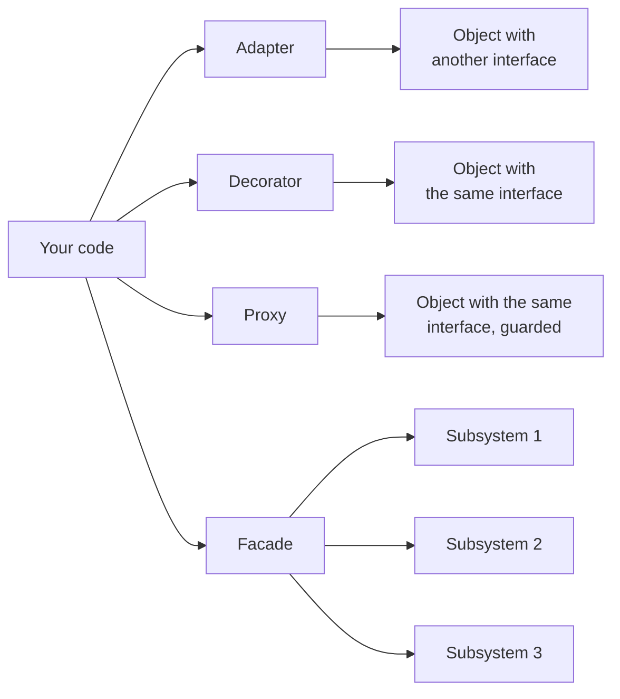
```mermaid
flowchart LR
    C[Your code] --> A[Adapter] --> X[Object with<br/>another interface]
    C --> D[Decorator] --> Y[Object with<br/>the same interface]
    C --> P[Proxy] --> Z[Object with the same<br/>interface, guarded]
    C --> F[Facade] --> S1[Subsystem 1]
    F --> S2[Subsystem 2]
    F --> S3[Subsystem 3]
```

- **Adapter** changes the interface (theirs → ours).
- **Decorator** keeps the interface and *adds* behaviour; you can stack several.
- **Proxy** keeps the interface and *controls access* (later, only for some users, somewhere else).
- **Facade** offers a *new, simpler* interface over *several* objects.

Section [8.1](#81-decorator-proxy-adapter-facade) compares them side by side.

### 5.1 Adapter

#### Card

| | |
|---|---|
| Relevance | ⭐⭐⭐ Essential |
| Family | Structural |
| Intent | Convert the interface of a class into the interface its clients expect, so classes that could not work together can. |
| Also known as | Wrapper |
| Levels | Problem · Classic · .NET |
| Run | `dotnet run --project src/Patterns.Runner -- adapter` |
| Code | [`src/Patterns.Structural/Adapter/`](../src/Patterns.Structural/Adapter/) |

#### The problem

The shop ships through an external carrier. The carrier gives us an old SDK (Software Development Kit, the library they publish to talk to their service) with one method, and a peculiar format: you send a text payload `"<country>;<units>;<totalCents>"` and receive `"PRICE=4.00;DAYS=2"`. We cannot change their code. Our code wants to ask a simple question in its own words: *"what does shipping this order cost, and how long does it take?"*

The carrier's rule (simulated in [`Adapter/External/`](../src/Patterns.Structural/Adapter/External/), which every level shares because it is "their" code): price `3.00 + 0.50 × units`; `2` days to Spain, `4` anywhere else. A malformed payload throws `FormatException`.

*Analogy:* a travel plug adapter. Your laptop's plug and the hotel's socket do not fit; the adapter sits between them and changes neither.

#### Without the pattern

From [`0-Problem/`](../src/Patterns.Structural/Adapter/0-Problem/):

```csharp
public sealed class CheckoutSummary(LegacyCarrierClient carrier)
{
    public string Describe(Order order)
    {
        // PAIN: our code speaks the carrier's private format. The same build-and-parse code lives in
        // OrderTracking too, and both break when the carrier changes its format.
        var cents = (int)(order.Total * 100);
        var answer = carrier.RequestQuote($"{order.ShippingAddress.Country};{order.Units};{cents}");
        var parts = answer.Split(';');
        var price = decimal.Parse(parts[0]["PRICE=".Length..], CultureInfo.InvariantCulture);
        var days = int.Parse(parts[1]["DAYS=".Length..], CultureInfo.InvariantCulture);
        return $"Shipping {price:0.00} in {days} days";
    }
}
```

What hurts: the carrier's format **leaks** into our classes, it is duplicated (`CheckoutSummary` and `OrderTracking` each have a copy), and a test of the checkout needs the carrier's SDK.

#### Structure

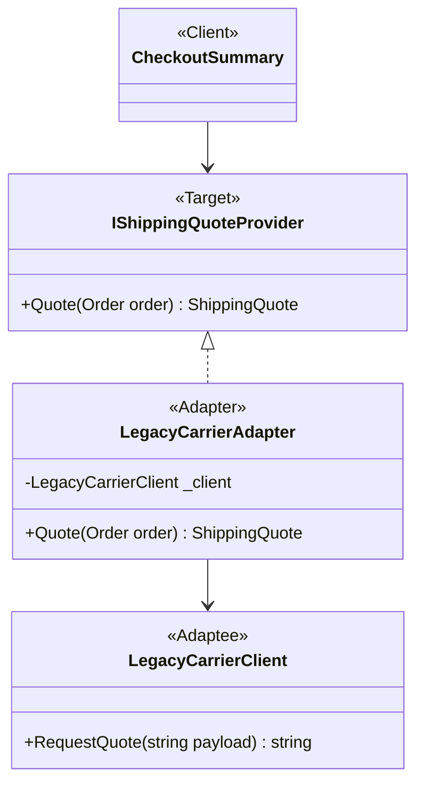
```mermaid
classDiagram
    class IShippingQuoteProvider {
        <<Target>>
        +Quote(Order order) ShippingQuote
    }
    class LegacyCarrierAdapter {
        <<Adapter>>
        -LegacyCarrierClient _client
        +Quote(Order order) ShippingQuote
    }
    class LegacyCarrierClient {
        <<Adaptee>>
        +RequestQuote(string payload) string
    }
    class CheckoutSummary {
        <<Client>>
    }
    CheckoutSummary --> IShippingQuoteProvider
    IShippingQuoteProvider <|.. LegacyCarrierAdapter
    LegacyCarrierAdapter --> LegacyCarrierClient
```

| Role | Our class | Responsibility |
|---|---|---|
| Target | `IShippingQuoteProvider` | The interface *our* code wants, in our words: `ShippingQuote Quote(Order)`. |
| Adaptee | `LegacyCarrierClient` | The existing class with the incompatible interface. We do not change it. |
| Adapter | `LegacyCarrierAdapter` | Implements the target by translating to and from the adaptee's format. |
| Client | `CheckoutSummary` | Uses the target only. |

`IShippingQuoteProvider` is also called a **port**: an interface owned by our code that describes what we need from the outside world. The adapter plugs the outside world into it.

#### How it runs

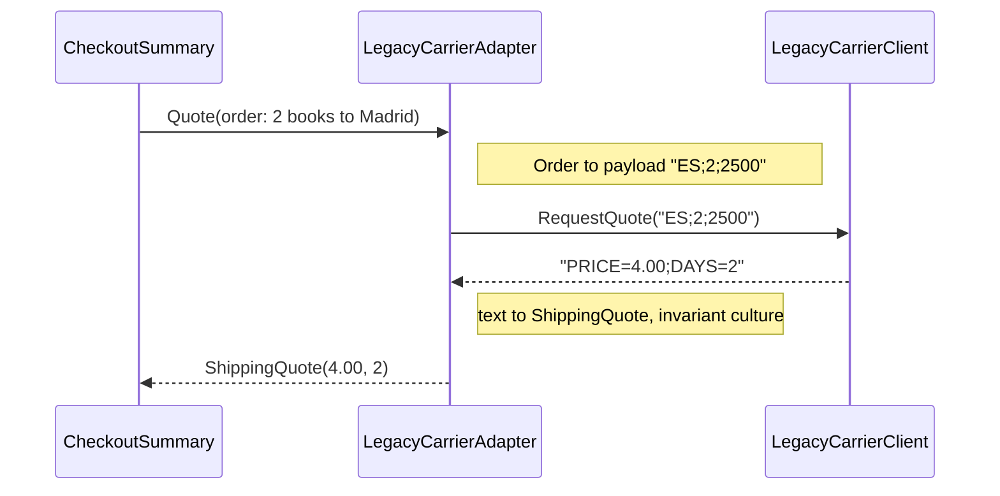
```mermaid
sequenceDiagram
    participant Client as CheckoutSummary
    participant Adapter as LegacyCarrierAdapter
    participant SDK as LegacyCarrierClient
    Client->>Adapter: Quote(order: 2 books to Madrid)
    Note right of Adapter: Order to payload "ES#59;2#59;2500"
    Adapter->>SDK: RequestQuote("ES#59;2#59;2500")
    SDK-->>Adapter: "PRICE=4.00#59;DAYS=2"
    Note right of Adapter: text to ShippingQuote, invariant culture
    Adapter-->>Client: ShippingQuote(4.00, 2)
```

#### By hand

```csharp
public sealed record ShippingQuote(decimal Price, int Days);

// Role: Target — what our code needs from a carrier, in our own terms.
public interface IShippingQuoteProvider
{
    ShippingQuote Quote(Order order);
}

// Role: Adapter — speaks the legacy carrier's text protocol so nobody else has to.
// Guide: §5.1
public sealed class LegacyCarrierAdapter(LegacyCarrierClient client) : IShippingQuoteProvider
{
    public ShippingQuote Quote(Order order)
    {
        var cents = (int)(order.Total * 100);
        var payload = string.Create(CultureInfo.InvariantCulture,
            $"{order.ShippingAddress.Country};{order.Units};{cents}");

        var fields = client.RequestQuote(payload)
            .Split(';')
            .Select(part => part.Split('='))
            .ToDictionary(pair => pair[0], pair => pair[1]);

        // InvariantCulture: the carrier always writes "4.00". Under a Spanish culture a plain
        // decimal.Parse would read "." as the thousands separator and return 400.
        return new ShippingQuote(
            decimal.Parse(fields["PRICE"], CultureInfo.InvariantCulture),
            int.Parse(fields["DAYS"], CultureInfo.InvariantCulture));
    }
}
```

Two books to Madrid give `ShippingQuote(4.00, 2)`; to Lisbon, `ShippingQuote(4.00, 4)`. The carrier's format now lives in **one** class. `CheckoutSummary` depends on `IShippingQuoteProvider`, so its tests use a fake provider, and switching carriers means writing a new adapter, not editing the checkout.

**Object adapter vs class adapter.** The GoF book describes two forms:

| | Object adapter | Class adapter |
|---|---|---|
| How | The adapter **holds** an adaptee and forwards to it (composition). | The adapter **inherits** from the adaptee and implements the target. |
| In C# | The normal form. | Rarely possible: C# has single class inheritance, and SDK classes are often `sealed`. |
| Can adapt | The adaptee and any subclass of it; the adaptee can be injected. | Only that one class. |

This repository, like almost all C#, uses object adapters.

#### In .NET

The framework uses adapters wherever two interfaces meet. The DotNet level codes **`StreamReader`** ([`2-DotNet/`](../src/Patterns.Structural/Adapter/2-DotNet/)): a `Stream` only knows bytes (`Read(byte[] buffer, …)`), while our code wants lines of text. `StreamReader` adapts the `Stream` interface to the `TextReader` one, decoding bytes into characters on the way:

```csharp
// Guide: §5.1
public static class CarrierRateFile
{
    // The carrier's rate file has one "<country>;<days>" per line, for example "ES;2\nPT;4".
    public static IReadOnlyDictionary<string, int> ReadDeliveryDays(Stream file)
    {
        // Adapter: bytes → text lines. leaveOpen: the caller owns the stream and disposes it.
        using var reader = new StreamReader(file, Encoding.UTF8, leaveOpen: true);
        var days = new Dictionary<string, int>();
        while (reader.ReadLine() is { } line)
        {
            var parts = line.Split(';');
            days[parts[0]] = int.Parse(parts[1], CultureInfo.InvariantCulture);
        }
        return days;
    }
}
```

Other adapters you meet in .NET:

- `StringReader` / `StringWriter`: a `string` seen as a `TextReader` / `TextWriter`.
- `PipeReader.AsStream()` / `PipeWriter.AsStream()` (`System.IO.Pipelines`): a pipe seen as a `Stream`, for APIs that only accept streams.
- Every *typed client* you write around an `HttpClient` to call an external API is an adapter, as is every class that wraps a vendor SDK behind one of your interfaces.

#### In the ecosystem

**AutoMapper** copies data between objects of different shapes (for example from a domain object to a DTO, a data transfer object, sent as JSON, JavaScript Object Notation). People sometimes call that "adapting", but it is a different thing: Adapter converts an **interface** (calls and behaviour) so two pieces of code can work together; mapping converts **data** from one shape to another. AutoMapper moved to a **commercial licence in 2025** (with a free tier for some users; check the current terms). Simpler alternatives: a hand-written mapping method (`ToDto()`), which is explicit and found by "go to definition", or a source generator such as **Mapperly** (Apache-2.0), which writes that method for you at compile time.

#### When to use it

- You must use a class you cannot change (an SDK, legacy code, a generated client) and its interface does not fit yours.
- You want your code to depend on **your** interface (a port) so the outside service can be replaced or faked in tests.
- Two existing interfaces must work together and neither can be changed.

#### When NOT to use it

- **You own both sides:** change one of them instead of adding a translator between them.
- **The external interface already fits** what you need: wrapping it "just in case" is an interface with one implementation that only forwards (section [3.6](#36-patternitis)).
- **You only need to copy data between shapes:** write a mapping method; you do not need an adapter class.

#### Costs

- One more class and interface per external dependency.
- The adapter must be kept in sync with the external format, and its translation can hide information (errors, extra fields) if done carelessly.

#### Relevance today

⭐⭐⭐ **Essential.** Every application that talks to an external service, a vendor SDK or legacy code needs adapters, and hexagonal ("ports and adapters") architectures are named after them.

#### Relatives

- **Facade** ([5.5](#55-facade)) also wraps, but it simplifies *several* objects behind a *new* interface; an adapter makes *one* object fit an *existing* interface. **Decorator** ([5.4](#54-decorator)) and **Proxy** ([5.7](#57-proxy)) keep the interface. Comparison in [8.1](#81-decorator-proxy-adapter-facade).
- **Bridge** ([5.2](#52-bridge)) separates abstraction and implementation *by design*; Adapter fixes a mismatch *after the fact*.

#### Try it

```bash
dotnet run --project src/Patterns.Runner -- adapter
```

1. Change the simulated carrier to answer `"PRICE=4,00;DAYS=2"`. Nothing throws: with the invariant culture `,` is the thousands separator, so the price silently becomes **400**. Find where you would have to fix it in each level (in Problem, count the copies).
2. Write a `FakeQuoteProvider` that always returns `ShippingQuote(0, 1)` and test `CheckoutSummary` with it. Try the same against the Problem version.
3. Feed `CarrierRateFile` a file with Windows line endings (`"ES;2\r\nPT;4"`). Does `ReadLine` handle it?

#### Interview questions

<details>
<summary>What is the difference between an object adapter and a class adapter?</summary>

An object adapter holds an instance of the adaptee and forwards to it (composition). A class adapter inherits from the adaptee and implements the target interface. C# code almost always uses object adapters because of single inheritance and sealed classes.
</details>

<details>
<summary>How is Adapter different from Facade?</summary>

Adapter makes one existing class fit an interface that already exists (yours). Facade designs a new, simpler interface over several classes. One converts, the other simplifies.
</details>

<details>
<summary>Is mapping a DTO to a domain object the Adapter pattern?</summary>

Not really. Adapter converts an interface, so code can call another object through it. Mapping converts data from one shape to another; it is a function, not a wrapper.
</details>

### 5.2 Bridge

#### Card

| | |
|---|---|
| Relevance | ⭐ Niche |
| Family | Structural |
| Intent | Decouple an abstraction from its implementation so the two can vary independently. |
| Also known as | Handle/Body |
| Levels | Classic · .NET |
| Run | `dotnet run --project src/Patterns.Runner -- bridge` |
| Code | [`src/Patterns.Structural/Bridge/`](../src/Patterns.Structural/Bridge/) |

#### The problem

The shop sends **kinds** of notification (order shipped, payment failed) through **channels** (email, SMS). These are two independent dimensions: a new kind should work on every channel, and a new channel should carry every kind.

*Analogy:* a TV remote and a TV. Remotes (basic, with voice control) and TVs (brand A, brand B) evolve separately; any remote works with any TV through a common set of signals.

#### Without the pattern

With inheritance alone, every combination becomes a class:

```csharp
class OrderShippedEmail { … }   class OrderShippedSms { … }
class PaymentFailedEmail { … }  class PaymentFailedSms { … }
// A third channel (push) adds 2 classes; a third kind (refund issued) adds 3 more.
// Kinds × channels classes, and the text of each kind is repeated once per channel.
```

What hurts: the number of classes is the **product** of the two dimensions, and the same logic is copied across the combinations.

#### Structure

```mermaid
classDiagram
    class Notification {
        <<Abstraction>>
        #IMessageChannel Channel
        +Send(Customer customer)* string
    }
    class OrderShippedNotification {
        <<RefinedAbstraction>>
    }
    class PaymentFailedNotification {
        <<RefinedAbstraction>>
    }
    class IMessageChannel {
        <<Implementor>>
        +Deliver(Customer customer, string title, string body) string
    }
    class EmailChannel {
        <<ConcreteImplementor>>
    }
    class SmsChannel {
        <<ConcreteImplementor>>
    }
    Notification <|-- OrderShippedNotification
    Notification <|-- PaymentFailedNotification
    Notification o-- IMessageChannel : bridge
    IMessageChannel <|.. EmailChannel
    IMessageChannel <|.. SmsChannel
```

| Role | Our class | Responsibility |
|---|---|---|
| Abstraction | `Notification` | What the shop wants to say; holds a channel (the "bridge"). |
| RefinedAbstraction | `OrderShippedNotification`, `PaymentFailedNotification` | Each kind builds its title and body. |
| Implementor | `IMessageChannel` | How a message physically reaches a customer. |
| ConcreteImplementor | `EmailChannel`, `SmsChannel` | One per channel. |

Two hierarchies of 2 classes each give the 4 combinations; a new channel or kind adds **one** class.

#### How it runs

```mermaid
sequenceDiagram
    participant Client
    participant Kind as OrderShippedNotification
    participant Channel as SmsChannel
    Client->>Kind: Send(ana)
    Note right of Kind: title "Order shipped", body from the order id
    Kind->>Channel: Deliver(ana, title, body)
    Channel-->>Kind: "[sms] to Ana | Order shipped: Order 1a2b3c4d is on its way."
    Kind-->>Client: the delivered text
```

#### By hand

```csharp
// Role: Implementor — how a message reaches a customer.
// Guide: §5.2
public interface IMessageChannel
{
    string Deliver(Customer customer, string title, string body);
}

// Role: ConcreteImplementor — email: addressed to the customer's email.
public sealed class EmailChannel : IMessageChannel
{
    public string Deliver(Customer customer, string title, string body) =>
        $"[email] to {customer.Email} | {title} | {body}";
}

// Role: ConcreteImplementor — SMS: short, addressed by name (a real one would use a phone number).
public sealed class SmsChannel : IMessageChannel
{
    public string Deliver(Customer customer, string title, string body) =>
        $"[sms] to {customer.Name} | {title}: {body}";
}

// Role: Abstraction — what the shop wants to say, independent of how it travels.
public abstract class Notification(IMessageChannel channel)
{
    protected IMessageChannel Channel { get; } = channel; // the bridge
    public abstract string Send(Customer customer);
}

// Role: RefinedAbstraction — "your order has shipped".
public sealed class OrderShippedNotification(IMessageChannel channel, Guid orderId) : Notification(channel)
{
    public override string Send(Customer customer) =>
        Channel.Deliver(customer, "Order shipped", $"Order {orderId.ToString()[..8]} is on its way.");
}
```

`PaymentFailedNotification(channel, 25.00m)` sends title `"Payment failed"` and body `"We could not charge 25.00."`. Any kind runs on any channel: `new PaymentFailedNotification(new EmailChannel(), 25.00m).Send(ana)` gives `"[email] to ana@example.com | Payment failed | We could not charge 25.00."`.

The word "implementation" in the GoF intent does not mean "the class that implements the interface". It means **the lower-level side the abstraction is built on** (here, the delivery mechanism).

#### In .NET

**Logging** in .NET is a bridge ([`2-DotNet/`](../src/Patterns.Structural/Bridge/2-DotNet/)). Your code writes to `ILogger` (the abstraction, with refinements like the `LogInformation` and `LogError` extension methods and `ILogger<T>`); **logging providers** (console, debug, Application Insights, a file…) are the implementors. The two sides vary independently: add a provider and every log call in the application uses it; add log calls and every provider receives them.

```csharp
// Role: ConcreteImplementor — a logging provider that keeps lines in a list (handy in tests).
// Guide: §5.2
public sealed class ListLoggerProvider : ILoggerProvider
{
    public List<string> Lines { get; } = [];

    public ILogger CreateLogger(string categoryName) => new ListLogger(categoryName, Lines);

    public void Dispose() { }

    private sealed class ListLogger(string category, List<string> lines) : ILogger
    {
        public IDisposable? BeginScope<TState>(TState state) where TState : notnull => null;
        public bool IsEnabled(LogLevel logLevel) => true;

        public void Log<TState>(LogLevel logLevel, EventId eventId, TState state, Exception? exception,
            Func<TState, Exception?, string> formatter) =>
            lines.Add($"{category}: {formatter(state, exception)}");
    }
}

var provider = new ListLoggerProvider();
using var factory = LoggerFactory.Create(logging => logging.AddProvider(provider));
factory.CreateLogger("Checkout").LogInformation("Order placed");
// provider.Lines: ["Checkout: Order placed"]
```

The code that logs never learns which providers exist; `LoggerFactory` builds a logger that forwards each call to one logger per provider.

#### When to use it

- Two dimensions vary independently and you see (or foresee) a class per combination.
- You want to choose or change the implementation at run time (the channel per customer preference).
- A library must run on several platforms or back-ends behind one API (drivers, logging, storage).

#### When NOT to use it

- **Only one dimension really varies:** a plain interface with implementations (Strategy, [6.9](#69-strategy)) is enough.
- **The combinations are few and fixed:** two or three small classes are simpler than two hierarchies.
- Do not design a bridge up front "in case" a second dimension appears; refactor to it when the class count starts to multiply.

#### Costs

- Two hierarchies instead of one; the split must be chosen well, or every change crosses the bridge.
- One more level of indirection on every call.

#### Relevance today

⭐ **Niche.** You rarely design a bridge in application code, but you use them constantly (logging, ADO.NET drivers, `Stream` over different storages). Recognising the shape explains why those APIs are built as they are.

#### Relatives

- **Adapter** ([5.1](#51-adapter)) makes mismatched interfaces fit after the fact; Bridge separates the two sides by design, up front.
- **Strategy** ([6.9](#69-strategy)) has the same shape (an object holding an interface); Bridge is about the *structure* of two hierarchies, Strategy about swapping *one algorithm*.
- **Abstract Factory** ([4.3](#43-abstract-factory)) can create the right implementor for an abstraction.

#### Try it

```bash
dotnet run --project src/Patterns.Runner -- bridge
```

1. Add a `PushChannel`. How many notification classes did you change?
2. Add a `RefundIssuedNotification`. How many channel classes did you change?
3. Register two providers in the `LoggerFactory` (yours and `AddConsole()` if you add the package to a scratch project) and log once: both receive it.

#### Interview questions

<details>
<summary>What problem does Bridge solve?</summary>

The "class explosion" when two independent dimensions are combined through inheritance (kinds × channels). It splits them into two hierarchies connected by a reference, so each grows on its own.
</details>

<details>
<summary>Where is Bridge in .NET?</summary>

In logging: `ILogger` is the abstraction your code uses, and `ILoggerProvider` implementations (console, debug, third-party sinks) are the implementors; they vary independently.
</details>

### 5.3 Composite

#### Card

| | |
|---|---|
| Relevance | ⭐⭐ Useful |
| Family | Structural |
| Intent | Compose objects into tree structures and let clients treat individual objects and groups of objects the same way. |
| Also known as | — |
| Levels | Problem · Classic · .NET |
| Run | `dotnet run --project src/Patterns.Runner -- composite` |
| Code | [`src/Patterns.Structural/Composite/`](../src/Patterns.Structural/Composite/) |

#### The problem

The shop sells **bundles**: a "Starter kit" contains a book, a mug and an "Audio" bundle, which contains the headphones. A bundle can hold products and other bundles, to any depth. The shop needs the price of anything (a product or a bundle) and how many products it contains, without caring which one it is holding.

The example: `Starter kit` = [Book 12.50, Mug 8.00, `Audio` = [Headphones 59.90]] → price **80.40**, **3** products.

*Analogy:* folders and files. A folder's size is the sum of what it contains, files and folders alike, and you ask a folder for its size exactly as you ask a file.

#### Without the pattern

From [`0-Problem/`](../src/Patterns.Structural/Composite/0-Problem/):

```csharp
public sealed class CatalogEntry
{
    public Product? Product { get; init; }            // set for a single product…
    public List<CatalogEntry> Children { get; } = []; // …or children, for a bundle

    public static decimal PriceOf(CatalogEntry entry)
    {
        // PAIN: every operation (price, count, export…) repeats this "is it one or many?" check.
        if (entry.Product is not null) return entry.Product.Price;
        decimal total = 0;
        foreach (var child in entry.Children) total += PriceOf(child);
        return total;
    }
}
```

What hurts: the caller must know whether it holds one thing or many, and that `if` is copied into every operation. Nothing prevents an entry with both a product and children.

#### Structure

```mermaid
classDiagram
    class ICatalogItem {
        <<Component>>
        +string Name
        +decimal Price
        +int ProductCount
    }
    class ProductItem {
        <<Leaf>>
        +ProductItem(Product product)
    }
    class Bundle {
        <<Composite>>
        +Bundle(string name)
        +Add(ICatalogItem item)
        +IReadOnlyList~ICatalogItem~ Items
    }
    ICatalogItem <|.. ProductItem
    ICatalogItem <|.. Bundle
    Bundle o-- ICatalogItem : children
```

| Role | Our class | Responsibility |
|---|---|---|
| Component | `ICatalogItem` | What every catalog item can tell you: name, price, product count. |
| Leaf | `ProductItem` | A single product; answers from its own data. |
| Composite | `Bundle` | Holds children (leaves or composites) and answers by asking them. |

The key is the arrow from `Bundle` back to `ICatalogItem`: a bundle holds *components*, so it can hold other bundles, and the tree can be as deep as needed.

#### How it runs

```mermaid
sequenceDiagram
    participant Client
    participant Kit as Bundle "Starter kit"
    participant Book as ProductItem Book
    participant Mug as ProductItem Mug
    participant Audio as Bundle "Audio"
    participant Phones as ProductItem Headphones
    Client->>Kit: Price
    Kit->>Book: Price
    Book-->>Kit: 12.50
    Kit->>Mug: Price
    Mug-->>Kit: 8.00
    Kit->>Audio: Price
    Audio->>Phones: Price
    Phones-->>Audio: 59.90
    Audio-->>Kit: 59.90
    Kit-->>Client: 80.40
```

#### By hand

```csharp
// Role: Component — anything in the catalog: a single product or a bundle of items.
// Guide: §5.3
public interface ICatalogItem
{
    string Name { get; }
    decimal Price { get; }
    int ProductCount { get; }
}

// Role: Leaf — one product.
public sealed class ProductItem(Product product) : ICatalogItem
{
    public string Name => product.Name;
    public decimal Price => product.Price;
    public int ProductCount => 1;
}

// Role: Composite — a bundle; answers every question by asking its children.
public sealed class Bundle(string name) : ICatalogItem
{
    private readonly List<ICatalogItem> _items = [];

    public string Name => name;
    public IReadOnlyList<ICatalogItem> Items => _items;
    public decimal Price => _items.Sum(item => item.Price);
    public int ProductCount => _items.Sum(item => item.ProductCount);

    public void Add(ICatalogItem item)
    {
        // A cycle would make Price recurse forever and crash the process (see below).
        if (ReferenceEquals(item, this) || (item is Bundle bundle && bundle.Contains(this)))
            throw new InvalidOperationException("A bundle cannot contain itself.");
        _items.Add(item);
    }

    private bool Contains(ICatalogItem target) =>
        _items.Any(item => ReferenceEquals(item, target) || (item is Bundle inner && inner.Contains(target)));
}
```

The client asks `kit.Price` and never checks what it holds. An empty bundle costs `0.00`, because the sum of nothing is zero.

**The cycle check.** A tree must not contain itself. If `kit.Add(kit)` were allowed (or `audio.Add(kit)` when `kit` already contains `audio`), `kit.Price` would ask `audio.Price`, which would ask `kit.Price`, and so on forever. In .NET that ends in a `StackOverflowException`, which **cannot be caught**: the whole process dies. So `Add` refuses it up front with a clear exception. The tests `Bundle_CannotContainItself` and `Bundle_CannotContainItsParent` pin both cases.

**Where does `Add` live?** GoF discusses two options. Putting `Add` on the component interface (*transparency*) lets the client treat everything identically, but then a leaf must do something with `Add` (throw?). Putting it only on the composite (*safety*), as here, means the compiler stops you from adding children to a product. In C#, the safe version is the usual choice.

#### In .NET

**Configuration** in .NET is a composite ([`2-DotNet/`](../src/Patterns.Structural/Composite/2-DotNet/)). Every `IConfigurationSection` is itself an `IConfiguration`: a section either has a value (a leaf) or has children (a composite), and you navigate both the same way.

```csharp
// appsettings-like data, in memory: Shipping → Carriers → Fast/Slow → Days
var configuration = new ConfigurationBuilder()
    .AddInMemoryCollection(new Dictionary<string, string?>
    {
        ["Shipping:Carriers:Fast:Days"] = "1",
        ["Shipping:Carriers:Slow:Days"] = "5",
    })
    .Build();

// Guide: §5.3
public static IReadOnlyDictionary<string, int> Read(IConfiguration configuration) =>
    configuration.GetSection("Shipping:Carriers")
        .GetChildren() // each child section is again an IConfiguration
        .ToDictionary(carrier => carrier.Key,
                      carrier => int.Parse(carrier["Days"]!, CultureInfo.InvariantCulture));
// { Fast: 1, Slow: 5 }
```

Other composites in .NET: `CompositeFileProvider` combines several `IFileProvider`s into one; `CompositeChangeToken` combines several change tokens; the ASP.NET Core and Windows Forms/WPF control trees; `Expression` trees (section [6.3](#63-interpreter)).

#### When to use it

- Your data is naturally a **tree** (bundles, menus, folders, organisation charts, expressions) and clients should not care whether they hold a leaf or a branch.
- Operations are "do it to me and to all my children" (sum, count, render, validate).

#### When NOT to use it

- **The structure is flat** (a list of products): a `List<T>` and LINQ are enough.
- **Leaves and groups need very different operations:** forcing them under one interface leads to methods that throw `NotSupportedException` on half the types.
- **Only one operation walks the tree, once:** a recursive function over a simple record may be clearer than an interface and two classes.

#### Costs

- The common interface can become too general: it is hard to restrict what a composite may contain (only books, at most two levels…) without type checks.
- Recursion: deep trees cost stack depth, and cycles must be prevented explicitly.

#### Relevance today

⭐⭐ **Useful.** Trees are everywhere (UI, configuration, expressions, file systems, menus) and Composite is how you model them without `if (isGroup)` everywhere.

#### Relatives

- **Decorator** ([5.4](#54-decorator)) has a similar diagram, but wraps **one** object to add behaviour, while a composite holds **many** to treat them as one. Comparison in [8.6](#86-composite-and-decorator).
- **Visitor** ([6.11](#611-visitor)) adds new operations to a composite tree without changing its classes.
- **Iterator** ([6.4](#64-iterator)) walks a composite tree.
- **Builder** ([4.4](#44-builder)) is a convenient way to assemble a tree.

#### Try it

```bash
dotnet run --project src/Patterns.Runner -- composite
```

1. Add a `Discount` property to `ICatalogItem` and implement it in both classes. Then try the same in the Problem version: how many `if`s did you write?
2. Try `audio.Add(kit)` after `kit.Add(audio)` and read the message.
3. Add a third carrier to the in-memory configuration under `Shipping:Carriers:Pickup:Days` and run `CarrierSettings.Read` again: no code changes.

#### Interview questions

<details>
<summary>What does Composite let a client do?</summary>

Treat a single object and a group of objects through the same interface, so code that works on one item also works on a whole tree of them.
</details>

<details>
<summary>Why must a composite prevent cycles?</summary>

Operations recurse through the children; a cycle makes the recursion infinite, which in .NET ends in an uncatchable `StackOverflowException` that kills the process.
</details>

<details>
<summary>Should <code>Add</code> be on the component interface or on the composite?</summary>

On the component it is more uniform (transparency) but leaves must reject it at run time; on the composite only it is type-safe (safety). C# code usually chooses safety.
</details>

### 5.4 Decorator

#### Card

| | |
|---|---|
| Relevance | ⭐⭐⭐ Essential |
| Family | Structural |
| Intent | Attach additional responsibilities to an object dynamically, by wrapping it in objects with the same interface. |
| Also known as | Wrapper |
| Levels | Problem · Classic · .NET |
| Run | `dotnet run --project src/Patterns.Runner -- decorator` |
| Code | [`src/Patterns.Structural/Decorator/`](../src/Patterns.Structural/Decorator/) |

#### The problem

The price of an order starts as the sum of its lines, then rules apply on top: VAT, a coupon, maybe a loyalty discount or rounding rules later. Different checkouts combine different rules, in different orders.

The example order is 8 books: **100.00**. With VAT (21 %) → **121.00**. With a 5.00 coupon → **95.00**. Both, VAT first → **116.00**; coupon first → **114.95**. The order of the rules changes the price.

*Analogy:* a coffee. The base is an espresso; milk, extra shot and syrup are added on top, in any combination, and each one adds its cost. You do not need a menu item for every combination.

#### Without the pattern

From [`0-Problem/`](../src/Patterns.Structural/Decorator/0-Problem/):

```csharp
public sealed class PriceCalculator
{
    // PAIN: each new rule adds a parameter and another branch; the order of the steps is hidden in
    // here, and there is no way to choose a different order.
    public decimal Price(Order order, bool applyVat, decimal? coupon)
    {
        var price = order.Total;
        if (applyVat) price = decimal.Round(price * 1.21m, 2, MidpointRounding.AwayFromZero);
        if (coupon is { } amount) price = Math.Max(0, price - amount);
        return price;
    }
}
```

What hurts: rules are welded into one method. A loyalty discount means another parameter and every caller changes; "coupon before VAT" for one market means another flag.

#### Structure

```mermaid
classDiagram
    class IPriceCalculator {
        <<Component>>
        +PriceOf(Order order) decimal
    }
    class BasePrice {
        <<ConcreteComponent>>
    }
    class VatDecorator {
        <<ConcreteDecorator>>
        -IPriceCalculator _inner
        -decimal _rate
    }
    class CouponDecorator {
        <<ConcreteDecorator>>
        -IPriceCalculator _inner
        -decimal _amount
    }
    IPriceCalculator <|.. BasePrice
    IPriceCalculator <|.. VatDecorator
    IPriceCalculator <|.. CouponDecorator
    VatDecorator --> IPriceCalculator : wraps
    CouponDecorator --> IPriceCalculator : wraps
```

| Role | Our class | Responsibility |
|---|---|---|
| Component | `IPriceCalculator` | The interface everyone shares. |
| ConcreteComponent | `BasePrice` | The real work at the centre: `order.Total`. |
| ConcreteDecorator | `VatDecorator`, `CouponDecorator` | Hold an inner `IPriceCalculator`, call it, and change its result. |

The trick is that a decorator **is** an `IPriceCalculator` and **holds** one. So decorators can wrap the base or each other, in any number and order. GoF also has an abstract `Decorator` base class holding the inner component; in C# with small decorators it is usually skipped.

#### How it runs

VAT first, then the coupon: `new CouponDecorator(new VatDecorator(new BasePrice(), 0.21m), 5m)`. The call goes **in** through each wrapper to the centre, and the result comes back **out** through each one, which changes it on the way:

```mermaid
sequenceDiagram
    participant Client
    participant Coupon as CouponDecorator (5.00)
    participant Vat as VatDecorator (21 %)
    participant Base as BasePrice
    Client->>Coupon: PriceOf(order)
    Coupon->>Vat: PriceOf(order)
    Vat->>Base: PriceOf(order)
    Base-->>Vat: 100.00
    Note right of Vat: 100.00 × 1.21
    Vat-->>Coupon: 121.00
    Note right of Coupon: 121.00 − 5.00
    Coupon-->>Client: 116.00
```

Swap the wrappers (`new VatDecorator(new CouponDecorator(new BasePrice(), 5m), 0.21m)`) and the coupon applies first: `(100.00 − 5.00) × 1.21 = 114.95`. The **outermost** decorator acts **last** on the result.

#### By hand

```csharp
// Role: Component — anything that can price an order.
// Guide: §5.4
public interface IPriceCalculator
{
    decimal PriceOf(Order order);
}

// Role: ConcreteComponent — the undecorated price.
public sealed class BasePrice : IPriceCalculator
{
    public decimal PriceOf(Order order) => order.Total;
}

// Role: ConcreteDecorator — adds VAT to whatever the inner calculator says.
public sealed class VatDecorator(IPriceCalculator inner, decimal rate) : IPriceCalculator
{
    public decimal PriceOf(Order order) =>
        decimal.Round(inner.PriceOf(order) * (1 + rate), 2, MidpointRounding.AwayFromZero);
}

// Role: ConcreteDecorator — subtracts a coupon, never going below zero.
public sealed class CouponDecorator(IPriceCalculator inner, decimal amount) : IPriceCalculator
{
    public decimal PriceOf(Order order) =>
        decimal.Round(Math.Max(0, inner.PriceOf(order) - amount), 2, MidpointRounding.AwayFromZero);
}
```

Each rule is a small class with one job, testable on its own; new rules are new classes; the order is decided where the chain is **assembled**, visible in one line. A coupon of 500 on a 100.00 order gives `0.00`, not a negative price.

#### In .NET

**`DelegatingHandler`** is the decorator of `HttpClient` ([`2-DotNet/`](../src/Patterns.Structural/Decorator/2-DotNet/)). Every `HttpClient` sends requests through a chain of `HttpMessageHandler`s; a `DelegatingHandler` holds an `InnerHandler`, can change the request on the way in and the response on the way out, and calls `base.SendAsync` to pass the request on.

```csharp
// Role: ConcreteDecorator — stamps every outgoing request with a correlation id.
// Guide: §5.4
public sealed class CorrelationIdHandler(Func<string> newId) : DelegatingHandler
{
    protected override Task<HttpResponseMessage> SendAsync(HttpRequestMessage request,
        CancellationToken cancellationToken)
    {
        request.Headers.Add("X-Correlation-Id", newId());
        return base.SendAsync(request, cancellationToken); // on to the inner handler
    }
}

// Built by hand: the outermost handler runs first on the way in.
var log = new List<string>();
var carrier = new StubCarrierHandler(); // the "network": answers 200 "ok" and records the headers it saw
using var client = new HttpClient(new CorrelationIdHandler(() => "abc-123")
{
    InnerHandler = new RequestLogHandler(log) { InnerHandler = carrier },
});
await client.GetAsync(new Uri("https://carrier.example.com/quote"));
// log: ["GET https://carrier.example.com/quote"]; carrier saw X-Correlation-Id: abc-123
```

In a real application you do not nest them by hand: **`IHttpClientFactory`** builds the chain from the registrations, in the order you add them (the first one added is the outermost):

```csharp
var requestLog = new List<string>();
// Handlers are registered as transient services; constructor arguments that are not services need a factory.
services.AddTransient(_ => new CorrelationIdHandler(() => Guid.NewGuid().ToString()));
services.AddTransient(_ => new RequestLogHandler(requestLog));
services.AddHttpClient("carrier")
    .AddHttpMessageHandler<CorrelationIdHandler>() // outermost
    .AddHttpMessageHandler<RequestLogHandler>();   // then this, then the real network handler
```

Resilience (retries, timeouts, circuit breakers from `Microsoft.Extensions.Http.Resilience`) is added to the same chain as more handlers.

**Decorating a registration in DI.** The Microsoft container has no `Decorate` method, but a factory registration does the same by hand:

```csharp
services.AddSingleton<IPriceCalculator>(_ =>
    new CouponDecorator(new VatDecorator(new BasePrice(), 0.21m), 5m));
```

**Streams** are decorators too: `new GZipStream(new BufferedStream(file), CompressionMode.Compress)` compresses the data, buffers it and then writes it to a `FileStream`; every layer is still a `Stream`. `CryptoStream` adds encryption the same way.

#### In the ecosystem

**Scrutor** (MIT licence) adds `Decorate` to the Microsoft container: it replaces an existing registration with the decorator, which receives the original as its inner object. `services.Decorate<IPriceCalculator, LoggingPriceCalculator>()` works when every other constructor parameter is a service; with plain values like a rate, use the factory overload: `services.Decorate<IPriceCalculator>((inner, _) => new VatDecorator(inner, 0.21m))`. For simple cases the factory lambda above, without any library, is enough.

#### When to use it

- You need to add behaviour (logging, caching, retries, validation, metrics, tax…) to an object **without changing it**, and to combine those behaviours freely.
- Different call sites need different combinations or orders.
- Cross-cutting concerns around an interface: a `CachingProductRepository` wrapping the real repository is the classic case.

#### When NOT to use it

- **One fixed extra step** that always applies: put it in the class, or in a single method that calls the next.
- **The behaviour needs the inside of the object**, not just its interface: a decorator only sees what the interface exposes.
- **Long chains that nobody can follow:** if a reader cannot tell what runs and in which order, list the steps explicitly (a pipeline or a plain method).

#### Costs

- Many small objects; a stack trace shows every layer.
- The order of decorators matters and is decided far from the decorators themselves: document it where the chain is assembled and test it, as `Order_Matters` does.
- Identity: the outer object is not the inner one, so code that checks types (`is BasePrice`) breaks.

#### Relevance today

⭐⭐⭐ **Essential.** `DelegatingHandler`, streams, middleware (which is a chain of decorators around the next delegate, see [6.1](#61-chain-of-responsibility)), and decorated services in DI are everyday .NET.

#### Relatives

- **Proxy** ([5.7](#57-proxy)) has the same structure; a proxy *controls access* to its subject, a decorator *adds behaviour*, and decorators are meant to stack. **Adapter** ([5.1](#51-adapter)) changes the interface; a decorator keeps it. Comparison in [8.1](#81-decorator-proxy-adapter-facade).
- **Composite** ([5.3](#53-composite)): a decorator is like a composite with exactly one child. Comparison in [8.6](#86-composite-and-decorator).
- **Chain of Responsibility** ([6.1](#61-chain-of-responsibility)): middleware and handler chains are decorators that may also stop the call.
- **Strategy** ([6.9](#69-strategy)) changes the *inside* of an object (its algorithm); Decorator changes the *outside* (what happens around it).

#### Try it

```bash
dotnet run --project src/Patterns.Runner -- decorator
```

1. Write a `LoyaltyDecorator` (10 % off) and put it in three different positions in the chain. Print the price each time.
2. Add the same rule to the Problem version and count the callers you had to change.
3. Swap the two handlers in the `HttpClient` chain. Does the carrier still receive the correlation header? Does anything in the log change? Why?

#### Interview questions

<details>
<summary>Decorator or inheritance: why wrap instead of subclass?</summary>

Subclasses fix the combination at compile time and need one class per combination; decorators are combined at run time, in any order and number, and each one can be reused around any implementation of the interface.
</details>

<details>
<summary>How does <code>IHttpClientFactory</code> use Decorator?</summary>

Each `AddHttpMessageHandler` registers a `DelegatingHandler`; the factory chains them by setting each one's `InnerHandler` to the next, ending in the real network handler. The first registered is the outermost.
</details>

<details>
<summary>What is the difference between Decorator and Proxy?</summary>

Same structure, different intent: a decorator adds behaviour and is stacked by the client; a proxy controls access to its subject (lazily, securely, remotely) and usually manages the subject itself.
</details>

### 5.5 Facade

#### Card

| | |
|---|---|
| Relevance | ⭐⭐⭐ Essential |
| Family | Structural |
| Intent | Provide one simple interface to a set of interfaces in a subsystem. |
| Also known as | — |
| Levels | Problem · Classic · .NET |
| Run | `dotnet run --project src/Patterns.Runner -- facade` |
| Code | [`src/Patterns.Structural/Facade/`](../src/Patterns.Structural/Facade/) |

#### The problem

Placing an order involves four **subsystems** (parts of the system with their own job), simulated in [`Facade/Subsystems/`](../src/Patterns.Structural/Facade/Subsystems/) and shared by every level:

| Subsystem | What it does |
|---|---|
| `Inventory` | Holds the stock. `Reserve(lines)` reserves all lines or none, and throws `"Not enough stock for <name>."`. |
| `PaymentGateway` | `Charge(customer, amount)` takes the money and returns `PAY-0001`, `PAY-0002`… |
| `Shipping` | `Schedule(order)` books the carrier and returns `TRK-0001`, … |
| `Mailer` | `Send(customer, text)` sends the confirmation; `Sent` lists what was sent. |

They must be called in the right order: reserve the stock, charge, schedule shipping, send the email. Both the website and the mobile app place orders.

*Analogy:* a hotel reception. You ask the receptionist for a taxi, a restaurant table and a wake-up call; you do not phone the taxi company, the restaurant and the switchboard yourself, and you do not need to know they exist.

#### Without the pattern

From [`0-Problem/`](../src/Patterns.Structural/Facade/0-Problem/):

```csharp
public sealed class WebCheckout(Inventory inventory, PaymentGateway payments, Shipping shipping, Mailer mailer)
{
    public string Place(Order order)
    {
        // PAIN: the whole sequence is copied in MobileCheckout. A fix here (say, reserving stock
        // before charging) is easy to forget there.
        inventory.Reserve(order.Lines);
        var paymentId = payments.Charge(order.Customer, order.Total);
        var tracking = shipping.Schedule(order);
        mailer.Send(order.Customer, $"Order confirmed. Tracking number: {tracking}.");
        return paymentId;
    }
}
```

What hurts: every client knows four subsystems and the right order to call them; the knowledge is duplicated and each copy can drift.

#### Structure

```mermaid
classDiagram
    class CheckoutFacade {
        <<Facade>>
        +PlaceOrder(Order order) CheckoutReceipt
    }
    class Inventory {
        <<Subsystem>>
    }
    class PaymentGateway {
        <<Subsystem>>
    }
    class Shipping {
        <<Subsystem>>
    }
    class Mailer {
        <<Subsystem>>
    }
    class WebCheckout {
        <<Client>>
    }
    class MobileCheckout {
        <<Client>>
    }
    WebCheckout --> CheckoutFacade
    MobileCheckout --> CheckoutFacade
    CheckoutFacade --> Inventory
    CheckoutFacade --> PaymentGateway
    CheckoutFacade --> Shipping
    CheckoutFacade --> Mailer
```

| Role | Our class | Responsibility |
|---|---|---|
| Facade | `CheckoutFacade` | Knows which subsystems to call and in what order; offers one method. |
| Subsystem | `Inventory`, `PaymentGateway`, `Shipping`, `Mailer` | Do the real work; they do not know the facade exists. |
| Client | web and mobile checkouts | Call the facade only. |

The subsystems stay public: a client that needs something special can still use them directly. A facade **simplifies**; it does not hide by force.

#### How it runs

```mermaid
sequenceDiagram
    participant Client
    participant Facade as CheckoutFacade
    participant Inventory
    participant Payments as PaymentGateway
    participant Shipping
    participant Mailer
    Client->>Facade: PlaceOrder(order)
    Facade->>Inventory: Reserve(lines)
    Note right of Inventory: first, so nothing is charged if stock is missing
    Facade->>Payments: Charge(ana, 25.00)
    Payments-->>Facade: "PAY-0001"
    Facade->>Shipping: Schedule(order)
    Shipping-->>Facade: "TRK-0001"
    Facade->>Mailer: Send(ana, confirmation)
    Facade-->>Client: CheckoutReceipt(id, PAY-0001, TRK-0001)
```

#### By hand

```csharp
public sealed record CheckoutReceipt(Guid OrderId, string PaymentId, string TrackingNumber);

// Role: Facade — one call to place an order; the order of the steps lives only here.
// Guide: §5.5
public sealed class CheckoutFacade(Inventory inventory, PaymentGateway payments, Shipping shipping, Mailer mailer)
{
    public CheckoutReceipt PlaceOrder(Order order)
    {
        inventory.Reserve(order.Lines); // all-or-nothing, and before charging: no money taken without stock
        var paymentId = payments.Charge(order.Customer, order.Total);
        var tracking = shipping.Schedule(order);
        mailer.Send(order.Customer, $"Order confirmed. Tracking number: {tracking}.");
        return new CheckoutReceipt(order.Id, paymentId, tracking);
    }
}
```

Two books give the receipt `PAY-0001` / `TRK-0001` and the book stock goes from 20 to 18. Ordering six headphones (only five in stock) throws `"Not enough stock for Wireless Headphones."`, and nothing is charged, reserved or mailed: the test `NotEnoughStock_ChargesNothing` checks all four. That guarantee now lives in one place, so every client gets it.

A real facade would also decide what happens when a *later* step fails (release the stock if the payment is declined). That is a compensation, outside this pattern; the facade is the natural place to put it.

#### In .NET

The framework is full of facades: one call that coordinates several lower-level objects. The DotNet level codes the simplest one, **`File`** ([`2-DotNet/`](../src/Patterns.Structural/Facade/2-DotNet/)):

```csharp
// Guide: §5.5
public static class InvoiceFile
{
    // The facade: one line opens the file, encodes the text, writes it and closes everything.
    public static string SaveSimple(string path, string invoice)
    {
        File.WriteAllText(path, invoice);
        return path;
    }

    // What the facade does for you, step by step: three objects and their disposal.
    public static string SaveTheLongWay(string path, string invoice)
    {
        using var stream = new FileStream(path, FileMode.Create, FileAccess.Write);
        using var writer = new StreamWriter(stream, new UTF8Encoding(encoderShouldEmitUTF8Identifier: false));
        writer.Write(invoice);
        return path;
    }
}
```

Both write the same bytes (the test reads them back with `File.ReadAllText` and with a `StreamReader`); `File` just hides the stream, the encoder and the disposal. The long way is still available when you need control (append, share, buffer size).

**`WebApplication`** is a facade on a large scale: one object in front of the host, the server, the configuration, the logging, the DI container and the middleware pipeline. `app.MapGet("/", …)` and `app.Run()` hide dozens of objects.

#### When to use it

- Clients repeat the same sequence of calls to several objects.
- You want one place for the rules of a process (order of steps, what to check first).
- You want to give a simple entry point to a complex library or legacy subsystem, and keep the rest of the code unaware of its details.

#### When NOT to use it

- **There is only one subsystem call behind it:** a facade that forwards one call to one object is an empty layer.
- **The facade grows into a "god object"** that every feature adds a method to: split it by use case (one facade or handler per process).
- **Clients need fine control** of the subsystems most of the time: they will bypass the facade anyway.

#### Costs

- One more class; it can become a dumping ground if not kept to one process.
- It can hide useful options of the subsystems; leave them reachable.

#### Relevance today

⭐⭐⭐ **Essential.** Application services ("place order", "register customer") are facades over the domain and infrastructure, and the framework uses facades everywhere to keep simple things simple (`File`, `WebApplication`, `HttpClient.GetStringAsync`).

#### Relatives

- **Adapter** ([5.1](#51-adapter)) converts one interface into another existing one; a facade invents a new, simpler one over several objects. Comparison in [8.1](#81-decorator-proxy-adapter-facade).
- **Mediator** ([6.5](#65-mediator)) also sits among several objects, but the colleagues *know* the mediator and talk through it; subsystems do not know their facade. Comparison in [8.4](#84-observer-and-mediator).
- **Singleton** ([4.1](#41-singleton)): a stateless facade is often registered as one.

#### Try it

```bash
dotnet run --project src/Patterns.Runner -- facade
```

1. In the Problem version, swap the charge and the reserve in `MobileCheckout` only, then order six headphones from mobile: money is charged and the order fails. The facade version cannot drift that way.
2. Add a fifth subsystem (`Analytics.Track(order)`) and count the classes you change in each level.
3. Open `File.WriteAllText` with "go to definition" (or the .NET source browser) and follow what it calls.

#### Interview questions

<details>
<summary>What is a Facade, in one sentence?</summary>

A class that offers one simple interface over several subsystems, so clients do not need to know them or the order to call them.
</details>

<details>
<summary>Does a Facade prevent clients from using the subsystems?</summary>

No. It simplifies the common case; the subsystems stay available for clients that need more control.
</details>

<details>
<summary>How is Facade different from Mediator?</summary>

A facade is called by clients and calls the subsystems, which do not know it exists (one direction). A mediator is known by its colleagues, which talk to each other only through it (both directions).
</details>

### 5.6 Flyweight

#### Card

| | |
|---|---|
| Relevance | 🕰 Historical — the runtime and cheap memory solve it in most cases |
| Family | Structural |
| Intent | Use sharing to support large numbers of fine-grained objects efficiently. |
| Also known as | — |
| Levels | Classic · .NET |
| Run | `dotnet run --project src/Patterns.Runner -- flyweight` |
| Code | [`src/Patterns.Structural/Flyweight/`](../src/Patterns.Structural/Flyweight/) |

#### The problem

Imagine the catalog grows to 10,000 entries. Each one shows its category's display name, an icon and the category's VAT rate. If every entry keeps its own copy of that category data, the same three values are stored ten thousand times. Only three categories exist.

*Analogy:* a printed book does not contain a separate metal type for every letter "e" on every page; the printer reuses the same few letter shapes everywhere and only the **position** of each letter changes.

#### Without the pattern

```csharp
// Every entry creates its own category object: 10,000 entries, 10,000 identical copies.
var entries = skus.Select(sku => new CatalogEntry(sku, 12.50m, new CategoryInfo("Books", "📚", 0.04m)));
```

What hurts: memory proportional to the number of entries for data that only has three distinct values.

#### Structure

The pattern splits the state in two:

- **Intrinsic state**: what is the same for many objects and can be shared (the category's name, icon and VAT rate). It lives in the **flyweight**, which must be immutable because many owners share it.
- **Extrinsic state**: what differs per use (the SKU and the price of each entry). It stays outside the flyweight, in the object that uses it.

```mermaid
classDiagram
    class CategoryInfoFactory {
        <<FlyweightFactory>>
        -Dictionary~string, CategoryInfo~ _cache
        +Get(string name) CategoryInfo
        +int Created
    }
    class CategoryInfo {
        <<Flyweight>>
        +string Name
        +string Icon
        +decimal VatRate
    }
    class CatalogEntry {
        <<Client>>
        +string Sku
        +decimal Price
        +CategoryInfo Category
    }
    CategoryInfoFactory o-- CategoryInfo : caches
    CatalogEntry --> CategoryInfo : shares
```

| Role | Our class | Responsibility |
|---|---|---|
| Flyweight | `CategoryInfo` | The shared, immutable intrinsic state. |
| FlyweightFactory | `CategoryInfoFactory` | Hands out flyweights, creating each distinct one only once. |
| Client | `CatalogEntry` | Keeps the extrinsic state and a reference to a shared flyweight. |

#### How it runs

```mermaid
sequenceDiagram
    participant Client
    participant Factory as CategoryInfoFactory
    Client->>Factory: Get("Books")
    Note right of Factory: not cached: create it (Created = 1)
    Factory-->>Client: books
    Client->>Factory: Get("books")
    Note right of Factory: cached (the name is case-insensitive)
    Factory-->>Client: the same books object
```

#### By hand

```csharp
// Role: Flyweight — category data shared by every entry of that category. Immutable on purpose.
// Guide: §5.6
public sealed record CategoryInfo(string Name, string Icon, decimal VatRate);

// Role: FlyweightFactory — creates each category once and hands out the shared instance.
public sealed class CategoryInfoFactory
{
    private static readonly Dictionary<string, (string Icon, decimal VatRate)> Known =
        new(StringComparer.OrdinalIgnoreCase)
        {
            ["Books"] = ("📚", 0.04m), ["Electronics"] = ("🔌", 0.21m), ["Home"] = ("🏠", 0.21m),
        };

    // "books" → "Books": the flyweight always carries the canonical name, whatever the caller typed.
    private static readonly Dictionary<string, string> CanonicalNames =
        Known.Keys.ToDictionary(key => key, StringComparer.OrdinalIgnoreCase);

    private readonly Dictionary<string, CategoryInfo> _cache = new(StringComparer.OrdinalIgnoreCase);

    public int Created { get; private set; }

    public CategoryInfo Get(string name)
    {
        if (_cache.TryGetValue(name, out var shared)) return shared;
        if (!Known.TryGetValue(name, out var data))
            throw new ArgumentException($"Unknown category '{name}'.", nameof(name));

        Created++;
        return _cache[name] = new CategoryInfo(CanonicalNames[name], data.Icon, data.VatRate);
    }
}

// Role: Client — the extrinsic state (SKU, price) plus a reference to the shared category.
public sealed record CatalogEntry(string Sku, decimal Price, CategoryInfo Category);
```

10,000 entries built through the factory create **3** `CategoryInfo` objects (`Created == 3`), and two Books entries hold the very same object (`Assert.Same`). (The VAT rates here are illustrative per-category values for this example; the shop's real rates per country are in [4.1](#41-singleton).)

#### In .NET

**String interning** ([`2-DotNet/`](../src/Patterns.Structural/Flyweight/2-DotNet/)) is the runtime's own flyweight. The runtime keeps an **intern pool**: a table with one shared instance per distinct string value. Every string *literal* in your code is interned automatically, so `"BOOK-001"` written twice is one object. Strings built at run time are not:

```csharp
// Guide: §5.6
var a = string.Concat("BOOK-", "001");
var b = string.Concat("BOOK-", "001");
// ReferenceEquals(a, b) == false: equal values, two objects.

var internedA = string.Intern(a);
var internedB = string.Intern(b);
// ReferenceEquals(internedA, internedB) == true: both are now the pool's single instance.
```

Interned strings are never freed until the process ends, so interning everything is a memory leak, not an optimisation.

**Why Flyweight is 🕰 in .NET.** The pattern was designed for 1990s machines, where thousands of small objects were a real cost. Today:

- memory is cheap, and the **garbage collector** (GC, the part of the runtime that frees unused objects) handles many small, short-lived objects very efficiently;
- **value types** (`struct`, `record struct`, enums) avoid separate objects altogether for small data;
- the runtime and the BCL (Base Class Library, the standard library of .NET) already share immutable instances for you: string literals, `Array.Empty<T>()`, `Task.CompletedTask`, `StringComparer.Ordinal`, `Encoding.UTF8`, `EqualityComparer<T>.Default`;
- sharing by reference is natural once data is immutable (records), without a special pattern.

It still matters in specific places: game engines (thousands of sprites sharing one texture), text editors (glyphs), parsers that intern identifiers, and caches of immutable lookup data. Measure before you reach for it.

#### When to use it

- A **profiler** shows many objects that hold the same immutable data, and memory is a real problem.
- The shared part is truly immutable and the per-use part is small.

#### When NOT to use it

- **Without a measurement** showing the memory problem: it is premature optimisation.
- **When the shared data is mutable:** one owner's change would appear in all the others.
- **A few hundred objects:** the factory and the split of state cost more in complexity than they save. Simpler alternative: immutable records, shared by reference where it is natural, or a `static readonly` instance.

#### Costs

- The state is split in two, which makes the code harder to follow.
- The factory's cache needs its own care: thread safety, and never freeing entries (like interned strings).

#### Relevance today

🕰 **Historical.** The runtime, value types and cheap memory solve the problem in almost all application code. You study it to understand string interning and the intrinsic/extrinsic split, and to recognise it in performance-critical code.

#### Relatives

- **Singleton** ([4.1](#41-singleton)) shares *one* instance of a class; Flyweight shares *one instance per distinct value*.
- **Object Pool** ([7.8](#78-object-pool)) *lends* mutable objects to one user at a time and takes them back; flyweights are immutable and shared by everyone at once.
- **Composite** ([5.3](#53-composite)): leaves of a large tree are often flyweights.

#### Try it

```bash
dotnet run --project src/Patterns.Runner -- flyweight
```

1. Build 10,000 entries without the factory and compare memory with `GC.GetTotalAllocatedBytes()` before and after each version.
2. Ask the factory for `"BOOKS"` and `"books"`: same object?
3. Check `ReferenceEquals("BOOK-001", "BOOK-001")` with two literals, and explain the result.

#### Interview questions

<details>
<summary>What are intrinsic and extrinsic state?</summary>

Intrinsic state is shared and immutable, and lives in the flyweight (the category data). Extrinsic state differs per use and is kept outside, by the client (the SKU and price of each entry).
</details>

<details>
<summary>Where does .NET use the Flyweight idea?</summary>

String interning: literals and `string.Intern` return one shared instance per distinct value. Also shared immutable instances like `Array.Empty<T>()` and `Task.CompletedTask`.
</details>

### 5.7 Proxy

#### Card

| | |
|---|---|
| Relevance | ⭐⭐ Useful |
| Family | Structural |
| Intent | Provide a stand-in for another object to control access to it. |
| Also known as | Surrogate |
| Levels | Problem · Classic · .NET |
| Run | `dotnet run --project src/Patterns.Runner -- proxy` |
| Code | [`src/Patterns.Structural/Proxy/`](../src/Patterns.Structural/Proxy/) |

#### The problem

Two situations in the shop, both about controlling access to an object:

1. **Product images are expensive to load** (from disk or a remote store). A product page lists many products, but the visitor looks at only a few images. Loading all of them up front is waste.
2. **Only administrators can change prices.** The price editor itself should not be full of permission checks.

Both levels use the same shared pieces: an `ImageStore` whose `Read(fileName)` returns 1024 bytes and counts its `Reads`, and a `User(Name, IsAdmin)`.

*Analogy:* a building receptionist. Visitors talk to the receptionist, who looks like the way in; the receptionist checks your badge (protection) or calls the person down only when you actually arrive (lazy). The person you visit does not do the checking.

#### Without the pattern

From [`0-Problem/`](../src/Patterns.Structural/Proxy/0-Problem/):

```csharp
public sealed class ProductPage(ImageStore store, IEnumerable<string> imageFiles)
{
    // PAIN: every image is read when the page is built, even those nobody looks at.
    private readonly Dictionary<string, byte[]> _images = imageFiles.ToDictionary(f => f, store.Read);
}

public sealed class PriceAdminPage(User user, Dictionary<Guid, decimal> prices)
{
    public void ChangePrice(Product product, decimal newPrice)
    {
        // PAIN: the same check is copied into every method that changes something; one forgotten
        // copy is a security hole.
        if (!user.IsAdmin) throw new UnauthorizedAccessException("Only administrators can change prices.");
        prices[product.Id] = newPrice;
    }
}
```

#### Structure

```mermaid
classDiagram
    class IProductImage {
        <<Subject>>
        +string FileName
        +byte[] Content
    }
    class StoredImage {
        <<RealSubject>>
    }
    class LazyImageProxy {
        <<Proxy>>
        -byte[]? _content
    }
    class Client
    Client --> IProductImage
    IProductImage <|.. StoredImage
    IProductImage <|.. LazyImageProxy
    LazyImageProxy ..> ImageStore : reads on first use
```

| Role | Our class | Responsibility |
|---|---|---|
| Subject | `IProductImage`, `IPriceEditor` | The interface the client uses; real object and proxy share it. |
| RealSubject | `StoredImage`, `PriceEditor` | Does the real work (reads the image, stores the price). |
| Proxy | `LazyImageProxy`, `AdminOnlyPriceEditor` | Looks like the real object and decides *when* or *whether* to let the call through. |

Three classic kinds of proxy:

| Kind | Controls | Example |
|---|---|---|
| **Virtual** | *When* the real object is created or loaded: only on first use. | `LazyImageProxy`, EF Core lazy loading. |
| **Protection** | *Who* may call it. | `AdminOnlyPriceEditor`. |
| **Remote** | *Where* it is: a local object that stands for one in another process or machine. | A generated gRPC (Google's remote procedure call framework) client, a typed client for a web API (application programming interface): you call a method, it sends a network request. |

Logging, caching and counting proxies ("smart references") are also common.

#### How it runs

```mermaid
sequenceDiagram
    participant Client
    participant Proxy as LazyImageProxy
    participant Store as ImageStore
    Client->>Proxy: new LazyImageProxy(store, "book.jpg")
    Note right of Proxy: nothing read yet (Reads = 0)
    Client->>Proxy: Content
    Proxy->>Store: Read("book.jpg")
    Store-->>Proxy: 1024 bytes
    Proxy-->>Client: 1024 bytes
    Client->>Proxy: Content (again)
    Note right of Proxy: cached: Reads stays 1
    Proxy-->>Client: the same bytes
```

#### By hand

```csharp
// Role: Proxy (virtual) — looks like an image, but reads it from the store only on first use.
// Guide: §5.7
public sealed class LazyImageProxy(ImageStore store, string fileName) : IProductImage
{
    private byte[]? _content;

    public string FileName => fileName;
    public byte[] Content => _content ??= store.Read(fileName); // read once, then reuse
}

// Role: Proxy (protection) — lets only administrators through to the real editor.
public sealed class AdminOnlyPriceEditor(IPriceEditor inner, User user) : IPriceEditor
{
    public void ChangePrice(Product product, decimal newPrice)
    {
        if (!user.IsAdmin) throw new UnauthorizedAccessException("Only administrators can change prices.");
        inner.ChangePrice(product, newPrice);
    }
}
```

The client receives an `IProductImage` or an `IPriceEditor` and cannot tell a proxy from the real thing. The real `PriceEditor` contains no security code at all; the check lives in one class, wrapped around it where the editor is created.

This hand-written lazy proxy is **not thread-safe**: two threads could both read the image. That is one reason to use `Lazy<T>` below.

#### In .NET

**`Lazy<T>`** is a ready-made virtual proxy for a value ([`2-DotNet/`](../src/Patterns.Structural/Proxy/2-DotNet/)): it runs the factory on first `.Value`, once, thread-safely.

```csharp
var image = new Lazy<byte[]>(() => store.Read("book.jpg")); // nothing read yet
var bytes = image.Value;                                    // read now…
var again = image.Value;                                    // …and not again: store.Reads == 1
```

**`DispatchProxy`** creates a proxy for **any interface** at run time: you write one `Invoke` method that receives every call, and the runtime generates a class implementing the interface that forwards to it. That makes a logging proxy for any service in a few lines:

```csharp
// Role: Proxy (generated) — logs every call to any interface, then forwards it to the real object.
// Guide: §5.7
// Not sealed: DispatchProxy generates a class at run time that derives from this one.
public class LoggingProxy<T> : DispatchProxy where T : class
{
    private T _target = default!;
    private List<string> _log = default!;

    public static T Create(T target, List<string> log)
    {
        var proxy = Create<T, LoggingProxy<T>>(); // the runtime builds a class implementing T
        var self = (LoggingProxy<T>)(object)proxy;
        self._target = target;
        self._log = log;
        return proxy;
    }

    protected override object? Invoke(MethodInfo? targetMethod, object?[]? args)
    {
        _log.Add($"{targetMethod!.Name} called");
        // Reflection: slower than a direct call. DoNotWrapExceptions lets the target's own exception
        // (say, UnauthorizedAccessException) reach the caller instead of a TargetInvocationException.
        return targetMethod.Invoke(_target, BindingFlags.DoNotWrapExceptions, binder: null, args, culture: null);
    }
}

var editor = LoggingProxy<IPriceEditor>.Create(new PriceEditor(), log);
editor.ChangePrice(SampleData.Book, 11.00m); // log: ["ChangePrice called"]
```

`T` must be an interface, and calls go through **reflection** (inspecting and invoking code at run time through metadata), which is slower than a direct call.

**EF Core lazy loading** is a virtual proxy you may already use: with `UseLazyLoadingProxies()` (package `Microsoft.EntityFrameworkCore.Proxies`), EF Core generates subclasses of your entities whose `virtual` navigation properties load the related data from the database on first access. It is convenient and also the classic source of the "N+1 queries" problem (one query per item in a loop).

#### In the ecosystem

**Castle DynamicProxy** (part of Castle.Core, Apache-2.0) generates proxies for interfaces *and* for classes with virtual members, with interceptors. It is what Moq and NSubstitute use to create mocks, what EF Core's lazy-loading proxies are built on, and what Autofac uses for interception.

#### When to use it

- **Virtual:** creating or loading the real object is expensive and often not needed.
- **Protection:** access rules should be enforced in one place, around the object, not inside it.
- **Remote:** callers should use a remote service as if it were a local object (generated clients).
- **Smart:** add logging, caching or counting around an interface without touching it.

#### When NOT to use it

- **The real object is cheap:** load it eagerly; laziness adds state and surprises (when does the slow call happen?).
- **Lazy loading in loops:** a virtual proxy that queries the database per item hides an N+1 problem. Load what you need up front.
- **Authorization that belongs at the boundary:** in ASP.NET Core, `[Authorize]` and policies on the endpoint are usually simpler than a protection proxy per service.
- **A remote proxy that hides that the call is remote:** network calls fail and are slow; the API should make that visible (async, errors), not pretend to be local.

#### Costs

- One more layer, invisible to the caller, which can surprise (a property access that suddenly hits the disk or the network).
- Generated proxies (`DispatchProxy`, Castle) use reflection: slower, and harder to debug.

#### Relevance today

⭐⭐ **Useful.** You use proxies constantly (`Lazy<T>`, EF Core navigation loading, mocking libraries, generated API clients) and write a few by hand. Knowing the kinds tells you what a proxy is doing behind an innocent-looking property.

#### Relatives

- **Decorator** ([5.4](#54-decorator)): the same structure; a decorator adds behaviour and stacks, a proxy controls access and often manages its subject. **Adapter** ([5.1](#51-adapter)) changes the interface; a proxy keeps it. Comparison in [8.1](#81-decorator-proxy-adapter-facade).
- **Flyweight** ([5.6](#56-flyweight)) and **Singleton** ([4.1](#41-singleton)) share instances; a virtual proxy *postpones* one.

#### Try it

```bash
dotnet run --project src/Patterns.Runner -- proxy
```

1. Build a page with ten `LazyImageProxy` images, show only two, and check `store.Reads`.
2. Wrap `AdminOnlyPriceEditor` in a `LoggingProxy<IPriceEditor>`, call it as a non-admin, and look at the log: is the failed call logged? Swap the order and try again.
3. Try `LoggingProxy<PriceEditor>.Create(...)` with the class instead of the interface and read the exception.

#### Interview questions

<details>
<summary>Name three kinds of proxy.</summary>

Virtual (creates or loads the real object on first use), protection (checks who may call it) and remote (a local stand-in for an object in another process or machine).
</details>

<details>
<summary>How does EF Core lazy loading work, and what is its risk?</summary>

EF Core generates proxy subclasses of the entities whose virtual navigation properties query the database on first access. The risk is N+1 queries: accessing a navigation inside a loop runs one query per item.
</details>

<details>
<summary>What is <code>DispatchProxy</code>?</summary>

A BCL class that generates, at run time, an implementation of an interface that routes every call to your `Invoke` method, so you can write logging, caching or interception proxies for any interface.
</details>

---

## 6. Behavioral patterns

**Behavioral** patterns are about **who does what, and how objects talk to each other**: which object handles a request, how a request is passed along, how an object reacts when another changes, how an algorithm is swapped. They mostly apply the principle "encapsulate what varies" (section [3.5](#35-the-principles-under-the-patterns)) to one kind of variation each.

This is the chapter where C# changed the most since 1994. Delegates, lambdas, `event`, `yield return`, records and pattern matching absorbed several of these patterns into the language; the sections say so where it happens.

| Pattern | Relevance | In one line |
|---|---|---|
| [6.1 Chain of Responsibility](#61-chain-of-responsibility) | ⭐⭐⭐ Essential | Pass a request along a chain of handlers; each one handles it, passes it on, or stops it. |
| [6.2 Command](#62-command) | ⭐⭐ Useful | Turn a request into an object, so it can be stored, queued or undone. |
| [6.3 Interpreter](#63-interpreter) | 🕰 Historical | Represent a small language as a tree of objects and evaluate it. |
| [6.4 Iterator](#64-iterator) | ⭐⭐⭐ Essential | Walk through a collection without knowing how it is stored. Understand it; never hand-write it. |
| [6.5 Mediator](#65-mediator) | ⭐⭐ Useful | Objects talk through one central object instead of to each other. |
| [6.6 Memento](#66-memento) | ⭐ Niche | Capture an object's state so it can be restored later, without exposing it. |
| [6.7 Observer](#67-observer) | ⭐⭐⭐ Essential | When one object changes, everyone interested is notified. |
| [6.8 State](#68-state) | ⭐⭐ Useful | An object changes its behaviour when its state changes. |
| [6.9 Strategy](#69-strategy) | ⭐⭐⭐ Essential | Swap one algorithm for another behind the same interface. |
| [6.10 Template Method](#610-template-method) | ⭐⭐ Useful | A base class fixes the steps of an algorithm; subclasses fill in some of them. |
| [6.11 Visitor](#611-visitor) | ⭐ Niche | Add operations to a fixed set of classes without changing them. |

### 6.1 Chain of Responsibility

#### Card

| | |
|---|---|
| Relevance | ⭐⭐⭐ Essential |
| Family | Behavioral |
| Intent | Avoid coupling the sender of a request to its receiver by giving several objects a chance to handle it; chain them and pass the request along. |
| Also known as | Pipeline (in its modern form) |
| Levels | Problem · Classic · .NET |
| Run | `dotnet run --project src/Patterns.Runner -- chain-of-responsibility` |
| Code | [`src/Patterns.Behavioral/ChainOfResponsibility/`](../src/Patterns.Behavioral/ChainOfResponsibility/) |

#### The problem

Before an order is accepted, the shop checks it against several rules, in this order, and reports the **first** one that fails:

| # | Rule | Message when it fails |
|---|---|---|
| 1 | The order has lines. | `Order has no lines.` |
| 2 | No line has more than 10 units. | `At most 10 units per product.` |
| 3 | There is stock for every line. | `Not enough stock for <name>.` |
| 4 | The shop ships to the country (`ES`, `PT`, `FR`). | `We do not ship to <country>.` |

Each check returns an `OrderCheck(bool IsValid, string? Error)`, with `OrderCheck.Ok` and `OrderCheck.Fail(message)`. Rules will be added (fraud, minimum amount), removed and reordered.

*Analogy:* a support hotline. The first-level agent solves what they can and passes the rest to the second level, who passes what they cannot solve to an engineer. You do not choose who answers; you call once and the request travels until someone handles it.

#### Without the pattern

From [`0-Problem/`](../src/Patterns.Behavioral/ChainOfResponsibility/0-Problem/):

```csharp
public sealed class OrderValidator
{
    // PAIN: one method knows every rule and their order. Adding, removing or reordering a rule
    // means editing (and re-testing) this method.
    public OrderCheck Validate(Order order)
    {
        if (order.Lines.Count == 0) return OrderCheck.Fail("Order has no lines.");
        if (order.Lines.Any(l => l.Quantity > 10)) return OrderCheck.Fail("At most 10 units per product.");
        var missing = order.Lines.FirstOrDefault(l => l.Product.Stock < l.Quantity);
        if (missing is not null) return OrderCheck.Fail($"Not enough stock for {missing.Product.Name}.");
        if (order.ShippingAddress.Country is not ("ES" or "PT" or "FR"))
            return OrderCheck.Fail($"We do not ship to {order.ShippingAddress.Country}.");
        return OrderCheck.Ok;
    }
}
```

For four rules this is honestly fine. It starts to hurt when rules multiply, need their own dependencies (a fraud service, the stock database), or different checkouts need different sets of rules.

#### Structure

```mermaid
classDiagram
    class OrderRule {
        <<Handler>>
        -OrderRule? _next
        +SetNext(OrderRule next) OrderRule
        +Check(Order order) OrderCheck
        #Passes(Order order)* OrderCheck
    }
    class NotEmptyRule {
        <<ConcreteHandler>>
    }
    class MaxQuantityRule {
        <<ConcreteHandler>>
    }
    class StockRule {
        <<ConcreteHandler>>
    }
    class ShippingCountryRule {
        <<ConcreteHandler>>
    }
    OrderRule <|-- NotEmptyRule
    OrderRule <|-- MaxQuantityRule
    OrderRule <|-- StockRule
    OrderRule <|-- ShippingCountryRule
    OrderRule --> OrderRule : next
```

| Role | Our class | Responsibility |
|---|---|---|
| Handler | `OrderRule` | Holds the next handler; `Check` runs this rule and, if it passes, asks the next one. |
| ConcreteHandler | `NotEmptyRule`, `MaxQuantityRule`, `StockRule`, `ShippingCountryRule` | One rule each. |
| Client | the checkout | Builds the chain once and calls `Check` on the first link. |

The self-reference (`OrderRule --> OrderRule : next`) is the chain.

#### How it runs

An empty order to the United States: the first rule fails, and the others never run.

```mermaid
sequenceDiagram
    participant Client
    participant R1 as NotEmptyRule
    participant R2 as MaxQuantityRule
    participant R3 as StockRule
    Client->>R1: Check(order)
    Note right of R1: no lines: fail here
    R1-->>Client: Fail("Order has no lines.")
    Note over R2,R3: never called
```

For a valid order (two books to Madrid), each rule passes and calls the next; the last one returns `OrderCheck.Ok`, which travels back to the client.

#### By hand

```csharp
// Role: Handler — one rule in the chain; knows only the next link.
// Guide: §6.1
public abstract class OrderRule
{
    private OrderRule? _next;

    // Returns the next rule, so a chain reads as a sentence: a.SetNext(b).SetNext(c).
    public OrderRule SetNext(OrderRule next) => _next = next;

    public OrderCheck Check(Order order)
    {
        var result = Passes(order);
        if (!result.IsValid) return result;           // stop: first failure wins
        return _next?.Check(order) ?? OrderCheck.Ok;  // pass it on (or we were the last)
    }

    protected abstract OrderCheck Passes(Order order);
}

// Role: ConcreteHandler — refuses orders without lines.
public sealed class NotEmptyRule : OrderRule
{
    protected override OrderCheck Passes(Order order) =>
        order.Lines.Count == 0 ? OrderCheck.Fail("Order has no lines.") : OrderCheck.Ok;
}

// Building the chain: the order of the rules is visible in one place.
var rules = new NotEmptyRule();
rules.SetNext(new MaxQuantityRule()).SetNext(new StockRule()).SetNext(new ShippingCountryRule());
var check = rules.Check(order);
```

Each rule is a small class with one reason to change. Adding a rule is a new class and one more `SetNext`; reordering is moving it in that line. The GoF form lets a handler *either* handle the request *or* pass it; here every handler does its part and passes on unless it fails, which is the common modern variant (a **pipeline**).

#### In .NET

**ASP.NET Core middleware** is Chain of Responsibility, and it is the most important instance of the pattern in .NET ([`2-DotNet/`](../src/Patterns.Behavioral/ChainOfResponsibility/2-DotNet/)). Every HTTP request goes through a chain of middleware; each one can do work before and after the next one, or **short-circuit** (answer and not call the next one at all). The DotNet level builds a pipeline in memory, without a web server, and calls it with a fake request:

```csharp
// Guide: §6.1
public static class OrderPipeline
{
    public static RequestDelegate Build(List<string> trace)
    {
        var app = new ApplicationBuilder(new ServiceCollection().BuildServiceProvider());

        app.Use(async (context, next) =>
        {
            trace.Add("correlation");
            context.Response.Headers["X-Correlation-Id"] = "abc-123";
            await next(context);
        });
        app.Use(async (context, next) =>
        {
            trace.Add("auth");
            if (!context.Request.Headers.ContainsKey("X-Customer-Id"))
            {
                context.Response.StatusCode = StatusCodes.Status401Unauthorized;
                return; // short-circuit: next is never called, the rest of the chain never runs
            }
            await next(context);
        });
        app.Use(async (context, next) =>
        {
            trace.Add("log");
            await next(context);
        });
        app.Run(async context => // terminal: no next
        {
            trace.Add("endpoint");
            await context.Response.WriteAsync("order accepted");
        });

        return app.Build(); // one RequestDelegate: the whole chain, nested
    }
}

var trace = new List<string>();
var context = new DefaultHttpContext();
context.Request.Headers["X-Customer-Id"] = "ana";
await OrderPipeline.Build(trace)(context);
// trace: ["correlation", "auth", "log", "endpoint"]; without the header: ["correlation", "auth"] and 401
```

**How the chain is built.** `Use` does not run anything; it records a function that, given the *next* delegate, returns a new delegate. `Build()` composes them **from the last to the first**: it starts from a built-in delegate that answers 404 (Not Found), wraps it with the terminal component that `Run` added (which never calls its next, so the 404 is never reached), wraps that with the "log" middleware, then "auth", then "correlation". A pipeline without `Run` therefore answers 404 to everything that reaches its end. The result is one `RequestDelegate` made of nested delegates:

```mermaid
flowchart LR
    R([request]) --> C
    subgraph C [correlation]
        direction LR
        subgraph A [auth]
            direction LR
            subgraph L [log]
                direction LR
                E[endpoint]
            end
        end
    end
    A -. no X-Customer-Id: 401, stop .-> X([response])
    E --> X
```

This is why the **order of `app.Use…` calls matters** in `Program.cs`: authentication must come before authorization, exception handling before everything it should catch. Each middleware is also a decorator ([5.4](#54-decorator)) around the rest of the pipeline: it can act before *and* after `await next(context)`.

Other chains in .NET: `DelegatingHandler` chains in `HttpClient` (section [5.4](#54-decorator)), and MVC filters (which can short-circuit an action).

#### When to use it

- A request goes through **several independent steps** (validation rules, middleware, approval levels) whose number and order change.
- Any step may need to **stop** the processing.
- Different entry points need different combinations of the same steps.

#### When NOT to use it

- **A handful of fixed checks:** a method with a few `if`s, as in "Without the pattern", is clearer.
- **Every step must always run and none can stop the others:** that is a list of steps (`foreach (var rule in rules)`), not a chain.
- **You need all the errors, not the first one** (a form showing every invalid field): collect results from a list of validators instead.
- **The order is hard to see:** if the chain is assembled in many places, nobody knows what runs. Build it in one place.

#### Costs

- A request may reach the end without being handled; decide what the end of the chain does.
- Debugging means stepping through several objects; stack traces are deep (very visible in ASP.NET Core).
- The order is a hidden contract between handlers.

#### Relevance today

⭐⭐⭐ **Essential.** Every ASP.NET Core application is a chain of middleware, and every `HttpClient` a chain of handlers. You configure one in every web project, and understanding it explains why order in `Program.cs` matters.

#### Relatives

- **Decorator** ([5.4](#54-decorator)): same nesting; a decorator always calls the inner object, a chain link may stop.
- **Command** ([6.2](#62-command)): the request passed along a chain is often a command object.
- **Composite** ([5.3](#53-composite)): a request can travel up a tree from a child to its parents, which is the original GoF example (help in a UI).
- Section [9.1](#91-combinations-you-will-meet-in-real-code) shows middleware as Chain of Responsibility plus Decorator.

#### Try it

```bash
dotnet run --project src/Patterns.Runner -- chain-of-responsibility
```

1. Move `ShippingCountryRule` to the front and validate an empty order to `"US"`: which message wins now?
2. Write a `MinimumTotalRule` (orders under 10.00 are refused) and add it to the chain without touching the other rules.
3. Swap the "auth" and "log" middleware and send a request without the header: what does the trace say?

#### Interview questions

<details>
<summary>How is ASP.NET Core middleware an example of Chain of Responsibility?</summary>

Each middleware receives the request and a `next` delegate; it can do work and call `next` to pass the request on, or answer directly and short-circuit the rest. `Build()` nests them into a single `RequestDelegate`.
</details>

<details>
<summary>Why does the order of <code>app.Use</code> calls matter?</summary>

Middleware runs in registration order on the way in (and reverse order on the way out). A middleware can only affect what comes after it, so, for example, authentication must be registered before authorization and exception handling before the code whose exceptions it should catch.
</details>

<details>
<summary>When would you use a list of validators instead of a chain?</summary>

When every rule must run and you want all the errors at once (form validation), or when no rule needs to stop the others.
</details>

### 6.2 Command

#### Card

| | |
|---|---|
| Relevance | ⭐⭐ Useful |
| Family | Behavioral |
| Intent | Encapsulate a request as an object, so it can be stored, queued, logged or undone. |
| Also known as | Action, Transaction |
| Levels | Problem · Classic · .NET |
| Run | `dotnet run --project src/Patterns.Runner -- command` |
| Code | [`src/Patterns.Behavioral/Command/`](../src/Patterns.Behavioral/Command/) |

#### The problem

The shopping cart has **undo**: add two books, add a mug, remove the books, then undo three times and the cart is empty again. For that, the cart's history must remember not only *what* was done, but *how to reverse it*.

Every level uses a `Cart` (the **receiver**: the object that does the real work) with `Items` (product id → quantity), `Add(product, quantity)` and `Remove(productId)` (removing a product that is not there does nothing).

*Analogy:* a restaurant order slip. The waiter does not cook; they write the order on a slip and hand it to the kitchen. The slip can wait in a queue, be cancelled, or be kept to know what was served. The request has become a **thing**.

#### Without the pattern

From [`0-Problem/`](../src/Patterns.Behavioral/Command/0-Problem/):

```csharp
public sealed class UndoableCart(Cart cart)
{
    private string? _lastAction;
    private Product? _lastProduct;
    private int _lastQuantity;

    public void Add(Product product, int quantity)
    {
        cart.Add(product, quantity);
        (_lastAction, _lastProduct, _lastQuantity) = ("add", product, quantity);
    }

    public void Undo()
    {
        // PAIN: only the last action is remembered (one level of undo), and every new action
        // ("apply coupon", "change quantity") adds a case to this switch.
        switch (_lastAction)
        {
            case "add": cart.Remove(_lastProduct!.Id); break;
            case "remove": cart.Add(_lastProduct!, _lastQuantity); break;
        }
        _lastAction = null;
    }
}
```

#### Structure

```mermaid
classDiagram
    class ICartCommand {
        <<Command>>
        +Execute()
        +Undo()
    }
    class AddItemCommand {
        <<ConcreteCommand>>
    }
    class RemoveItemCommand {
        <<ConcreteCommand>>
        -int _removedQuantity
    }
    class Cart {
        <<Receiver>>
        +Add(Product product, int quantity)
        +Remove(Guid productId)
    }
    class CartHistory {
        <<Invoker>>
        -Stack~ICartCommand~ _done
        +Run(ICartCommand command)
        +Undo() bool
    }
    ICartCommand <|.. AddItemCommand
    ICartCommand <|.. RemoveItemCommand
    AddItemCommand --> Cart
    RemoveItemCommand --> Cart
    CartHistory o-- ICartCommand
```

| Role | Our class | Responsibility |
|---|---|---|
| Command | `ICartCommand` | `Execute()` and `Undo()`. |
| ConcreteCommand | `AddItemCommand`, `RemoveItemCommand` | Hold the receiver and the parameters, and remember what they need to undo themselves. |
| Receiver | `Cart` | Does the real work. Knows nothing about commands. |
| Invoker | `CartHistory` | Runs commands and keeps them on a stack to undo them later. |
| Client | the cart UI | Creates the commands and gives them to the invoker. |

#### How it runs

```mermaid
sequenceDiagram
    participant Client
    participant History as CartHistory
    participant Remove as RemoveItemCommand
    participant Cart
    Client->>History: Run(remove book)
    History->>Remove: Execute()
    Remove->>Cart: Remove(book.Id)
    Note right of Remove: remembers that 2 books were removed
    History->>History: push(command)
    Client->>History: Undo()
    History->>History: pop() the command
    History->>Remove: Undo()
    Remove->>Cart: Add(book, 2)
    History-->>Client: true
```

#### By hand

```csharp
// Role: Command — a cart operation that can be done and undone.
// Guide: §6.2
public interface ICartCommand
{
    void Execute();
    void Undo();
}

// Role: ConcreteCommand — removes a product, remembering how many there were.
public sealed class RemoveItemCommand(Cart cart, Product product) : ICartCommand
{
    private int _removedQuantity;

    public void Execute()
    {
        _removedQuantity = cart.Items.GetValueOrDefault(product.Id); // 0 if it was not there
        cart.Remove(product.Id);
    }

    public void Undo()
    {
        if (_removedQuantity > 0) cart.Add(product, _removedQuantity); // nothing removed, nothing to restore
    }
}

// Role: Invoker — runs commands and keeps them for undo; it never knows what a command does.
public sealed class CartHistory
{
    private readonly Stack<ICartCommand> _done = new();

    public void Run(ICartCommand command)
    {
        command.Execute();
        _done.Push(command);
    }

    public bool Undo()
    {
        if (!_done.TryPop(out var command)) return false;
        command.Undo();
        return true;
    }
}
```

`AddItemCommand` remembers the quantity the product had before, so its `Undo` puts the cart back exactly as it was. Undo now has **unlimited levels** (a stack), and a new operation is a new command class; `CartHistory` never changes. `RemoveItemCommand` takes the `Product`, not just its id, so `Undo` can add it back.

Because a request is now an object, you can also: **queue** it (run later, in a background worker), **log** it (an audit trail of what users did), **retry** it, or send it over the wire (the request objects of a web API are commands).

#### In .NET

In C#, a command with one method is just a **delegate**. `Action` (no return value) and `Func<T>` are commands as values. With undo, a command is a pair of delegates ([`2-DotNet/`](../src/Patterns.Behavioral/Command/2-DotNet/)):

```csharp
// Guide: §6.2
public sealed record UndoableAction(string Name, Action Do, Action Undo);

public sealed class ActionHistory
{
    private readonly Stack<UndoableAction> _done = new();

    public void Run(UndoableAction action) { action.Do(); _done.Push(action); }

    public bool Undo()
    {
        if (!_done.TryPop(out var action)) return false;
        action.Undo();
        return true;
    }
}

// Each command is written where it is created, as two lambdas over the cart.
var before = cart.Items.GetValueOrDefault(SampleData.Book.Id); // what undo must restore
history.Run(new UndoableAction("add 2 x Clean Code",
    Do: () => cart.Add(SampleData.Book, 2),
    Undo: () =>
    {
        cart.Remove(SampleData.Book.Id);
        if (before > 0) cart.Add(SampleData.Book, before);
    }));
```

The lambdas **capture** the cart and the product (a *closure*: a function that keeps references to the variables around it), which is exactly what a ConcreteCommand's fields did. No classes, same pattern. The `Name` is there for an "undo add 2 x Clean Code" menu item or a log.

Other commands you meet in .NET: `ICommand` in WPF and MAUI (buttons bound to commands, with `CanExecute`); the request objects of the Mediator section ([6.5](#65-mediator)); work items queued to a `Channel<T>` or a background queue; `Task.Run(() => …)` takes a command.

#### When to use it

- **Undo/redo**, history, or replay.
- Requests must be **queued, scheduled, retried or logged** before or instead of being run now.
- The code that *decides* what to do is separate from the code that *does* it (a button and an action; a web request and its handler).

#### When NOT to use it

- **The action runs immediately and is never stored, undone or queued:** call the method.
- **A command class per method "for consistency":** if nothing needs to treat the request as data, the class is ceremony. Simpler alternative: a delegate.
- **Undo of things you cannot undo** (an email already sent, a payment captured): a command with an `Undo` that pretends is worse than none. Use compensating actions with their own rules.

#### Costs

- One class per operation in the class-based form.
- Commands that remember state for undo must capture it correctly at `Execute` time; bugs here are subtle (undoing the wrong quantity).

#### Relevance today

⭐⭐ **Useful.** Delegates made one-method commands part of the language, and request objects in web APIs and message handlers are commands by another name. The full pattern with undo is mostly found in editors, design tools and UI frameworks.

#### Relatives

- **Memento** ([6.6](#66-memento)) is the other way to undo: save the whole state instead of reversing each operation. Section [9.1](#91-combinations-you-will-meet-in-real-code) combines them.
- **Strategy** ([6.9](#69-strategy)) also wraps behaviour in an object; a strategy is *how* to do something, a command is *a request to do* something. Comparison in [8.5](#85-command-and-strategy).
- **Chain of Responsibility** ([6.1](#61-chain-of-responsibility)) passes commands along; **Mediator** ([6.5](#65-mediator)) dispatches them to handlers.

#### Try it

```bash
dotnet run --project src/Patterns.Runner -- command
```

1. Add a **redo** stack to `CartHistory`: undone commands go there, `Redo()` runs them again, and a new `Run` clears it.
2. Call `Undo()` twice on the Problem version and look at the cart.
3. Write a `ClearCartCommand` that removes everything and restores everything on undo.

#### Interview questions

<details>
<summary>What does turning a request into an object give you?</summary>

You can store it, queue it, log it, retry it, send it elsewhere, and undo it, because the request now exists as data separate from the moment it is executed.
</details>

<details>
<summary>How do delegates relate to the Command pattern?</summary>

A delegate (`Action`, `Func<T>`) is a command with one method; lambdas capture the receiver and parameters, which a ConcreteCommand would hold in fields. For undo you pair two delegates.
</details>

<details>
<summary>Command or Memento for undo?</summary>

Command reverses each operation and stores only what each needs; it is efficient but every command must know how to undo itself. Memento stores snapshots of the whole state; it is simple and always correct but costs memory per snapshot.
</details>

### 6.3 Interpreter

#### Card

| | |
|---|---|
| Relevance | 🕰 Historical — you rarely write one; you use the ones .NET has |
| Family | Behavioral |
| Intent | Given a language, define a representation for its grammar and an interpreter that uses it to evaluate sentences. |
| Also known as | — |
| Levels | Classic · .NET |
| Run | `dotnet run --project src/Patterns.Runner -- interpreter` |
| Code | [`src/Patterns.Behavioral/Interpreter/`](../src/Patterns.Behavioral/Interpreter/) |

#### The problem

The marketing team wants to write discount rules themselves, as text, without a deployment:

```
total > 100 AND category = 'books'
```

means "orders over 100.00 that contain at least one book". The shop must **understand** such sentences and evaluate them against an order.

The language is tiny. Its **grammar** (the rules that say which sentences are valid) is:

| Rule | Means | Example |
|---|---|---|
| `rule := condition ("AND" condition)*` | One or more conditions joined by `AND`. | `total > 100 AND category = 'books'` |
| `condition := "total" (">" \| ">=") number` | The order total compared with a number. | `total >= 100` |
| `condition := "category" "=" "'" text "'"` | Some line of the order is in that category. | `category = 'books'` |

Keywords are case-insensitive (`TOTAL`, `and`), categories are compared ignoring case, numbers use a dot (`99.90`).

*Analogy:* musical notation. A score is a sentence in a small language; a musician *interprets* it, symbol by symbol, to produce music.

#### Without the pattern

```csharp
// Ad-hoc string handling: works for this exact sentence, breaks for the next one.
var parts = rule.Split(" AND ");
var limit = decimal.Parse(parts[0].Replace("total > ", ""), CultureInfo.InvariantCulture);
var category = parts[1].Replace("category = '", "").TrimEnd('\'');
// ">=" breaks it, a third condition breaks it, "Total" breaks it, and nobody can tell why.
```

What hurts: no structure. Every new feature of the language is another `Replace`, and invalid input produces nonsense instead of a clear error.

#### Structure

The Interpreter pattern turns each grammar rule into a class. A parsed sentence becomes a **tree** of those objects (an *abstract syntax tree*, AST), and evaluating the sentence means asking the root to interpret itself.

```mermaid
classDiagram
    class IRuleExpression {
        <<AbstractExpression>>
        +Interpret(Order order) bool
    }
    class TotalGreaterThan {
        <<TerminalExpression>>
        +decimal Amount
        +bool OrEqual
    }
    class HasCategory {
        <<TerminalExpression>>
        +string Name
    }
    class AndExpression {
        <<NonterminalExpression>>
        +IRuleExpression Left
        +IRuleExpression Right
    }
    class DiscountRuleParser {
        +Parse(string rule)$ IRuleExpression
    }
    IRuleExpression <|.. TotalGreaterThan
    IRuleExpression <|.. HasCategory
    IRuleExpression <|.. AndExpression
    AndExpression o-- IRuleExpression
    DiscountRuleParser ..> IRuleExpression : builds
```

| Role | Our class | Responsibility |
|---|---|---|
| AbstractExpression | `IRuleExpression` | `Interpret(order)`. |
| TerminalExpression | `TotalGreaterThan`, `HasCategory` | Leaves of the tree: a single condition. |
| NonterminalExpression | `AndExpression` | Combines other expressions. |
| Context | the `Order` | What the sentence is evaluated against. |
| (Parser) | `DiscountRuleParser` | Turns text into the tree. GoF leaves parsing out of the pattern; you always need one. |

The sample rule becomes this tree:

```mermaid
flowchart TD
    A["AndExpression"] --> T["TotalGreaterThan(100, orEqual: false)"]
    A --> C["HasCategory('books')"]
```

#### How it runs

```mermaid
sequenceDiagram
    participant Client
    participant Root as AndExpression
    participant Total as TotalGreaterThan(100)
    participant Cat as HasCategory("books")
    Client->>Root: Interpret(9 books, 112.50)
    Root->>Total: Interpret(order)
    Total-->>Root: true (112.50 > 100)
    Root->>Cat: Interpret(order)
    Cat-->>Root: true
    Root-->>Client: true
```

#### By hand

```csharp
// Role: AbstractExpression — any piece of a discount rule.
// Guide: §6.3
public interface IRuleExpression
{
    bool Interpret(Order order);
}

// Role: TerminalExpression — "total > n" or "total >= n".
public sealed record TotalGreaterThan(decimal Amount, bool OrEqual) : IRuleExpression
{
    public bool Interpret(Order order) => OrEqual ? order.Total >= Amount : order.Total > Amount;
}

// Role: TerminalExpression — "category = 'x'": some line is in that category.
public sealed record HasCategory(string Name) : IRuleExpression
{
    public bool Interpret(Order order) =>
        order.Lines.Any(l => string.Equals(l.Product.Category.Name, Name, StringComparison.OrdinalIgnoreCase));
}

// Role: NonterminalExpression — both sides must hold.
// Named AndExpression, not And: "And" is a Visual Basic keyword and analyzer CA1716 rejects it as a type name.
public sealed record AndExpression(IRuleExpression Left, IRuleExpression Right) : IRuleExpression
{
    public bool Interpret(Order order) => Left.Interpret(order) && Right.Interpret(order);
}
```

`DiscountRuleParser.Parse(text)` splits the text into **tokens** (words, numbers, `>`, `>=`, `=`, quoted text) and follows the grammar table: read a condition, then while the next token is `AND`, read another and combine them with `AndExpression`. That style, one method per grammar rule, is called a **recursive descent parser**. Invalid input fails with a position: `"total >> 5"` → `FormatException("Unexpected '>' at position 7.")` (positions count characters from 0), `"total >"` → `"Unexpected end of rule."`, `"price > 5"` → `"Unexpected 'price' at position 0."`.

With the rule `total > 100 AND category = 'books'`: 9 books (112.50) → true; 7 books (87.50) → false; 2 headphones (119.80) → false, no book.

#### In .NET

**Expression trees** (`System.Linq.Expressions`) are .NET's built-in representation of code as a tree of objects, and they can be **compiled** to real, fast code. The DotNet level parses the rule with the same parser and then translates the tree into an expression tree ([`2-DotNet/`](../src/Patterns.Behavioral/Interpreter/2-DotNet/)):

```csharp
// Guide: §6.3
public static class RuleCompiler
{
    public static Func<Order, bool> Compile(string rule)
    {
        var order = Expression.Parameter(typeof(Order), "order");
        var body = Translate(DiscountRuleParser.Parse(rule), order);
        return Expression.Lambda<Func<Order, bool>>(body, order).Compile(); // IL (Intermediate Language, what C# compiles to), as if hand-written
    }

    private static Expression Translate(IRuleExpression node, ParameterExpression order) => node switch
    {
        TotalGreaterThan t when t.OrEqual => Expression.GreaterThanOrEqual(Total(order), Expression.Constant(t.Amount)),
        TotalGreaterThan t => Expression.GreaterThan(Total(order), Expression.Constant(t.Amount)),
        HasCategory c => AnyLineIn(order, c.Name),          // a call to Enumerable.Any over order.Lines
        AndExpression a => Expression.AndAlso(Translate(a.Left, order), Translate(a.Right, order)),
        _ => throw new NotSupportedException(node.GetType().Name),
    };
    // Total(order) = Expression.Property(order, nameof(Order.Total)); AnyLineIn builds
    // Expression.Call(typeof(Enumerable), nameof(Enumerable.Any), [typeof(OrderLine)], lines, predicate).
}
```

The difference from the Classic level: Classic **walks the tree every time** it evaluates a rule; the compiled version walks it **once**, produces a delegate, and evaluating is then a normal method call. Expression trees are also how Entity Framework translates `Where(p => p.Price > 100)` into SQL (for properties mapped to columns) (section [7.5](#75-specification)): instead of compiling the tree, it *reads* it.

**`Regex`** is the other interpreter in the BCL: the pattern string is a sentence in the regular-expression language; `Regex` parses it into a tree and interprets it against the input (or compiles it with `RegexOptions.Compiled`, or generates C# for it at build time with `[GeneratedRegex]`).

#### When to use it

- A **small, stable language** that non-developers or configuration must express (rules, filters, search queries), and the grammar fits on one screen.
- You need to evaluate the same sentence many times, or translate it into something else (SQL, an expression tree).

#### When NOT to use it

- **The language is large or will grow:** use a parser generator (ANTLR), or an existing language (C# scripting, JSON-based rules, a SQL `WHERE`). Hand-written interpreters do not scale.
- **The "language" is a fixed set of options:** a form with fields (minimum total, category) is simpler and safer than free text.
- **Performance matters and you walk the tree every time:** compile it (expression trees) or cache the result.

#### Costs

- One class per grammar rule; complex grammars become many classes.
- You must write and maintain a parser, error messages and tests for every edge of the grammar.
- A text language users can write is also a source of support questions and security concerns (validate and limit it).

#### Relevance today

🕰 **Historical.** As a hand-written pattern it is rare: you use the interpreters .NET already has (expression trees, `Regex`, LINQ providers) or a parser generator. Studying it explains how those work, and expression trees are everyday in EF Core.

#### Relatives

- **Composite** ([5.3](#53-composite)): the syntax tree *is* a composite (`AndExpression` holds expressions).
- **Visitor** ([6.11](#611-visitor)) adds operations over the tree (print it, translate it) without changing the node classes; `ExpressionVisitor` is exactly that for expression trees.
- **Specification** ([7.5](#75-specification)) is a small interpreter of business rules built from code instead of text.

#### Try it

```bash
dotnet run --project src/Patterns.Runner -- interpreter
```

1. Add `OR` to the grammar. Where does it go, and does `AND` bind tighter than `OR`?
2. Feed the parser `"total >> 5"` and other broken rules; are the messages useful to a marketing user?
3. Time 1,000,000 evaluations with `Interpret` and with the compiled delegate.

#### Interview questions

<details>
<summary>What is an abstract syntax tree?</summary>

The tree of objects a parser builds from a sentence: each node is a grammar construct (a condition, an AND), and leaves are the simplest pieces. Interpreting, translating or printing the sentence means walking the tree.
</details>

<details>
<summary>Where does .NET use the Interpreter idea?</summary>

Expression trees (`System.Linq.Expressions`), which LINQ providers like EF Core read and translate to SQL, and `Regex`, which parses a pattern into a tree and evaluates it.
</details>

### 6.4 Iterator

#### Card

| | |
|---|---|
| Relevance | ⭐⭐⭐ Essential — understand it; never hand-write it |
| Family | Behavioral |
| Intent | Access the elements of a collection one by one without exposing how it is stored. |
| Also known as | Cursor, Enumerator |
| Levels | Problem · Classic · .NET |
| Run | `dotnet run --project src/Patterns.Runner -- iterator` |
| Code | [`src/Patterns.Behavioral/Iterator/`](../src/Patterns.Behavioral/Iterator/) |

#### The problem

The order history page shows orders in **pages** of a fixed size: 7 orders with a page size of 3 give pages of 3, 3 and 1. The caller should not care whether the history is a list, a database or a remote API; it wants "the next page" until there are no more. A page size below 1 is an error (`ArgumentOutOfRangeException`).

*Analogy:* a TV remote's "next channel" button. You go through the channels one by one without knowing how the TV stores them.

#### Without the pattern

From [`0-Problem/`](../src/Patterns.Behavioral/Iterator/0-Problem/):

```csharp
public sealed class OrderHistory
{
    public List<Order> Orders { get; } = []; // PAIN: the storage is public; callers depend on it being a List
}

// Every caller repeats the paging arithmetic:
for (var start = 0; start < history.Orders.Count; start += pageSize)
{
    // PAIN: Math.Min and the bounds are easy to get wrong (an off-by-one here loses the last page).
    var page = history.Orders.GetRange(start, Math.Min(pageSize, history.Orders.Count - start));
    Show(page);
}
```

What hurts: the history cannot change its storage (to a database, to pages from an API) without breaking every caller, and the paging logic is copied everywhere with its bugs.

#### Structure

```mermaid
classDiagram
    class IIterator~T~ {
        <<Iterator>>
        +bool HasNext
        +GetNext() T
    }
    class PageIterator {
        <<ConcreteIterator>>
        -int _position
    }
    class OrderHistory {
        <<ConcreteAggregate>>
        -List~Order~ _orders
        +Pages(int pageSize) IIterator
    }
    IIterator~T~ <|.. PageIterator
    OrderHistory ..> PageIterator : creates
    PageIterator --> OrderHistory : reads
```

| Role | Our class | Responsibility |
|---|---|---|
| Iterator | `IIterator<T>` | `HasNext` and `GetNext()`. |
| ConcreteIterator | `PageIterator` | Remembers where it is and builds the next page. |
| Aggregate | `OrderHistory` | Holds the orders privately and creates iterators over them. |

In .NET the same roles have standard names: `IEnumerable<T>` is the Aggregate (it has `GetEnumerator()`), `IEnumerator<T>` is the Iterator (`MoveNext()`, `Current`).

#### How it runs

```mermaid
sequenceDiagram
    participant Client
    participant History as OrderHistory
    participant It as PageIterator
    Client->>History: Pages(3)
    History-->>Client: iterator at position 0
    loop while HasNext
        Client->>It: HasNext
        It-->>Client: true
        Client->>It: GetNext()
        It-->>Client: page of 3, 3, then 1 orders
    end
    Client->>It: HasNext
    It-->>Client: false
```

#### By hand

```csharp
// Role: Iterator — walks a sequence one element at a time.
// Guide: §6.4
public interface IIterator<out T>
{
    bool HasNext { get; }
    T GetNext(); // GoF calls it Next(); that is a Visual Basic keyword, which analyzer CA1716 rejects
}

// Role: ConcreteAggregate — keeps its storage private and hands out iterators.
public sealed class OrderHistory(IEnumerable<Order> orders)
{
    private readonly List<Order> _orders = [.. orders];

    public IIterator<IReadOnlyList<Order>> Pages(int pageSize)
    {
        ArgumentOutOfRangeException.ThrowIfLessThan(pageSize, 1);
        return new PageIterator(_orders, pageSize);
    }

    // Role: ConcreteIterator — remembers where it is; the caller never sees an index.
    private sealed class PageIterator(List<Order> orders, int pageSize) : IIterator<IReadOnlyList<Order>>
    {
        private int _position;

        public bool HasNext => _position < orders.Count;

        public IReadOnlyList<Order> GetNext()
        {
            if (!HasNext) throw new InvalidOperationException("No more pages.");
            var page = orders.GetRange(_position, Math.Min(pageSize, orders.Count - _position));
            _position += page.Count;
            return page;
        }
    }
}
```

The paging arithmetic exists once, the list is private, and the iterator is a nested class with access to it. An empty history has no pages: `HasNext` is `false` from the start.

#### In .NET

You should **never write that class**: C# writes it for you. A method that returns `IEnumerable<T>` and uses `yield return` is turned by the compiler into an iterator ([`2-DotNet/`](../src/Patterns.Behavioral/Iterator/2-DotNet/)):

```csharp
// Guide: §6.4
public IEnumerable<IReadOnlyList<Order>> Pages(int pageSize)
{
    ArgumentOutOfRangeException.ThrowIfLessThan(pageSize, 1); // see the note on laziness below
    return PagesCore(pageSize);
}

private IEnumerable<IReadOnlyList<Order>> PagesCore(int pageSize)
{
    for (var start = 0; start < _orders.Count; start += pageSize)
        yield return _orders.GetRange(start, Math.Min(pageSize, _orders.Count - start));
}
```

**What `foreach` really does.** `foreach (var page in history.Pages(3)) Show(page);` is compiled into roughly:

```csharp
using (IEnumerator<IReadOnlyList<Order>> e = history.Pages(3).GetEnumerator())
{
    while (e.MoveNext())      // "HasNext + advance" in one call
    {
        var page = e.Current; // "the element where we are"
        Show(page);
    }
}                             // Dispose: lets the iterator clean up (close a file, a connection)
```

**What `yield return` really does.** The compiler rewrites the method into a hidden class that implements `IEnumerator<T>`, with a field holding a **state** number (where the method was paused) and fields for its local variables (`start`). Each `MoveNext()` runs the method's code from where it stopped until the next `yield return`, stores the value in `Current`, remembers the position and returns `true`; when the method ends, `MoveNext()` returns `false`. It is a **state machine** generated from ordinary-looking code, the same idea the compiler uses for `async`/`await`.

**Laziness.** Nothing in an iterator method runs until someone starts enumerating, and then only as far as they go. `history.Pages(3).First()` builds **one** page, never the rest; the test `Yield_IsLazy` uses a counting source to prove it. Two consequences:

- Argument checks inside an iterator method would also be delayed until the first `MoveNext()`. That is why `Pages` checks `pageSize` and then calls a separate `PagesCore` that holds the `yield`.
- Enumerating twice runs the code twice. If the source is expensive (a database query), materialise it once with `ToList()`.

**`IAsyncEnumerable<T>`** is the same pattern when getting each element needs `await` (a page from an API, rows from a database):

```csharp
public static async IAsyncEnumerable<Order> StreamAsync(FakeOrderApi api)
{
    for (var page = 1; ; page++)
    {
        var orders = await api.GetPageAsync(page); // a call only when the consumer asks for more
        if (orders.Count == 0) yield break;
        foreach (var order in orders) yield return order;
    }
}

await foreach (var order in StreamAsync(api)) { /* api.Calls grows as you consume */ }
```

For in-memory paging, LINQ already has it: `orders.Chunk(3)` (.NET 6+) returns the pages as arrays.

#### When to use it

- Always, through `IEnumerable<T>` / `yield return`: expose sequences as `IEnumerable<T>` (or `IReadOnlyList<T>`) instead of the concrete collection.
- `yield return` when the elements are computed, read from somewhere, or potentially infinite, and the caller may stop early.
- `IAsyncEnumerable<T>` when producing each element needs I/O.

#### When NOT to use it

- **Never hand-write an iterator class** like `PageIterator` in C#: `yield return` does it correctly (including `Dispose`).
- **Lazy sequences over things that change or close:** an `IEnumerable<T>` over a `DbContext` returned from a method that disposes the context fails when enumerated later. Return a materialised list.
- **When the caller needs the count or random access:** return `IReadOnlyList<T>`, not a lazy sequence they will enumerate several times.

#### Costs

- Laziness surprises: delayed exceptions, multiple enumeration, sequences that are read after their source is gone.
- A small allocation per enumeration (the generated enumerator object).

#### Relevance today

⭐⭐⭐ **Essential.** `foreach`, LINQ, `yield return` and `await foreach` are the Iterator pattern, used in every line of collection code. You must understand how they work (laziness, the generated state machine); you should never implement the pattern by hand.

#### Relatives

- **Composite** ([5.3](#53-composite)): iterators walk trees; a recursive `yield return` flattens one.
- **Visitor** ([6.11](#611-visitor)) also traverses a structure, but runs an *operation* per element type; an iterator only hands out the elements.
- **Factory Method** ([4.2](#42-factory-method)): `GetEnumerator()` is a factory method for iterators.

#### Try it

```bash
dotnet run --project src/Patterns.Runner -- iterator
```

1. Put the `pageSize` check inside the `yield` method, call `Pages(0)` without enumerating, and see that nothing throws. Then call `.ToList()`.
2. Enumerate `StreamAsync` with `.Take(5)` (LINQ for `IAsyncEnumerable<T>` is built into .NET 10) and check `api.Calls`.
3. Compare `history.Pages(3)` with `orders.Chunk(3)` on the same data.

#### Interview questions

<details>
<summary>What does the compiler generate for a method with <code>yield return</code>?</summary>

A hidden class implementing `IEnumerable<T>` and `IEnumerator<T>`, with a state field and fields for the local variables. Each `MoveNext()` resumes the method from the last `yield return` and runs to the next one: a state machine.
</details>

<details>
<summary>Why are argument checks in iterator methods delayed, and how do you fix it?</summary>

Because none of the method's body runs until the first `MoveNext()`. Split it: a public non-iterator method that checks the arguments and returns a call to a private iterator method.
</details>

<details>
<summary>What is the danger of returning a lazy <code>IEnumerable&lt;T&gt;</code> from a repository?</summary>

It may be enumerated after the context or connection behind it is disposed, or enumerated several times, running the query again each time. Return a materialised list unless laziness is the point.
</details>

### 6.5 Mediator

#### Card

| | |
|---|---|
| Relevance | ⭐⭐ Useful |
| Family | Behavioral |
| Intent | Define an object that encapsulates how a set of objects interact, so they do not refer to each other directly. |
| Also known as | — |
| Levels | Problem · Classic · .NET |
| Run | `dotnet run --project src/Patterns.Runner -- mediator` |
| Code | [`src/Patterns.Behavioral/Mediator/`](../src/Patterns.Behavioral/Mediator/) |

#### The problem

The shop's web API has endpoints such as "place an order" and "get an order's total". Each endpoint needs several collaborators: the order store, a price check, an audit log, and more every month. If each endpoint receives and calls all of them, the endpoint classes grow huge constructors and know everything.

The examples use two **requests**: `PlaceOrder(Order)` returns the new order's id, and `GetOrderTotal(Guid OrderId)` returns its total (`25.00` for two books), over an in-memory `OrderStore`.

*Analogy:* an airport control tower. Planes do not talk to each other to decide who lands; each talks only to the tower, which coordinates them. Add a plane and nobody else changes.

#### Without the pattern

From [`0-Problem/`](../src/Patterns.Behavioral/Mediator/0-Problem/):

```csharp
// PAIN: the endpoint knows every collaborator, and its constructor grows with every feature.
public sealed class OrdersEndpoint(OrderStore store, PriceCheck priceCheck, AuditLog audit)
{
    public Guid Place(Order order)
    {
        priceCheck.Verify(order);
        store.Save(order);
        audit.Record($"placed {order.Id}");
        return order.Id;
    }

    public decimal TotalOf(Guid orderId) => store.Get(orderId).Total;
}
```

#### Structure

There are **two forms** of Mediator.

**The GoF form: colleagues talk through a mediator.** The book's example is a dialog box: when the user picks a value in a list, a text box and a button must update. Instead of every widget knowing the others, each tells the mediator "I changed", and the mediator decides what the others do. In the shop, a checkout form where choosing a shipping method updates the total and enabling the coupon field changes the button:

```csharp
public sealed class CheckoutFormMediator
{
    public required ShippingSelector Shipping { get; init; }
    public required CouponBox Coupon { get; init; }
    public required PayButton Pay { get; init; }

    // Colleagues call this; only the mediator knows how they affect each other.
    public void Changed(object colleague)
    {
        if (colleague == Shipping || colleague == Coupon)
            Pay.ShowTotal(Shipping.Cost + Coupon.Discount);
    }
}
```

**The request/handler form** (what .NET developers usually mean today): callers send a **request** object to a **dispatcher**, which finds the one **handler** for that request type. The caller knows only the dispatcher; handlers know only what they need.

```mermaid
classDiagram
    class Dispatcher {
        <<Mediator>>
        +Send~TResponse~(IRequest~TResponse~ request) TResponse
    }
    class IRequest~TResponse~ {
        <<Request>>
    }
    class IRequestHandler~TRequest, TResponse~ {
        <<Handler>>
        +Handle(TRequest request) TResponse
    }
    class PlaceOrderHandler {
        <<ConcreteHandler>>
    }
    class OrdersEndpoint {
        <<Colleague>>
    }
    OrdersEndpoint --> Dispatcher
    Dispatcher ..> IRequestHandler~TRequest, TResponse~ : finds and calls
    IRequestHandler~TRequest, TResponse~ <|.. PlaceOrderHandler
```

| Role | Our class | Responsibility |
|---|---|---|
| Mediator | `Dispatcher` | Finds the handler for a request type and calls it. |
| Request | `PlaceOrder`, `GetOrderTotal` (records implementing `IRequest<TResponse>`) | The message, with the type of its answer. |
| Handler | `PlaceOrderHandler`, `GetOrderTotalHandler` | The code for one request, with only the dependencies it needs. |
| Colleague | the endpoints | Send requests; know nothing about handlers. |

#### How it runs

```mermaid
sequenceDiagram
    participant Endpoint
    participant Dispatcher
    participant Handler as GetOrderTotalHandler
    participant Store as OrderStore
    Endpoint->>Dispatcher: Send(new GetOrderTotal(id))
    Note right of Dispatcher: look up the handler by request type
    Dispatcher->>Handler: Handle(request)
    Handler->>Store: Get(id)
    Store-->>Handler: order
    Handler-->>Dispatcher: 25.00
    Dispatcher-->>Endpoint: 25.00
```

#### By hand

```csharp
// Role: Request — a message that declares the type of its answer.
// Guide: §6.5
public interface IRequest<TResponse>;

public interface IRequestHandler<TRequest, TResponse> where TRequest : IRequest<TResponse>
{
    TResponse Handle(TRequest request);
}

public sealed record GetOrderTotal(Guid OrderId) : IRequest<decimal>;

// Role: Mediator — routes each request to the one handler registered for its type.
public sealed class Dispatcher
{
    // Request type → a function that calls its handler. Storing a function hides the generic types,
    // so Send only needs to know TResponse.
    private readonly Dictionary<Type, Func<object, object?>> _handlers = [];

    public void Register<TRequest, TResponse>(IRequestHandler<TRequest, TResponse> handler)
        where TRequest : IRequest<TResponse> =>
        _handlers[typeof(TRequest)] = request => handler.Handle((TRequest)request);

    public TResponse Send<TResponse>(IRequest<TResponse> request)
    {
        if (!_handlers.TryGetValue(request.GetType(), out var handle))
            throw new InvalidOperationException($"No handler registered for {request.GetType().Name}.");
        return (TResponse)handle(request)!;
    }
}

var total = dispatcher.Send(new GetOrderTotal(orderId)); // TResponse inferred: decimal
```

The endpoint now depends on one thing, the dispatcher. Each handler is small, focused and testable on its own, and a new feature is a new request plus its handler.

#### In .NET

The BCL has no mediator; the DotNet level builds one over the DI container in about 40 lines ([`2-DotNet/`](../src/Patterns.Behavioral/Mediator/2-DotNet/)). Handlers are ordinary registered services, so they receive their own dependencies by constructor injection:

```csharp
services.AddSingleton<OrderStore>();
services.AddTransient<IRequestHandler<PlaceOrder, Guid>, PlaceOrderHandler>();
services.AddTransient<IRequestHandler<GetOrderTotal, decimal>, GetOrderTotalHandler>();
services.AddSingleton<Dispatcher>();

// Guide: §6.5
public sealed class Dispatcher(IServiceProvider provider)
{
    public TResponse Send<TResponse>(IRequest<TResponse> request)
    {
        // Build the closed generic type IRequestHandler<GetOrderTotal, decimal> at run time.
        var handlerType = typeof(IRequestHandler<,>).MakeGenericType(request.GetType(), typeof(TResponse));
        var handler = provider.GetService(handlerType)
            ?? throw new InvalidOperationException($"No handler registered for {request.GetType().Name}.");

        // Reflection; DoNotWrapExceptions keeps the handler's own exception type for the caller.
        return (TResponse)handlerType.GetMethod("Handle")!
            .Invoke(handler, BindingFlags.DoNotWrapExceptions, binder: null, [request], culture: null)!;
    }
}
```

That is the core of what MediatR does (MediatR caches the handler lookups and adds async, notifications and pipeline behaviours on top).

#### In the ecosystem

**MediatR** is the best-known implementation of the request/handler mediator in .NET, and its **pipeline behaviours** (logging, validation, transactions around every handler) made it popular. It moved to a **commercial licence in 2025** (with a free tier for some users; check the current terms). Alternatives: a hand-written dispatcher like the one above; **Mediator** by Martin Othamar (MIT), which uses a source generator instead of reflection; or no mediator at all (see below).

#### When to use it

- **GoF form:** several objects (UI widgets, game entities) influence each other in many-to-many ways.
- **Request/handler form:** many endpoints or message consumers, each with its own dependencies, and you want one handler per use case plus a single place to add cross-cutting behaviour (logging, validation, transactions) around all of them.

#### When NOT to use it

- **A small API:** an endpoint that calls a service directly is clearer, and "go to definition" works. A mediator turns a direct call into a lookup by type.
- **Just to make constructors smaller:** that hides dependencies instead of reducing them. Split the class instead.
- **Handlers that call other handlers through the mediator:** the flow becomes invisible. Call the shared code directly.
- In minimal APIs, an endpoint can receive exactly the service it needs as a parameter; that is often all you need.

#### Costs

- Indirection: you cannot "go to definition" from `Send(new GetOrderTotal(…))` to its handler.
- A missing handler fails at run time, not at compile time.
- The mediator can become a god object if it starts containing logic.

#### Relevance today

⭐⭐ **Useful.** The request/handler mediator is very common in .NET codebases (often through MediatR, often in "vertical slice" code, where each feature is one request, its handler and its tests, or in CQRS, Command Query Responsibility Segregation, which uses separate models for writing and reading); the GoF form appears in UI code. Both are easy to overuse.

#### Relatives

- **Observer** ([6.7](#67-observer)): a mediator *coordinates* (it decides what happens); an observer subject only *announces* (subscribers decide). Comparison in [8.4](#84-observer-and-mediator).
- **Facade** ([5.5](#55-facade)): subsystems do not know their facade; colleagues do know their mediator.
- **Command** ([6.2](#62-command)): the requests sent to a dispatcher are commands. **Chain of Responsibility** ([6.1](#61-chain-of-responsibility)): MediatR's pipeline behaviours are a chain around each handler.

#### Try it

```bash
dotnet run --project src/Patterns.Runner -- mediator
```

1. Send a request with no registered handler and read the message.
2. Add a `CancelOrder` request and handler. How many existing files changed?
3. Add a "pipeline behaviour" to the DotNet dispatcher: log `"handling GetOrderTotal"` before every handler, in one place.

#### Interview questions

<details>
<summary>What problem does Mediator solve?</summary>

Many objects that would otherwise reference each other (many-to-many) talk through one mediator instead, so each depends only on the mediator and changes in how they interact live in one place.
</details>

<details>
<summary>What is the downside of the request/handler mediator?</summary>

It replaces direct calls with a lookup by type: navigation and compile-time checks are lost, a missing handler fails at run time, and simple flows become harder to follow.
</details>

<details>
<summary>Why do some teams drop MediatR?</summary>

Its licence became commercial in 2025, and the core (dispatching a request to a handler from the container) is a few dozen lines; many teams also prefer direct calls for small APIs.
</details>

### 6.6 Memento

#### Card

| | |
|---|---|
| Relevance | ⭐ Niche |
| Family | Behavioral |
| Intent | Without breaking encapsulation, capture an object's internal state so it can be restored later. |
| Also known as | Token, Snapshot |
| Levels | Classic · .NET |
| Run | `dotnet run --project src/Patterns.Runner -- memento` |
| Code | [`src/Patterns.Behavioral/Memento/`](../src/Patterns.Behavioral/Memento/) |

#### The problem

Another way to undo in the cart (compare with Command in [6.2](#62-command)): before each change, **save a snapshot** of the cart; to undo, **restore** the last snapshot. Simple and always correct, whatever the change was. The difficulty: something outside the cart (the history) must keep those snapshots, yet the cart's internals should stay private.

*Analogy:* a save point in a video game. The game stores your progress; you can go back to it. You cannot open the save file and edit your health points: only the game can read it.

#### Without the pattern

```csharp
// Saving state by reading the cart's internals from outside:
var saved = new Dictionary<Guid, int>(cart.Items); // the history now depends on how Cart stores items
// …and restoring needs a public setter that anyone can call:
cart.ReplaceItems(saved); // breaks encapsulation: any code can overwrite the cart
```

What hurts: either the cart exposes its internals to whoever keeps the history, or it offers a public "overwrite everything" method that anyone can misuse.

#### Structure

```mermaid
classDiagram
    class Cart {
        <<Originator>>
        +Add(Product product, int quantity)
        +Remove(Guid productId)
        +CreateSnapshot() CartSnapshot
        +Restore(CartSnapshot snapshot)
    }
    class CartSnapshot {
        <<Memento>>
        ~ImmutableDictionary Items
    }
    class CartCaretaker {
        <<Caretaker>>
        -Stack~CartSnapshot~ _history
        +Save()
        +Undo() bool
    }
    Cart ..> CartSnapshot : creates and reads
    CartCaretaker o-- CartSnapshot : keeps, never reads
    CartCaretaker --> Cart
```

`~` marks an `internal` member.

| Role | Our class | Responsibility |
|---|---|---|
| Originator | `Cart` | Creates snapshots of its own state and restores from them. |
| Memento | `CartSnapshot` | Holds the saved state; offers **nothing public**. |
| Caretaker | `CartCaretaker` | Keeps snapshots in a stack and hands them back for undo; cannot look inside. |

#### How it runs

```mermaid
sequenceDiagram
    participant Client
    participant Caretaker as CartCaretaker
    participant Cart
    Client->>Caretaker: Save()
    Caretaker->>Cart: CreateSnapshot()
    Cart-->>Caretaker: snapshot (opaque)
    Client->>Cart: Add(mug, 1)
    Client->>Caretaker: Undo()
    Caretaker->>Cart: Restore(snapshot)
    Note right of Cart: items are back to what they were
    Caretaker-->>Client: true
```

#### By hand

```csharp
// Role: Memento — an opaque snapshot of a cart. Nothing outside this assembly can read it.
// Guide: §6.6
public sealed class CartSnapshot
{
    internal CartSnapshot(ImmutableDictionary<Guid, int> items) => Items = items;
    internal ImmutableDictionary<Guid, int> Items { get; }
}

// Role: Originator — the only one who knows how to save and restore itself.
public sealed class Cart
{
    private ImmutableDictionary<Guid, int> _items = ImmutableDictionary<Guid, int>.Empty;

    public IReadOnlyDictionary<Guid, int> Items => _items;
    public void Add(Product product, int quantity) =>
        _items = _items.SetItem(product.Id, _items.GetValueOrDefault(product.Id) + quantity);
    public void Remove(Guid productId) => _items = _items.Remove(productId);

    public CartSnapshot CreateSnapshot() => new(_items); // immutable: later edits cannot change it
    public void Restore(CartSnapshot snapshot) => _items = snapshot.Items;
}

// Role: Caretaker — keeps the snapshots, in order, without knowing what is inside.
public sealed class CartCaretaker(Cart cart)
{
    private readonly Stack<CartSnapshot> _history = new();

    public void Save() => _history.Push(cart.CreateSnapshot());

    public bool Undo()
    {
        if (!_history.TryPop(out var snapshot)) return false;
        cart.Restore(snapshot);
        return true;
    }
}
```

**Encapsulation of the snapshot.** GoF asks for two views of the memento: a *wide* one for the originator (it can read the state) and a *narrow* one for everybody else (they can only hold it). C++ did this with `friend` classes. In C#:

- `internal` members, as here: only code in the same assembly can read the snapshot. Good enough when the caretaker lives in another project; within one assembly it is a convention.
- A nested class inside `Cart` with private members gives the strictest version: only `Cart` can read it.

**Why records make it trivial.** The snapshot must not change after it is taken. If the cart kept a mutable `Dictionary` and the snapshot shared it, the next `Add` would change the "saved" state too (the shallow-copy trap of [4.5](#45-prototype)). Immutable data removes the problem: an `ImmutableDictionary` can be shared safely, so taking a snapshot costs nothing. Note that `with` alone is not enough: it is a shallow copy, so a record holding a mutable `Dictionary` would still share it. What matters is that the *contents* are immutable.

#### In .NET

When the state is an **immutable record**, the state is its own memento ([`2-DotNet/`](../src/Patterns.Behavioral/Memento/2-DotNet/)): every change returns a new state, and the old one is untouched, forever.

```csharp
// Guide: §6.6
public sealed record CartState(ImmutableDictionary<Guid, int> Items)
{
    public static CartState Empty { get; } = new(ImmutableDictionary<Guid, int>.Empty);

    public CartState Add(Product product, int quantity) =>
        this with { Items = Items.SetItem(product.Id, Items.GetValueOrDefault(product.Id) + quantity) };

    public CartState Remove(Guid productId) => this with { Items = Items.Remove(productId) };
}

var history = new Stack<CartState>();
var cart = CartState.Empty;
history.Push(cart); cart = cart.Add(SampleData.Book, 2);
history.Push(cart); cart = cart.Add(SampleData.Mug, 1);
cart = history.Pop(); // undo: the state with just the books, exactly as it was
```

No originator, no caretaker class, no encapsulation problem: there is nothing to protect because nothing can change. This is how many UI state libraries (Redux and its imitators: the whole UI state is one immutable value, replaced on every change) and many functional designs implement undo and "time travel" debugging.

#### When to use it

- You need undo, rollback or "cancel editing" and the state is **small or cheap to share** (immutable).
- Reversing each operation (Command) would be complex or error-prone, and a snapshot is simple.
- A transaction-like "try this, and go back if it fails".

#### When NOT to use it

- **The state is large and mutable:** copying it on every change costs memory and time. Use Command (store only the change) or immutable data structures.
- **The state includes external resources** (open files, database rows, sent emails): a snapshot cannot restore them.
- **The type is already an immutable record:** just keep the old values in a stack; do not add a `Snapshot` class.

#### Costs

- Memory per snapshot; long histories need a limit.
- Keeping the snapshot opaque in C# takes care (`internal` or nested types).

#### Relevance today

⭐ **Niche.** The class-based pattern is rare in application code; immutable records made the idea everyday without a pattern name. Knowing it explains why immutability makes undo, caching and concurrency easier.

#### Relatives

- **Command** ([6.2](#62-command)) is the other way to undo; they combine well (each command keeps a memento of what it changed). See [9.1](#91-combinations-you-will-meet-in-real-code).
- **Prototype** ([4.5](#45-prototype)) also copies state, to create a new object rather than to restore an old one.
- **State** ([6.8](#68-state)): a memento can capture which state an object was in.

#### Try it

```bash
dotnet run --project src/Patterns.Runner -- memento
```

1. Change `Cart` to use a mutable `Dictionary` that the snapshot shares, and run `Snapshot_IsNotChangedByLaterEdits`.
2. Limit `CartCaretaker` to the last 10 snapshots.
3. Rewrite the Command demo's undo with `CartState` and a stack. Which is shorter?

#### Interview questions

<details>
<summary>How does Memento keep encapsulation?</summary>

Only the originator can read the snapshot's contents; the caretaker stores and returns it without seeing inside. In C# that is done with `internal` or nested types.
</details>

<details>
<summary>Why do immutable records make Memento almost free?</summary>

An immutable state cannot change after it is created, so the old state can be kept as is: there is nothing to copy and nothing to protect.
</details>

### 6.7 Observer

#### Card

| | |
|---|---|
| Relevance | ⭐⭐⭐ Essential |
| Family | Behavioral |
| Intent | Define a one-to-many dependency so that when one object changes state, all its dependents are notified automatically. |
| Also known as | Publish-Subscribe, Dependents, Listener |
| Levels | Problem · Classic · .NET |
| Run | `dotnet run --project src/Patterns.Runner -- observer` |
| Code | [`src/Patterns.Behavioral/Observer/`](../src/Patterns.Behavioral/Observer/) |

#### The problem

When an order is placed, three things must happen: a confirmation **email**, a **stock** reservation and an **analytics** event. Next month there will be a fourth (loyalty points), then a fifth. The code that places orders should not have to change each time someone new wants to react.

In the examples each reaction writes one line to a shared log, so the tests can check who ran and in which order. For two books:

```
email: order 1a2b3c4d confirmed
stock: reserve 2 units
analytics: order total 25.00
```

*Analogy:* a newspaper subscription. The publisher does not know who reads the paper or why; it prints and delivers to whoever subscribed. Subscribing and cancelling do not change the newspaper.

#### Without the pattern

From [`0-Problem/`](../src/Patterns.Behavioral/Observer/0-Problem/):

```csharp
public sealed class OrderService(EmailSender email, StockUpdater stock, Analytics analytics)
{
    public void Place(Order order)
    {
        // PAIN: OrderService depends on every class that reacts to an order. A new reaction means
        // editing this class, its constructor and its tests.
        email.SendConfirmation(order);
        stock.Reserve(order);
        analytics.Track(order);
    }
}
```

This is the "high coupling" picture of section [3.5](#35-the-principles-under-the-patterns).

#### Structure

```mermaid
classDiagram
    class OrderPublisher {
        <<Subject>>
        -List~IOrderObserver~ _observers
        +Attach(IOrderObserver observer)
        +Detach(IOrderObserver observer)
        +Publish(Order order)
    }
    class IOrderObserver {
        <<Observer>>
        +OnOrderPlaced(Order order)
    }
    class EmailObserver {
        <<ConcreteObserver>>
    }
    class StockObserver {
        <<ConcreteObserver>>
    }
    class AnalyticsObserver {
        <<ConcreteObserver>>
    }
    OrderPublisher o-- IOrderObserver : notifies
    IOrderObserver <|.. EmailObserver
    IOrderObserver <|.. StockObserver
    IOrderObserver <|.. AnalyticsObserver
```

| Role | Our class | Responsibility |
|---|---|---|
| Subject | `OrderPublisher` | Keeps the list of observers and notifies them all. Knows only the interface. |
| Observer | `IOrderObserver` | What an observer must offer: `OnOrderPlaced(order)`. |
| ConcreteObserver | `EmailObserver`, `StockObserver`, `AnalyticsObserver` | One reaction each. |

#### How it runs

```mermaid
sequenceDiagram
    participant Service as Order placing code
    participant Subject as OrderPublisher
    participant Email as EmailObserver
    participant Stock as StockObserver
    participant Analytics as AnalyticsObserver
    Service->>Subject: Publish(order)
    Subject->>Email: OnOrderPlaced(order)
    Subject->>Stock: OnOrderPlaced(order)
    Subject->>Analytics: OnOrderPlaced(order)
    Note over Subject: in subscription order
```

#### By hand

```csharp
// Role: Observer — anything that wants to know when an order is placed.
// Guide: §6.7
public interface IOrderObserver
{
    void OnOrderPlaced(Order order);
}

// Role: Subject — announces placed orders to whoever subscribed.
public sealed class OrderPublisher
{
    private readonly List<IOrderObserver> _observers = [];

    public void Attach(IOrderObserver observer) => _observers.Add(observer);
    public void Detach(IOrderObserver observer) => _observers.Remove(observer);

    public void Publish(Order order)
    {
        // One failing observer must not silence the others: notify everybody, then report.
        var failures = new List<Exception>();
        foreach (var observer in _observers.ToList()) // a copy: an observer may detach while notified
        {
            try { observer.OnOrderPlaced(order); }
            catch (Exception ex) { failures.Add(ex); }
        }
        if (failures.Count > 0) throw new AggregateException(failures);
    }
}
```

`OrderPublisher` knows only `IOrderObserver`. Loyalty points are a new observer and one `Attach` where the application is wired; no existing class changes.

**Push vs pull.** There are two ways to tell observers what changed:

| | Push | Pull |
|---|---|---|
| The notification carries | the data (`OnOrderPlaced(order)`) | only "something changed" |
| The observer then | uses the data it received | asks the subject for what it needs |
| Good when | observers need the same data | observers need different parts, or the data is large |
| In .NET | `event EventHandler<OrderPlacedEventArgs>`, `IObservable<T>` | `IChangeToken` (configuration reload: "it changed, read it again") |

This repository uses push.

**A failing observer.** If the stock observer throws, should the email still go out? In the Classic subject, yes: `Publish` notifies everyone, collects the failures and throws one `AggregateException` at the end (test `Classic_FailingObserver_DoesNotStopTheOthers`). The C# `event` below behaves differently, and that difference is worth knowing.

#### In .NET

C# has the pattern built in as **events** ([`2-DotNet/`](../src/Patterns.Behavioral/Observer/2-DotNet/)):

```csharp
// Guide: §6.7
public sealed class OrderPlacedEventArgs(Order order) : EventArgs
{
    public Order Order { get; } = order;
}

public sealed class OrderService
{
    public event EventHandler<OrderPlacedEventArgs>? OrderPlaced; // the subject's subscriber list

    public void Place(Order order) => OrderPlaced?.Invoke(this, new OrderPlacedEventArgs(order));
}

EventHandler<OrderPlacedEventArgs> handler = (_, e) => log.Add($"stock: reserve {e.Order.Units} units");
service.OrderPlaced += handler; // Attach
service.OrderPlaced -= handler; // Detach: needs the same delegate instance, so keep a reference to the lambda
```

An `event` is a **multicast delegate**: one delegate that holds a list of methods and calls them in order. The `event` keyword restricts outsiders to `+=` and `-=`; only the declaring class can raise it. Two differences from the hand-written subject:

- **A failing subscriber stops the rest.** `Invoke` calls the handlers one after another; if the second throws, the exception goes straight to `Place`, and the third handler **never runs**. The test `Event_StopsAtFirstFailingSubscriber` documents it. If you need "notify everyone anyway", loop over `OrderPlaced.GetInvocationList()` with a `try`/`catch`, as the Classic level does.
- **Memory leaks.** The subject's delegate holds a reference to every subscriber (to the object whose method was subscribed, or to what a lambda captures). A long-lived subject (a singleton service) keeps short-lived subscribers (a page, a view model) **alive forever** if they never unsubscribe: the garbage collector cannot free them. Rule: whoever subscribes must unsubscribe when it is done (`-=`, or `Dispose` of the subscription), or the subject must live no longer than its subscribers.

**`IObservable<T>` / `IObserver<T>`** are the BCL's interfaces for a *stream* of notifications: `OnNext(value)` for each item, `OnError(exception)` and `OnCompleted()` at the end. `Subscribe` returns an `IDisposable`, which makes unsubscribing explicit and leak-proof with `using`:

```csharp
public sealed class OrderStream : IObservable<Order>
{
    private readonly List<IObserver<Order>> _observers = [];

    public IDisposable Subscribe(IObserver<Order> observer)
    {
        _observers.Add(observer);
        return new Unsubscriber(() => _observers.Remove(observer)); // Dispose = unsubscribe
    }

    public void Publish(Order order)
    {
        foreach (var observer in _observers.ToList()) observer.OnNext(order);
    }

    private sealed class Unsubscriber(Action unsubscribe) : IDisposable
    {
        public void Dispose() => unsubscribe();
    }
}
```

**`IChangeToken`** is the pull-style observer used by configuration and file providers: `ChangeToken.OnChange(() => configuration.GetReloadToken(), () => …)` runs your callback when `appsettings.json` changes, and you read the new values yourself.

#### In the ecosystem

**System.Reactive** (Rx.NET, MIT, a .NET Foundation project) builds a whole query language on `IObservable<T>`: filter, combine, throttle and buffer streams of events with LINQ-like operators (`Where`, `Throttle`, `Buffer`). It shines for UI events and real-time data; for "notify three services that an order was placed" it is far more than you need.

#### When to use it

- One object's change must trigger **several independent reactions**, and new reactions keep appearing.
- The object that changes should not know who reacts (a domain object raising "order placed"; a UI control raising "clicked").
- A stream of values over time (sensor readings, price ticks): `IObservable<T>`.

#### When NOT to use it

- **There is exactly one reaction that always happens:** call it directly; an event hides a simple call.
- **The reactions must happen in a guaranteed order, or all succeed together:** in-process events are not transactions. If stock reservation must not happen without the email, coordinate them explicitly (a facade, [5.5](#55-facade)).
- **The reaction is slow or can fail and must be retried** (send an email via an external service): an in-memory event lost on a crash is not enough; use a message queue (out of scope, see [9.4](#94-out-of-scope)).
- **Subscribers with short lives on a long-lived subject**, if you cannot guarantee unsubscription.

#### Costs

- The flow is implicit: reading `Place` you cannot see what happens next; you must find the subscribers.
- Ordering, error handling and threading of notifications are decisions to make (and document).
- Memory leaks from forgotten subscriptions.

#### Relevance today

⭐⭐⭐ **Essential.** C# events, UI frameworks, `IObservable<T>`, `IChangeToken`, domain events and message buses are all Observer. You use it, and its pitfalls (leaks, exceptions), constantly.

#### Relatives

- **Mediator** ([6.5](#65-mediator)): a mediator decides what each colleague does; an observer subject only announces. They combine: a mediator can be an observer of its colleagues. Comparison in [8.4](#84-observer-and-mediator).
- **Chain of Responsibility** ([6.1](#61-chain-of-responsibility)) passes a request until one handles it; Observer sends it to everybody.
- **Command** ([6.2](#62-command)): what gets published is often a command or event object.

#### Try it

```bash
dotnet run --project src/Patterns.Runner -- observer
```

1. Add a `LoyaltyObserver` (`"loyalty: 25 points"`) without touching `OrderPublisher`. Then add the same reaction to the Problem version.
2. Make the stock observer throw and compare the log in the Classic and `event` versions.
3. Subscribe a lambda that captures a large `byte[]` to a static event, drop every other reference, call `GC.Collect()`, and check with `GC.GetTotalMemory` whether the memory is freed.

#### Interview questions

<details>
<summary>What happens if a C# event handler throws?</summary>

The exception propagates from the `Invoke` call and the remaining handlers are not called. To notify everyone regardless, iterate `GetInvocationList()` and catch per handler.
</details>

<details>
<summary>How can events cause memory leaks?</summary>

The event's delegate references every subscriber. If the publisher lives longer than a subscriber that never unsubscribes, the subscriber stays reachable and is never collected.
</details>

<details>
<summary>What is the difference between push and pull observers?</summary>

In push, the notification carries the data observers need. In pull, it only says something changed, and each observer reads what it needs from the subject. `IChangeToken` is pull; events with `EventArgs` are push.
</details>

### 6.8 State

#### Card

| | |
|---|---|
| Relevance | ⭐⭐ Useful |
| Family | Behavioral |
| Intent | Allow an object to change its behaviour when its internal state changes; it appears to change its class. |
| Also known as | Objects for States |
| Levels | Problem · Classic · .NET |
| Run | `dotnet run --project src/Patterns.Runner -- state` |
| Code | [`src/Patterns.Behavioral/State/`](../src/Patterns.Behavioral/State/) |

#### The problem

An order moves through its **life cycle**, described in section [3.8](#38-the-shop):

```mermaid
stateDiagram-v2
    [*] --> Draft
    Draft --> Placed : Place
    Placed --> Paid : Pay
    Paid --> Shipped : Ship
    Draft --> Cancelled : Cancel
    Placed --> Cancelled : Cancel
    Paid --> Cancelled : Cancel
    Shipped --> [*]
    Cancelled --> [*]
```

Four actions (`Place`, `Pay`, `Ship`, `Cancel`), five statuses. What an action does **depends on the status**: `Ship` on a paid order ships it; on a placed order it is an error. Every illegal move throws `InvalidOperationException` with the message `"Cannot <action> an order that is <Status>."`, for example `"Cannot ship an order that is Placed."`.

*Analogy:* a traffic light. Pressing the pedestrian button does different things depending on whether the light is green, amber or red. The button is the same; the behaviour comes from the current state.

#### Without the pattern

From [`0-Problem/`](../src/Patterns.Behavioral/State/0-Problem/):

```csharp
public sealed class OrderWorkflow
{
    public OrderStatus Status { get; private set; } = OrderStatus.Draft;

    public void Pay()
    {
        // PAIN: the rules of each status are scattered across four methods. To know everything a
        // Paid order can do, you read all of them.
        if (Status != OrderStatus.Placed) throw Illegal("pay");
        Status = OrderStatus.Paid;
    }

    public void Cancel()
    {
        if (Status is OrderStatus.Shipped or OrderStatus.Cancelled) throw Illegal("cancel");
        Status = OrderStatus.Cancelled;
    }
    // Place() and Ship() repeat the same shape…

    private InvalidOperationException Illegal(string action) =>
        new($"Cannot {action} an order that is {Status}.");
}
```

With 5 statuses and 4 actions this is still readable. It hurts when each status also has its own data and behaviour (a paid order has a payment id, a shipped one a tracking number, each with its own rules for refunds…), and every method grows a `switch` on `Status`.

#### Structure

```mermaid
classDiagram
    class OrderContext {
        <<Context>>
        -OrderState _state
        +OrderStatus Status
        +Place()
        +Pay()
        +Ship()
        +Cancel()
    }
    class OrderState {
        <<State>>
        +OrderStatus Status*
        +Place(OrderContext order)
        +Pay(OrderContext order)
        +Ship(OrderContext order)
        +Cancel(OrderContext order)
    }
    class DraftState {
        <<ConcreteState>>
    }
    class PlacedState {
        <<ConcreteState>>
    }
    class PaidState {
        <<ConcreteState>>
    }
    class ShippedState {
        <<ConcreteState>>
    }
    class CancelledState {
        <<ConcreteState>>
    }
    OrderContext --> OrderState : current
    OrderState <|-- DraftState
    OrderState <|-- PlacedState
    OrderState <|-- PaidState
    OrderState <|-- ShippedState
    OrderState <|-- CancelledState
```

| Role | Our class | Responsibility |
|---|---|---|
| Context | `OrderContext` | What clients use. Holds the current state object and delegates every action to it. |
| State | `OrderState` | One method per action; by default every action is illegal (throws). |
| ConcreteState | `DraftState`, `PlacedState`, `PaidState`, `ShippedState`, `CancelledState` | Override only the actions that are legal in that status, and move the context to the next state. |

#### How it runs

```mermaid
sequenceDiagram
    participant Client
    participant Order as OrderContext
    participant Placed as PlacedState
    participant Paid as PaidState
    Client->>Order: Pay()
    Order->>Placed: Pay(order)
    Placed->>Order: TransitionTo(PaidState)
    Client->>Order: Pay()
    Order->>Paid: Pay(order)
    Note right of Paid: not overridden: base throws
    Paid-->>Client: "Cannot pay an order that is Paid."
```

#### By hand

```csharp
// Role: State — what an order can do in one status. By default, nothing is allowed.
// Guide: §6.8
public abstract class OrderState
{
    public abstract OrderStatus Status { get; }

    public virtual void Place(OrderContext order) => throw Illegal("place");
    public virtual void Pay(OrderContext order) => throw Illegal("pay");
    public virtual void Ship(OrderContext order) => throw Illegal("ship");
    public virtual void Cancel(OrderContext order) => throw Illegal("cancel");

    private InvalidOperationException Illegal(string action) =>
        new($"Cannot {action} an order that is {Status}.");
}

// Role: ConcreteState — a placed order can be paid or cancelled, nothing else.
public sealed class PlacedState : OrderState
{
    public override OrderStatus Status => OrderStatus.Placed;
    public override void Pay(OrderContext order) => order.TransitionTo(new PaidState());
    public override void Cancel(OrderContext order) => order.TransitionTo(new CancelledState());
}

// Role: Context — the order clients use; its behaviour comes from the current state object.
public sealed class OrderContext
{
    private OrderState _state = new DraftState();

    public OrderStatus Status => _state.Status;
    public void Place() => _state.Place(this);
    public void Pay() => _state.Pay(this);
    public void Ship() => _state.Ship(this);
    public void Cancel() => _state.Cancel(this);

    internal void TransitionTo(OrderState next) => _state = next;
}
```

Everything a placed order can do is in `PlacedState`, in five lines. Adding a status (`Refunded`) is a new class plus the transitions that lead to it; the existing statuses do not change unless they gain a new move. States without data can be shared single instances (they are stateless), which is a small Flyweight ([5.6](#56-flyweight)).

#### In .NET

.NET has no State pattern built in. For a life cycle like this one, the light alternative is a **transition table** written as a single `switch` expression on the pair (status, action) ([`2-DotNet/`](../src/Patterns.Behavioral/State/2-DotNet/)):

```csharp
public enum OrderAction { Place, Pay, Ship, Cancel }

// Guide: §6.8
public static class OrderTransitions
{
    public static OrderStatus Next(OrderStatus from, OrderAction action) => (from, action) switch
    {
        (OrderStatus.Draft, OrderAction.Place) => OrderStatus.Placed,
        (OrderStatus.Placed, OrderAction.Pay) => OrderStatus.Paid,
        (OrderStatus.Paid, OrderAction.Ship) => OrderStatus.Shipped,
        (OrderStatus.Draft or OrderStatus.Placed or OrderStatus.Paid, OrderAction.Cancel) => OrderStatus.Cancelled,
        _ => throw new InvalidOperationException(
            $"Cannot {action.ToString().ToLowerInvariant()} an order that is {from}."),
    };
}
```

The whole state diagram fits on one screen and reads like it. Combined with records (`order with { Status = OrderTransitions.Next(order.Status, OrderAction.Pay) }`), it is often all you need.

**Switch or classes?**

| Use a transition `switch` when… | Use State classes when… |
|---|---|
| States differ only in **which moves are allowed**. | States differ in **behaviour and data** (a paid order computes refunds, a shipped one tracks the parcel). |
| The diagram fits in one table and changes rarely. | Each state has a lot of logic, and you want it together. |
| You want to see the whole machine at a glance. | Several people change different states independently. |

Many real workflows start as a `switch` and are refactored to classes when one state grows its own logic (section [3.6](#36-patternitis)).

#### In the ecosystem

**Stateless** (Apache-2.0) lets you declare a state machine fluently (`machine.Configure(Placed).Permit(Pay, Paid)`), with guards, entry/exit actions and diagram export. Useful for large workflows with many guards; overkill for five states.

#### When to use it

- An object's behaviour depends on its state, and **many methods** would otherwise `switch` on the same state field.
- States have their own data and rules that belong together.
- The life cycle must be enforced: illegal transitions must be impossible, not just discouraged.

#### When NOT to use it

- **Few states, rules that only say which moves are legal:** a transition `switch` (the .NET level) is shorter and shows the whole diagram at once.
- **Two states:** a `bool` and an `if`.
- **The states come from configuration** or change per customer: a table-driven machine (or a library) is better than one class per state.

#### Costs

- One class per state; the overall diagram is no longer visible in one place, only by reading every class.
- The states and the context are tightly coupled (states call `TransitionTo`).

#### Relevance today

⭐⭐ **Useful.** Every order, payment, ticket or document has a life cycle. Most are well served by a `switch` expression; the class-based State pattern earns its place when states carry real behaviour.

#### Relatives

- **Strategy** ([6.9](#69-strategy)) has the same structure (a context delegating to an interchangeable object). A strategy is chosen **from outside** and usually stays; a state **changes itself** as the object moves through its life. Comparison in [8.2](#82-strategy-state-template-method).
- **Flyweight** ([5.6](#56-flyweight)): stateless state objects can be shared.
- **Memento** ([6.6](#66-memento)) can capture the state to restore it.

#### Try it

```bash
dotnet run --project src/Patterns.Runner -- state
```

1. Add a `Refund` action: only a `Paid` or `Shipped` order can be refunded, and it ends `Cancelled`. Do it in all three levels and compare.
2. Try to ship a placed order and cancel a shipped one; read the messages.
3. Run the `[Theory]` over all 20 (status, action) pairs and count how many are legal.

#### Interview questions

<details>
<summary>What is the difference between State and Strategy?</summary>

Same structure, different intent. A strategy is chosen by the client and represents *how* to do something; a state represents *where* the object is in its life and replaces itself as the object changes, so the transitions live inside the states.
</details>

<details>
<summary>When is a <code>switch</code> expression better than the State pattern?</summary>

When states only differ in which transitions are allowed: a `switch` on `(status, action)` is a readable transition table that shows the whole state machine at once.
</details>

### 6.9 Strategy

#### Card

| | |
|---|---|
| Relevance | ⭐⭐⭐ Essential |
| Family | Behavioral |
| Intent | Define a family of algorithms, encapsulate each one, and make them interchangeable. |
| Also known as | Policy |
| Levels | Problem · Classic · .NET |
| Run | `dotnet run --project src/Patterns.Runner -- strategy` |
| Code | [`src/Patterns.Behavioral/Strategy/`](../src/Patterns.Behavioral/Strategy/) |

#### The problem

The shop offers three shipping methods, each priced differently:

| Method | Price |
|---|---|
| `standard` | 4.99, **free** when the order total is 50.00 or more |
| `express` | 9.99 + 1.00 per unit |
| `pickup` | 0.00 (collect it in the store) |

For three books (37.50): standard 4.99, express 12.99, pickup 0.00. For four books (exactly 50.00), standard is free: the rule is `>=`, not `>`. More methods (a locker network, same-day delivery) are coming.

*Analogy:* getting to the airport. Bus, taxi or train: the goal is the same, the way and the cost differ, and you pick one depending on the situation. The trip does not change because a new tram line opens.

#### Without the pattern

From [`0-Problem/`](../src/Patterns.Behavioral/Strategy/0-Problem/) (also shown in section [2.3](#23-the-folder-of-a-pattern)):

```csharp
public sealed class ShippingCalculator
{
    public decimal CostFor(Order order, string method) => method switch
    {
        "standard" => order.Total >= 50.00m ? 0.00m : 4.99m,
        "express" => 9.99m + 1.00m * order.Units,
        "pickup" => 0.00m,
        // PAIN: every new carrier means another case here, and this method's tests change with it.
        _ => throw new ArgumentException($"Unknown shipping method '{method}'."),
    };
}
```

For three methods that never change, this `switch` is perfectly fine. It hurts when methods are added often, have their own dependencies (a carrier API) or their own tests, or are chosen by configuration.

#### Structure

```mermaid
classDiagram
    class ShippingCalculator {
        <<Context>>
        -IShippingStrategy _strategy
        +CostFor(Order order) decimal
    }
    class IShippingStrategy {
        <<Strategy>>
        +CostFor(Order order) decimal
    }
    class StandardShipping {
        <<ConcreteStrategy>>
    }
    class ExpressShipping {
        <<ConcreteStrategy>>
    }
    class StorePickup {
        <<ConcreteStrategy>>
    }
    ShippingCalculator --> IShippingStrategy
    IShippingStrategy <|.. StandardShipping
    IShippingStrategy <|.. ExpressShipping
    IShippingStrategy <|.. StorePickup
```

| Role | Our class | Responsibility |
|---|---|---|
| Strategy | `IShippingStrategy` | The common interface of the algorithms. |
| ConcreteStrategy | `StandardShipping`, `ExpressShipping`, `StorePickup` | One pricing rule each. |
| Context | `ShippingCalculator` | Holds a strategy and uses it; does not know which one. |

#### How it runs

The sequence diagram of section [3.4](#34-how-to-read-the-diagrams) is exactly this pattern: the calculator forwards `CostFor(order)` to the express strategy, which returns 12.99.

#### By hand

```csharp
// Role: Strategy — one way of pricing shipping.
// Guide: §6.9
public interface IShippingStrategy
{
    decimal CostFor(Order order);
}

// Role: ConcreteStrategy — standard shipping, free from 50.00 (inclusive).
public sealed class StandardShipping : IShippingStrategy
{
    public decimal CostFor(Order order) => order.Total >= 50.00m ? 0.00m : 4.99m;
}

// Role: ConcreteStrategy — express: a fixed fee plus one euro per unit.
public sealed class ExpressShipping : IShippingStrategy
{
    public decimal CostFor(Order order) => 9.99m + 1.00m * order.Units;
}

// Role: Context — prices shipping with whatever strategy it was given.
public sealed class ShippingCalculator(IShippingStrategy strategy)
{
    public decimal CostFor(Order order) => strategy.CostFor(order);
}
```

Each rule is its own class with its own tests (`Standard_AtExactly50_IsFree`). A new method is a new class; neither the calculator nor the other strategies change (the Open/Closed principle, [3.5](#35-the-principles-under-the-patterns)).

#### In .NET

**Keyed services** let the container hold all the strategies and pick one by name at run time ([`2-DotNet/`](../src/Patterns.Behavioral/Strategy/2-DotNet/)):

```csharp
services.AddKeyedSingleton<IShippingStrategy, StandardShipping>("standard");
services.AddKeyedSingleton<IShippingStrategy, ExpressShipping>("express");
services.AddKeyedSingleton<IShippingStrategy, StorePickup>("pickup");

// Guide: §6.9
public sealed class ShippingCalculator(IServiceProvider services)
{
    public decimal CostFor(Order order, string method) =>
        services.GetRequiredKeyedService<IShippingStrategy>(method).CostFor(order); // unknown key: InvalidOperationException
}
```

Compare with the Problem level: the same `CostFor(order, method)` signature, but the `switch` is now the container's registrations, and a new method is a new class plus one line of registration.

**A strategy is often just a function.** When the algorithm is one method with no dependencies, a `Func<Order, decimal>` *is* the strategy interface, and a lambda is a concrete strategy:

```csharp
public static class ShippingRules
{
    public static readonly Func<Order, decimal> Standard = order => order.Total >= 50.00m ? 0.00m : 4.99m;
    public static readonly Func<Order, decimal> Express = order => 9.99m + 1.00m * order.Units;
}

decimal Price(Order order, Func<Order, decimal> shipping) => order.Total + shipping(order);
```

**Strategy vs `Func<>` vs keyed services:**

| Choose | When |
|---|---|
| `Func<T, TResult>` | The algorithm is one small function, with no dependencies of its own, chosen in code. |
| An interface + classes | The algorithm has several methods, its own dependencies (a carrier client), its own tests, or a name you want to see in the code. |
| Keyed services | The strategy is chosen **at run time by a key** (a user's choice, a configuration value) and the strategies come from the container. |

The BCL uses strategies everywhere: `IComparer<T>` decides how `List<T>.Sort` orders elements, `IEqualityComparer<T>` how a `Dictionary` compares keys (`StringComparer.OrdinalIgnoreCase` is a strategy), and every LINQ method that takes a lambda takes a strategy:

```csharp
orders.Sort(Comparer<Order>.Create((a, b) => b.Total.CompareTo(a.Total))); // most expensive first
```

#### When to use it

- Several ways of doing the same thing, chosen at run time (by the user, by configuration, by data).
- A `switch` on a "type" or "mode" string that keeps growing, especially if each branch is long or has its own dependencies.
- You want to test each algorithm in isolation.

#### When NOT to use it

- **Two or three stable variants:** a `switch` expression is clearer, and everything is in one place.
- **The variants never change at run time** and only one is used: there is nothing to swap.
- **Only to pass a little behaviour:** use a `Func<>` parameter, not an interface and a class.

#### Costs

- More types; the reader must find which strategy is used where.
- Clients (or the composition root) must know the strategies to choose one.

#### Relevance today

⭐⭐⭐ **Essential.** Every lambda passed to LINQ, every comparer and every service resolved by key is a strategy. It is the pattern behind "depend on an interface and inject the implementation".

#### Relatives

- **State** ([6.8](#68-state)): same structure; a state replaces itself, a strategy is chosen from outside. **Template Method** ([6.10](#610-template-method)) varies part of an algorithm by inheritance; Strategy varies all of it by composition. Comparison in [8.2](#82-strategy-state-template-method).
- **Command** ([6.2](#62-command)): both wrap behaviour in an object; comparison in [8.5](#85-command-and-strategy).
- **Factory Method** ([4.2](#42-factory-method)) and keyed services: a factory often chooses the strategy. See [9.1](#91-combinations-you-will-meet-in-real-code).
- **Decorator** ([5.4](#54-decorator)) changes the outside of an object; Strategy its inside.

#### Try it

```bash
dotnet run --project src/Patterns.Runner -- strategy
```

1. Add a `locker` method (2.50 flat) at each level and count the files you touch.
2. Change `>=` to `>` in `StandardShipping` and run the tests: which one catches it?
3. Ask the .NET calculator for `"drone"` and read the exception.

#### Interview questions

<details>
<summary>How do lambdas relate to Strategy?</summary>

A delegate type like `Func<Order, decimal>` is a one-method strategy interface, and each lambda is a concrete strategy. When the algorithm needs no state or dependencies, a lambda replaces the classes.
</details>

<details>
<summary>Give three examples of Strategy in the BCL.</summary>

`IComparer<T>` for sorting, `IEqualityComparer<T>` (for example `StringComparer.OrdinalIgnoreCase`) for dictionaries and sets, and the predicate and selector lambdas of LINQ.
</details>

<details>
<summary>When is a <code>switch</code> better than Strategy?</summary>

When there are few variants, they rarely change, and they have no dependencies of their own: the switch keeps all the rules visible in one place.
</details>

### 6.10 Template Method

#### Card

| | |
|---|---|
| Relevance | ⭐⭐ Useful |
| Family | Behavioral |
| Intent | Define the skeleton of an algorithm in a method, deferring some steps to subclasses. |
| Also known as | — |
| Levels | Problem · Classic · .NET |
| Run | `dotnet run --project src/Patterns.Runner -- template-method` |
| Code | [`src/Patterns.Behavioral/TemplateMethod/`](../src/Patterns.Behavioral/TemplateMethod/) |

#### The problem

The shop exports orders as **CSV** (comma-separated values, for spreadsheets) and as **JSON** (for other systems). Both exports follow the same rules: skip draft orders, sort by total (highest first, then by id), write a header, one row per order, a footer. Only the **format** of the header, rows and footer differs.

The tests use three fixed orders: A (two books, 25.00, `Placed`), B (headphones, 59.90, `Paid`) and C (a mug, `Draft`). The CSV export is exactly:

```
id,customer,status,total
00000000-0000-0000-0000-000000000002,Ana,Paid,59.90
00000000-0000-0000-0000-000000000001,Ana,Placed,25.00
```

and the JSON export `[{"id":"…0002","total":59.90},{"id":"…0001","total":25.00}]` (full ids, no spaces). Order C is a draft, so it appears in neither.

*Analogy:* a recipe card for "a sandwich": take bread, add the filling, close, cut. Every sandwich follows those steps; only "add the filling" changes between a ham sandwich and a cheese one.

#### Without the pattern

From [`0-Problem/`](../src/Patterns.Behavioral/TemplateMethod/0-Problem/):

```csharp
public sealed class CsvExporter
{
    public string Export(IEnumerable<Order> orders)
    {
        // PAIN: the filter and sort rules are copied in JsonExporter. Changing them (say, also skip
        // cancelled orders) in one exporter and forgetting the other is a matter of time.
        var selected = orders.Where(o => o.Status != OrderStatus.Draft)
                             .OrderByDescending(o => o.Total).ThenBy(o => o.Id);
        var csv = new StringBuilder("id,customer,status,total\n");
        foreach (var order in selected)
            csv.Append(CultureInfo.InvariantCulture, $"{order.Id},{order.Customer.Name},{order.Status},{order.Total:0.00}\n");
        return csv.ToString();
    }
}
```

#### Structure

```mermaid
classDiagram
    class OrderExporter {
        <<AbstractClass>>
        +Export(IEnumerable~Order~ orders) string
        #Header()* string
        #Row(Order order, bool isLast)* string
        #Footer() string
    }
    class CsvOrderExporter {
        <<ConcreteClass>>
        #Header() string
        #Row(Order order, bool isLast) string
    }
    class JsonOrderExporter {
        <<ConcreteClass>>
        #Header() string
        #Row(Order order, bool isLast) string
        #Footer() string
    }
    OrderExporter <|-- CsvOrderExporter
    OrderExporter <|-- JsonOrderExporter
```

| Role | Our class | Responsibility |
|---|---|---|
| AbstractClass | `OrderExporter` | `Export` is the **template method**: the fixed steps. It calls abstract steps and hooks. |
| ConcreteClass | `CsvOrderExporter`, `JsonOrderExporter` | Fill in the steps that vary: header, row, and optionally footer. |

Three kinds of method appear:

- the **template method** (`Export`): public and *not* virtual, so subclasses cannot change the skeleton;
- **abstract steps** (`Header`, `Row`): every subclass must provide them;
- **hooks** (`Footer`): virtual with a default (here, empty), so subclasses *may* override them. JSON needs a closing `]`; CSV does not.

#### How it runs

```mermaid
sequenceDiagram
    participant Client
    participant Base as OrderExporter.Export
    participant Json as JsonOrderExporter
    Client->>Base: Export(orders)
    Note right of Base: skip drafts, sort by total desc, then id
    Base->>Json: Header()
    Json-->>Base: "["
    Base->>Json: Row(B, isLast: false)
    Base->>Json: Row(A, isLast: true)
    Base->>Json: Footer()
    Json-->>Base: "]"
    Base-->>Client: the JSON text
```

The base class calls the subclass, not the other way round.

#### By hand

```csharp
// Role: AbstractClass — the export algorithm, with the format left to subclasses.
// Guide: §6.10
public abstract class OrderExporter
{
    // The template method: not virtual, so every exporter follows the same rules.
    public string Export(IEnumerable<Order> orders)
    {
        var selected = orders.Where(o => o.Status != OrderStatus.Draft)
                             .OrderByDescending(o => o.Total).ThenBy(o => o.Id)
                             .ToList();
        var text = new StringBuilder(Header());
        for (var i = 0; i < selected.Count; i++)
            text.Append(Row(selected[i], isLast: i == selected.Count - 1));
        return text.Append(Footer()).ToString();
    }

    protected abstract string Header();
    protected abstract string Row(Order order, bool isLast);
    protected virtual string Footer() => ""; // a hook: optional, empty by default
}

// Role: ConcreteClass — the CSV format.
public sealed class CsvOrderExporter : OrderExporter
{
    protected override string Header() => "id,customer,status,total\n";
    protected override string Row(Order order, bool isLast) => string.Create(CultureInfo.InvariantCulture,
        $"{order.Id},{order.Customer.Name},{order.Status},{order.Total:0.00}\n");
}

// Role: ConcreteClass — the JSON format (written by hand to keep the example small).
public sealed class JsonOrderExporter : OrderExporter
{
    protected override string Header() => "[";
    protected override string Row(Order order, bool isLast) => string.Create(CultureInfo.InvariantCulture,
        $"{{\"id\":\"{order.Id}\",\"total\":{order.Total:0.00}}}{(isLast ? "" : ",")}");
    protected override string Footer() => "]";
}
```

The selection rules live in one place; a new format is a subclass with two or three small methods.

**The Hollywood principle: "don't call us, we'll call you".** In ordinary code, your code calls the library. With Template Method the roles reverse: the base class (often a framework) owns the flow and **calls your code** at the right moments. That inversion of control is what makes frameworks frameworks.

**Why to prefer composition.** Template Method is the GoF pattern built on inheritance, and it inherits its limits (section [3.5](#35-the-principles-under-the-patterns)): a class has one base class, so you cannot combine "CSV format" with "only paid orders" and "gzip" without a subclass per combination; and subclasses depend on the base class's internals. If the varying steps were passed in as objects or functions (`new OrderExporter(new CsvFormat())`), you would have Strategy ([6.9](#69-strategy)) instead, with free combination. Template Method is still fine when the steps are few, belong together, and the base class is designed for it, as in the framework classes below.

#### In .NET

**`BackgroundService`** is a template method you use in every worker service ([`2-DotNet/`](../src/Patterns.Behavioral/TemplateMethod/2-DotNet/)). The framework's `StartAsync` and `StopAsync` own the skeleton (start the work on a background task, cancel it on shutdown, wait for it); you fill in one abstract step, `ExecuteAsync`:

```csharp
// Role: ConcreteClass — fills in the one step BackgroundService leaves open.
// Guide: §6.10
public sealed class NightlyExportService(IEnumerable<Order> orders, StringWriter output) : BackgroundService
{
    protected override Task ExecuteAsync(CancellationToken stoppingToken)
    {
        output.Write(new CsvOrderExporter().Export(orders)); // export once, then finish
        return Task.CompletedTask;
    }
}
```

The host calls `StartAsync`, which calls your `ExecuteAsync`: the Hollywood principle in action. Since .NET 10, `StartAsync` runs the whole `ExecuteAsync` on a background task and returns at once, so a test must `await service.ExecuteTask` (or call `StopAsync`) before checking the result.

**`Stream`** is another: methods like `CopyTo`, `ReadExactly` and the `Span`-based `Read` are written once in the `Stream` base class on top of the abstract `Read(byte[], int, int)` and `Write`, which each concrete stream (`FileStream`, `MemoryStream`, `NetworkStream`) implements. MVC's `Controller.OnActionExecuting` / `OnActionExecuted`, EF Core's `DbContext.OnConfiguring` / `OnModelCreating` and `JsonConverter<T>.Read` / `Write` are steps and hooks of the same kind.

#### When to use it

- Several classes share the **same algorithm** with a few varying steps, and the steps belong together.
- You write a **framework or base class** that must control the order of steps (and guarantee the common ones run) while letting users customise some of them.

#### When NOT to use it

- **The varying parts are independent of each other** (format, filter, compression): pass them as objects or delegates (Strategy) so they combine freely.
- **Only one implementation exists:** write the method directly.
- **Deep hierarchies** (a template method calling a template method in the parent): the flow becomes very hard to follow. Prefer composition.

#### Costs

- Inheritance: one base class, coupling to its internals, and subclasses that break when the base changes (the "fragile base class" problem).
- The flow jumps between base and subclass, which makes reading and debugging harder.

#### Relevance today

⭐⭐ **Useful.** You *use* framework template methods (`BackgroundService`, `Stream`, `DbContext`) all the time; you *write* new ones less often, because composition (Strategy, delegates) is usually the better choice in application code.

#### Relatives

- **Strategy** ([6.9](#69-strategy)) varies the whole algorithm by composition; Template Method varies steps by inheritance. Comparison in [8.2](#82-strategy-state-template-method).
- **Factory Method** ([4.2](#42-factory-method)) is a template method whose varying step is "create an object".
- **Chain of Responsibility** ([6.1](#61-chain-of-responsibility)): the `Check` method of `OrderRule` is itself a small template method.

#### Try it

```bash
dotnet run --project src/Patterns.Runner -- template-method
```

1. Also skip `Cancelled` orders: change one line in Classic, two in Problem.
2. Write a `MarkdownOrderExporter` that produces a table, overriding the footer hook if needed.
3. Rewrite the Classic level with composition: `OrderExporter(IOrderFormat format)`. What does each version make easy?

#### Interview questions

<details>
<summary>What is a hook in Template Method?</summary>

A virtual step with a default implementation (often empty) that subclasses may override but do not have to, unlike abstract steps, which they must provide.
</details>

<details>
<summary>What is the Hollywood principle?</summary>

"Don't call us, we'll call you": the base class or framework controls the flow and calls the user's code at defined points, instead of the user's code calling the library.
</details>

<details>
<summary>Why is Template Method often replaced by Strategy?</summary>

Template Method relies on inheritance: one base class, combinations need more subclasses, and subclasses depend on base internals. Passing the varying steps as objects or delegates lets them combine and be tested independently.
</details>

### 6.11 Visitor

#### Card

| | |
|---|---|
| Relevance | ⭐ Niche — pattern matching is the modern alternative |
| Family | Behavioral |
| Intent | Represent an operation to be performed on the elements of an object structure, so new operations can be added without changing the elements' classes. |
| Also known as | — |
| Levels | Classic · .NET |
| Run | `dotnet run --project src/Patterns.Runner -- visitor` |
| Code | [`src/Patterns.Behavioral/Visitor/`](../src/Patterns.Behavioral/Visitor/) |

#### The problem

The catalog tree of Composite ([5.3](#53-composite)) needs more and more **operations**: the VAT of a bundle, an indented outline for printing, an export to the supplier's format, a weight for shipping… Adding a method to every node class for every new operation turns the catalog classes into a dumping ground. This pattern uses its own small tree (`CatalogNode` with `ProductNode` and `BundleNode`), the same Starter kit as in Composite.

Two operations are coded:

- **VAT**: books at 4 %, everything else at 21 %, summed without rounding and rounded once at the end. Starter kit: `0.50 + 1.68 + 12.579 = 14.759` → **14.76**.
- **Outline**: an indented list, two spaces per level, prices with a dot:

```
Starter kit
  Clean Code 12.50
  Coffee Mug 8.00
  Audio
    Wireless Headphones 59.90
```

*Analogy:* a tax inspector visiting businesses. The shops and restaurants do not learn tax law; the inspector brings it, and applies a different rule to each kind of business. A health inspector visiting the same places brings a different set of rules. New inspections need no change to the businesses.

#### Without the pattern

```csharp
// Each operation is a type switch over the node classes, repeated in every operation:
decimal VatOf(CatalogNode node)
{
    if (node is ProductNode p) return p.Product.Price * (p.Product.Category.Name == "Books" ? 0.04m : 0.21m);
    if (node is BundleNode b) return b.Children.Sum(VatOf);
    throw new NotSupportedException(); // a new node type compiles fine and fails here, at run time
}
```

In 1994 C++ this was considered fragile: the type checks were casts, and forgetting a node type was silent. That is the problem Visitor solved, and the reason C# pattern matching now competes with it (see "In .NET").

#### Structure

```mermaid
classDiagram
    class ICatalogVisitor {
        <<Visitor>>
        +Visit(ProductNode node)
        +Visit(BundleNode node)
    }
    class VatVisitor {
        <<ConcreteVisitor>>
        +decimal Total
    }
    class OutlineVisitor {
        <<ConcreteVisitor>>
        +string Text
    }
    class CatalogNode {
        <<Element>>
        +Accept(ICatalogVisitor visitor)*
    }
    class ProductNode {
        <<ConcreteElement>>
    }
    class BundleNode {
        <<ConcreteElement>>
    }
    ICatalogVisitor <|.. VatVisitor
    ICatalogVisitor <|.. OutlineVisitor
    CatalogNode <|-- ProductNode
    CatalogNode <|-- BundleNode
    CatalogNode ..> ICatalogVisitor : Accept
```

| Role | Our class | Responsibility |
|---|---|---|
| Visitor | `ICatalogVisitor` | One `Visit` overload per element class. |
| ConcreteVisitor | `VatVisitor`, `OutlineVisitor` | One operation, with a method per element type. |
| Element | `CatalogNode` | Declares `Accept(visitor)`. |
| ConcreteElement | `ProductNode`, `BundleNode` | Implement `Accept` by calling `visitor.Visit(this)`. |

#### How it runs

**Double dispatch, step by step.** The operation to run depends on **two** types at once: which visitor (VAT or outline) and which node (product or bundle). A normal virtual call chooses a method by **one** type at run time (the object it is called on): that is *single dispatch*. Visitor gets the second choice with a second call:

1. The client calls `node.Accept(visitor)`. `Accept` is virtual, so the runtime picks the **node's** override: first dispatch, on the node type.
2. Inside `ProductNode.Accept`, the code is `visitor.Visit(this)`. There, `this` has the static type `ProductNode`, so the **compiler** already chose the `Visit(ProductNode)` overload.
3. `Visit` is an interface method, so the runtime picks the **visitor's** implementation: second dispatch, on the visitor type.

```mermaid
sequenceDiagram
    participant Client
    participant Node as ProductNode (Clean Code)
    participant Visitor as VatVisitor
    Client->>Node: Accept(visitor)
    Note right of Node: 1st dispatch: ProductNode.Accept runs
    Node->>Visitor: Visit(this as ProductNode)
    Note right of Visitor: 2nd dispatch: VatVisitor.Visit(ProductNode) runs
    Visitor->>Visitor: Total += 12.50 × 0.04
```

For a bundle, `BundleNode.Accept` calls `visitor.Visit(this)`, and `VatVisitor.Visit(BundleNode)` calls `child.Accept(this)` on each child, so the visit walks the whole tree.

#### By hand

```csharp
// Role: Visitor — one method per kind of node: the operation, split by node type.
// Guide: §6.11
public interface ICatalogVisitor
{
    void Visit(ProductNode node);
    void Visit(BundleNode node);
}

// Role: ConcreteElement — a product; its only job in the pattern is to say "I am a product".
public sealed class ProductNode(Product product) : CatalogNode
{
    public Product Product => product;
    public override void Accept(ICatalogVisitor visitor) => visitor.Visit(this); // this: ProductNode
}

// Role: ConcreteVisitor — computes VAT over a whole tree.
public sealed class VatVisitor : ICatalogVisitor
{
    private decimal _raw; // summed unrounded; rounded once, at the end

    public decimal Total => decimal.Round(_raw, 2, MidpointRounding.AwayFromZero);

    public void Visit(ProductNode node) =>
        _raw += node.Product.Price * (node.Product.Category.Name == "Books" ? 0.04m : 0.21m);

    public void Visit(BundleNode node)
    {
        foreach (var child in node.Children) child.Accept(this); // walk into the bundle
    }
}
```

A new operation (weight, supplier export) is a new visitor class; the node classes do not change. The price: a new **node type** (a gift card) means a new `Visit` method in the interface and in **every** visitor. Visitor makes adding operations easy and adding types hard; plain classes do the opposite. Choose it when the set of types is stable and the operations keep coming.

#### In .NET

**Pattern matching** is the modern alternative ([`2-DotNet/`](../src/Patterns.Behavioral/Visitor/2-DotNet/)). With a closed hierarchy of records, an operation is a function with a `switch` expression; the "dispatch on the node type" is the `switch`:

```csharp
public abstract record CatalogItem;
public sealed record ProductItem(Product Product) : CatalogItem;
public sealed record BundleItem(string Name, IReadOnlyList<CatalogItem> Children) : CatalogItem;

// Guide: §6.11
public static class VatCalculator
{
    public static decimal VatOf(CatalogItem item) =>
        decimal.Round(RawVat(item), 2, MidpointRounding.AwayFromZero);

    private static decimal RawVat(CatalogItem item) => item switch
    {
        ProductItem { Product.Category.Name: "Books" } p => p.Product.Price * 0.04m,
        ProductItem p => p.Product.Price * 0.21m,
        BundleItem b => b.Children.Sum(RawVat),
        _ => throw new NotSupportedException(item.GetType().Name),
    };
}
```

Same result (14.76), no `Accept`, no visitor interface, and the elements know nothing about the operations. What it loses: C# does not yet check that a `switch` over a class hierarchy covers every subtype, so a new record type reaches the `_` arm at run time. That is the trade-off "Without the pattern" described, accepted today because the code is short and the `switch` is all in one place.

**`ExpressionVisitor`** is the BCL's Visitor for expression trees (section [6.3](#63-interpreter)): it has one `Visit…` method per node kind (`VisitBinary`, `VisitConstant`, `VisitMember`…), and you override the ones you care about. EF Core uses visitors like this to translate LINQ into SQL. A small one that collects the constants of a condition:

```csharp
public sealed class ConstantCollector : ExpressionVisitor
{
    public List<object?> Constants { get; } = [];

    protected override Expression VisitConstant(ConstantExpression node)
    {
        Constants.Add(node.Value);
        return base.VisitConstant(node);
    }
}

Expression<Func<Order, bool>> rule = o => o.Total > 100m && o.Units < 5;
var collector = new ConstantCollector();
collector.Visit(rule); // collector.Constants: [100, 5]
```

The Roslyn compiler APIs (`CSharpSyntaxVisitor`, `CSharpSyntaxWalker`) are visitors too, used to write analyzers and source generators.

#### When to use it

- A **stable set of element types** (a syntax tree, a document model) and a **growing set of operations** over them.
- Operations that need different code per element type and want to keep their state together (a running total, an indentation level).
- Libraries that expose a tree to users: a visitor base class (like `ExpressionVisitor`) lets users write operations without touching the library.

#### When NOT to use it

- **Your own small hierarchy in C#:** a `switch` expression over records does the same with far less code.
- **The element types change often:** every new type edits every visitor.
- **One or two operations:** put them on the classes, or write a function.

#### Costs

- Double dispatch is hard to explain and to follow in a debugger.
- Elements must expose enough state for visitors to work, which weakens encapsulation.
- New element types are expensive.

#### Relevance today

⭐ **Niche.** You write a visitor class when a library hands you one (`ExpressionVisitor`, Roslyn's syntax visitors). For your own types, pattern matching made the hand-written pattern unnecessary in most cases.

#### Relatives

- **Composite** ([5.3](#53-composite)): visitors usually walk composite trees. Section [9.1](#91-combinations-you-will-meet-in-real-code) combines them.
- **Interpreter** ([6.3](#63-interpreter)): the syntax tree of an interpreter is the typical structure a visitor works on.
- **Iterator** ([6.4](#64-iterator)) hands you elements; a visitor runs type-specific code on each one.

#### Try it

```bash
dotnet run --project src/Patterns.Runner -- visitor
```

1. Write a `ProductCountVisitor` and the same operation as a `switch` function. Compare their length.
2. Add a `GiftCardNode`: how many files must change in Classic? And in the .NET level, what happens if you forget the new case?
3. Extend `ConstantCollector` to also collect member names (`Total`, `Units`) by overriding `VisitMember`.

#### Interview questions

<details>
<summary>What is double dispatch?</summary>

Choosing the code to run by the run-time types of two objects. Visitor does it with two virtual calls: `element.Accept(visitor)` picks the element's method, which calls `visitor.Visit(this)` and picks the visitor's method for that element type.
</details>

<details>
<summary>What does Visitor make easy, and what does it make hard?</summary>

It makes adding new operations easy (a new visitor class) and adding new element types hard (every visitor needs a new method).
</details>

<details>
<summary>How does C# pattern matching replace Visitor?</summary>

A `switch` expression on the element's type (with property patterns for details) dispatches per type in one function, with no `Accept` methods. It trades the compiler's completeness check for much less code.
</details>

---

## 7. Modern .NET patterns

*Coming in a later phase.*

### 7.1 Dependency Injection

*Coming in a later phase.*

### 7.2 Options

*Coming in a later phase.*

### 7.3 Repository

*Coming in a later phase.*

### 7.4 Unit of Work

*Coming in a later phase.*

### 7.5 Specification

*Coming in a later phase.*

### 7.6 Result

*Coming in a later phase.*

### 7.7 Null Object

*Coming in a later phase.*

### 7.8 Object Pool

*Coming in a later phase.*

---

## 8. Patterns that get confused

*Coming in a later phase.*

### 8.1 Decorator, Proxy, Adapter, Facade

*Coming in a later phase.*

### 8.2 Strategy, State, Template Method

*Coming in a later phase.*

### 8.3 Factory Method, Abstract Factory, Builder

*Coming in a later phase.*

### 8.4 Observer and Mediator

*Coming in a later phase.*

### 8.5 Command and Strategy

*Coming in a later phase.*

### 8.6 Composite and Decorator

*Coming in a later phase.*

---

## 9. Combining and choosing

*Coming in a later phase.*

### 9.1 Combinations you will meet in real code

*Coming in a later phase.*

### 9.2 From symptom to pattern

*Coming in a later phase.*

### 9.3 When not to use each pattern

*Coming in a later phase.*

### 9.4 Out of scope

*Coming in a later phase.*

---

## 10. Glossary

*Coming in a later phase.*
